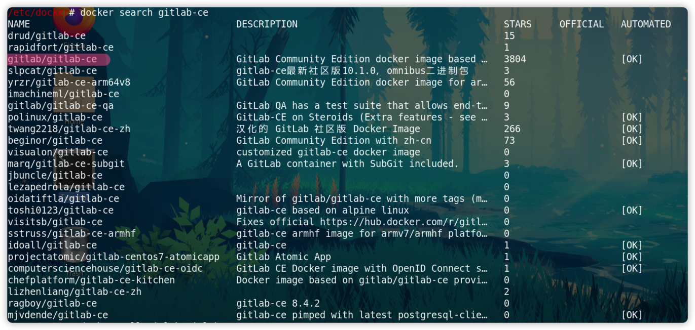

# CICD 实战纪律

> 环境
> CentOS Linux release 7.9.2009 (Core) (On VMware Fusion)

## 安装Docker
https://docs.docker.com/engine/install/centos/

1. 设置存储库
```shell
sudo yum install -y yum-utils
sudo yum-config-manager \
    --add-repo \
    https://download.docker.com/linux/centos/docker-ce.repo
```

2. 安装Docker
```shell
sudo yum install docker-ce docker-ce-cli containerd.io docker-buildx-plugin docker-compose-plugin
```
3. 启动docker
```shell
# 启动docker
systemctl start docker
# 重启docker
systemctl restart docker
```
5. 设置docker镜像源
    修改 vi /etc/docker/daemon.json 文件
```json
{  
   "registry-mirrors": ["http://hub-mirror.c.163.com"]  
}
```
docker 源地址：
- Docker 官方中国区： https://registry.docker-cn.com

- 网易：http://hub-mirror.c.163.com

- 中国科技大学：https://docker.mirrors.ustc.edu.cn

- 阿里云：https://xxx.mirror.aliyuncs.com （需要注册）
6. 安装gitlab：
    - docker search gitlab-ce
    - 
1. 