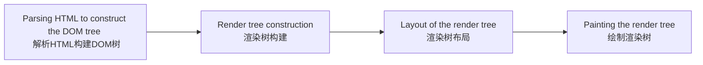

# 浏览器如何工作

#翻译 #浏览器 #前端

> 2022.09.14 zheng-kun@foxmail.com 译
>
>  翻译自 [How browsers work](https://web.dev/howbrowserswork/) 作者：[Tali Garsiel](https://web.dev/authors/taligarsiel/) [Paul Irish](https://web.dev/authors/paulirish/) 
>
> Tali Garsiel 原文写于 2009年10月，Paul Irish 整理之后于2011.8.15 发布于 web.dev

## 前言

这篇关于WebKit和Gecko整个内部机制的入门书是以色列开发人员Tali Garsiel大量研究的结果。多年以来，她查看了所有关于浏览器内部的公开资料，并花费了大量的时间阅读了浏览器的源码。她这样写道：

> 在IE浏览器统治90%浏览器市场的时代，我们除了将浏览器看作一个“黑盒”之外就没有太多的事情去做了，但是现在，随着开源浏览器占到了超过一半的使用量，这是一个不错的机会去看看引擎盖底下，看看浏览器里面有什么东西，好吧，里面是数百万行的C++代码……

Tali将她的研究成果发布在她自己的[个人网站](http://taligarsiel.com/)上,我们认为她的研究应该被更多人看到，因此我们将她的研究整理出来在这里重新发布。

> 作为一名web开发者，学习浏览器内部的原理可以帮助你更好地决策，明白最佳开发实践背后的原因。尽管这个文档很长，我们还是建议你花些时间深入挖掘。我们保证你受益匪浅。 —— *Paul Irish, Chrome Developer Relations*

## 介绍

Web浏览器是使用最广泛的软件。在本文中，我将解释浏览器如何在屏幕后工作。我们将搞清楚从你在浏览器地址栏输入`google.com`，直到你在浏览器屏幕上看到google页面，这段时间发生了什么。

## 我们将要讨论的浏览器

现在有五个主流的桌面浏览器：`Chrome`、`Internet Explorer`、`Firefox`、`Safari` 和 `Opera`。移动端主要的浏览器有 `Android Browser`、`iPhone`、`Opera Mini` 和 `Opera Mobile`、`UC Browsers`、 `the Nokia S40/S60` browsers 和` Chrome`，除了 `Opera` 外，所有这些移动端浏览器都基于`Webkit`。我将以开源浏览器 `Chrome`、`Firefox`、`Safari`（部分开源）举例。根据 [StatCounter 的统计](http://gs.statcounter.com/)(截止2013年6月) `Chrome`、`Firefox` 和 `Safari` 占据了大约全球桌面浏览器使用量的71%。而在移动端， `Android Browser`、`iPhone` 和 `Chrome`占大约54%。

## 浏览器的主要功能

浏览器的主要功能是呈现你选择的web资源：它从服务器请求资源，并将其展示在浏览器窗口中。这里的资源通常是一个HTML文档，但也有可能是一个PDF，一张图片，或者其他类型的内容。资源的位置通过使用URI（Uniform Resource Identifier，统一资源标识符）来详细说明。

浏览器解释并展示HTML文件的方法是由HTML和CSS规范指定的。这些规范由W3C（World Wide Web Consortium，万维网联盟）组织维护，W3C的工作是对web进行标准化。多年来，这些浏览器只遵循了规范的一部分，并且开发了自己的扩展。这给Web开发者带来的严重的兼容性问题。而当今，大多数浏览器都或多或少符合规范。

不同浏览器的用户界面有很多共同的元素。常见的用户界面元素有：
  1. 用于输入URI的地址栏 
  2. 后退和前进按钮
  3. 书签选项
  4. 用于刷新或停止当前文件加载的刷新与暂停按钮
  5. 用于回到首页的首页按钮

奇怪的是，没有任何正式规范来规定浏览器的用户界面，它仅仅来自于多年经验和浏览器之间的相互借鉴形成的良好实践。HTML5规范没有定义浏览器必须的UI元素，但列出了一些通用的元素，其中包含地址栏、状态栏、工具栏。当然，也有一些特定游览器所独有的独特功能，例如Firefox的下载管理器。

## 浏览器的高级结构

浏览器的主要组件有：
1. **用户界面（The user interface）**：它包括地址栏、前进/后退按钮、书签菜单等等。除了你看到的请求页面的窗口之外，其他都属于用户界面。
2. **浏览器引擎（The browser engine）**：控制UI与渲染引擎之间的行为。
3. **渲染引擎（The rendering engine）**：负责展示请求到的内容。例如，如果请求到的内容是HTML，渲染引擎负责解析HTML与CSS，并将解析后的内容展示在屏幕上。
4. **网络（Networking）**：对HTTP请求等网络调用，在独立于平台的接口后面为不同的平台使用不同的实现。
5. **UI后端（UI backend）**：用于绘制组合框、窗口这样的基础部件。这个后端暴露出一个不限定平台的通用接口。它底层使用了操作系统的用户接口。
6. **JavaScript解释器（interpreter）**：用于解析和执行JavaScript代码。
7. **数据存储**：这是一个持久层。浏览器需可能需要在本地保存各种数据，比如`cookie`。浏览器也支持`localStorage`、`IndexDB`、`WebSQL`和`FileSystem`等存储机制。  

浏览器部件图：

Figure : Browser components

- 需要注意的是，像Chrome这样的浏览器会运行渲染引擎的多个实例：每个标签页代对应一个实例。同样，每个标签页也在单独的进程（Process）中运行。

## 渲染引擎
渲染引擎的职责是…… 好吧，就是渲染，在浏览器屏幕上展示请求到的内容。

渲染引擎默认可以展示HTML、XML文档和图像，它也可以通过插件或者扩展展示其它类型的数据；例如，使用PDF查看器插件展示PDF文档。但是，在本篇中，我们将聚焦于核心功能：展示使用CSS格式化的HTML与图像。

## 渲染引擎种类

不同的浏览器使用不同的渲染引擎：Internet Explorer 使用 Trident内核，Firefox 使用 Gecko内核，Safari使用WebKit。Chrome 和 Opera（从版本15开始）使用Blink，他是WebKit的一个分支。

WebKit是一个开源渲染引擎，它最初是Linux平台的引擎，后台被Apple修改为支持Mac和Windows。点击[webkit.org](http://webkit.org/) 查看更多详情

## 主要流程

渲染引擎将开始从网络层获取请求文档的内容。这一步通常会在8kB的块中完成。

之后，进行渲染引擎如下图所示的基本流程：

渲染引擎将开始解析HTML文档，并将元素转换为树中的DOM节点，被称为”**内容树（content tree）**“，引擎会解析外部CSS文件和style元素中的样式数据。样式信息和HTML中的视觉指令将用来创建另外一个树：**渲染数（render tree）**

渲染树包含具有颜色和尺寸等视觉属性的矩形。这些矩形按照正确的顺序显示在屏幕上。

在构建渲染树之后，它将经历一个“**布局（layout）**”过程。即给每个节点提供在屏幕上显示的精确坐标。下一个阶段是**绘制（painting）**——将遍历渲染树，每个节点将使用UI后端层（UI backend layer）绘制。

重要的是要明白这是一个渐近的过程。为了更好的用户体验，渲染引擎将尝试尽可能及时地将内容展示在屏幕上。它不会等到所有的HTML都被解析后菜开始构建和布局渲染树。部分内容将被解析并展示出来，而该过程将继续处理来自网络的其余内容。

### 主流程示例

Figure : WebKit main flow

Figure : Mozilla's Gecko rendering engine main flow

从上面两图中可以看到，尽管WebKit和Gecko使用的术语略有不同，但是流程上基本相同。

Gecko将视觉格式化的元素树称为“框架树（Frame Tree）”。每个元素都是一个框架。WebKit则使用术语“渲染树（Render Tree）”表示，它由“渲染对象”组成。WebKit使用术语“布局（Layout）表示元素的放置”，而Gecko称其为“回流（Reflow）”。 “连接（Attachment）”是WebKit用来表示用DOM节点和视觉信息创建渲染树这个过程的术语。一个微小的非语义差异是，Gecko在HTML和DOM树之间有额外的一层。它被称为“内容接收器（Content Sink）”，是制造DOM元素的工厂。我们将讨论流程的每个部分：

### 解析-一般

