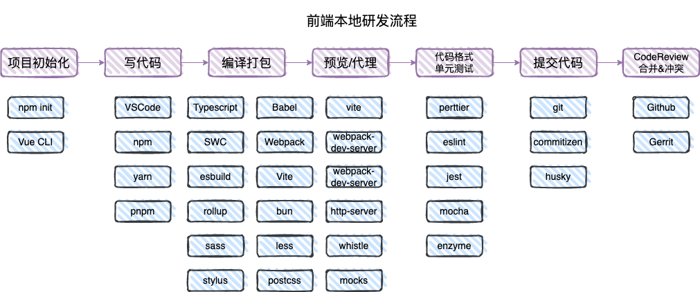
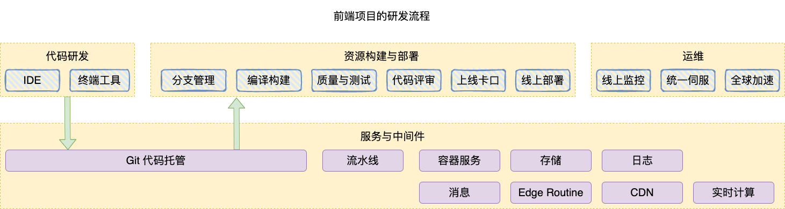

# 前端工程化介绍

## 定义
前端工程 约等于 软件工程
项目开发的规模问题：
- 项目数量
- 协同人数
- 项目规模
- 项目复杂度
> [项目危机](https://zh.wikipedia.org/wiki/%E8%BD%AF%E4%BB%B6%E5%8D%B1%E6%9C%BA)（Software Crisis）1968:
> 指在软件开发及维护的过程中所遇到的一系列严重问题，这些问题皆可能导致软件产品的寿命缩短、甚至夭折。软件开发是一项高难度、高风险的活动，由于它的高失败率，故有所谓“软件危机”之说。软件危机的本源是复杂、期望和改变。这个术语用来描述正急遽增加之电脑的力量带来的冲击和可能要处理的问题的复杂性。从本质上来说，它谈到了写出正确、可理解、可验证的计算机程序的困难。
### 前端工程的定义：
在规模化前端项目开发的场景下，利用标准化的、可衡量的工具、流程和系统，提升效率、质量，降低前端研发成本，服务好企业与前端开发者的需求。

## 实现前端工程的工具、流程与系统
### 工具
- 服务开发框架（Express、Koa）
- 持续集成系统
- 容器技术（docker）
- 命令行工具（Commander.js）
- 项目脚手架
- 构建编译工具(Babel、vite、webpack、gulp、esBuild等)
本地研发工具：

### 前端项目的研发流程

### 目标与方案
1. 效率提高
    - 构建插件
    - 终端套件
    - 研发IDE
    - 构建服务
    - 持续交付平台
2. 保证质量
    - 代码检查服务
    - 持续集成服务
    - 代码评审平台
    - 灰度发布
    - 线上监控
3. 降低成本
    - CDN源站
    - 项目标准化

### 前端资源发布

 
仓库接入vercel，发布一次 Edge Function
Github以依赖安全提醒能力
Semver 动态版本机制
npm hoist
依赖反查 
依赖锁定

npm overrides 重写 package-lock.json 中依赖版本
npm audit 查看依赖漏洞信息
Github Renovate Bot 
Vercel

  

