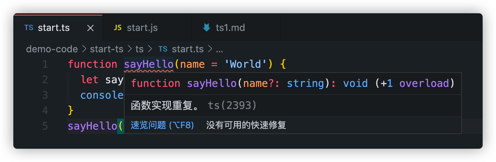
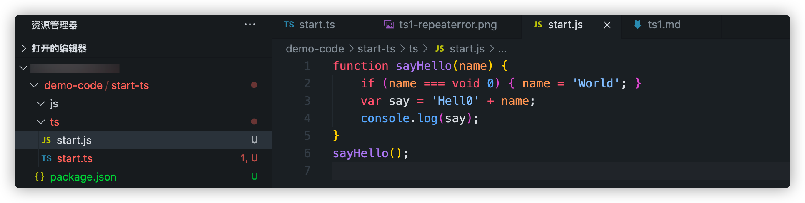

# Hello TypeScript
[TOC]
## TypeScript是什么
#### 官网的解释：
> The goal of TypeScript is to be a static typechecker for JavaScript programs - in other words, a tool that runs before your code runs (static) and ensures that the types of the program are correct (typechecked).
- TypeScript的目标是成为JavaScript的静态类型检查器，简而言之，它是代码执行前运行的一个工具，确保程序的类型是正确的
- TypeScript 仅会在编译是对类型的错误报错
- TypeScript 编译时报错，依然会生成编译结果，如果要在编译是终止js文件的生成，可以在 `tsconfig.json` 文件中配置 `noEmitOnError`
### TypeScript 与 JavaScript 的关系
TypeScript 是 JavaScript 的超集， 这意味着我们所有JavaScript代码都可以在TypeScript 中正常运行（但是这与我们使用 TypeScript 的初衷背离）。
TypeScript 代码可以通过 TypeScript 编译器或 Babel 转译为 JavaScript 代码

## 开始TypeScript

### 安装TypeScript
`npm install typescript -g`

### 第一个ts文件
- 新建一个`start.ts`文件, 我们先写入js代码，如下
```JavaScript
function sayHello(name = 'World') {
  let say = 'Hello' + name
  console.log(say)
}
sayHello()
```
- 在终端中运行`tsc ts/start.ts`之后会发现ts/目录下多了一个`start.js`文件，这就是ts根据start.ts编译出的js代码文件
### 函数实现重复问题 
#### 问题
我们发现，这时候终端中会报一个‘函数实现重复的问题’


原因是我们在用tsc编译之后，ts文件下多了一个js文件，这个jd文件中也有sayHello函数，而编译器会对同一文件夹下的同名变量作出警告，导致了我们看到的错误（将start.js中的代码注释掉报错消失）

- void 
  > `void 0` 和 `void(0)` 等效
  > `void` 对给定的表达式求值，并返回`undefined`
  > `button.onclick = () => void doSomething();` // 在箭头函数中避免泄漏（当函数返回值不会被使用到的时候，应该使用 void 运算符来确保返回 undefined，这样API 改变时不会影响箭头函数的行为。）
#### 解决
在项目更目录添加ts配置文件解决该问题(tsconfig.json的存在说明这个是一个TypeScript项目，tsconfig为ts项目的根目录)

### tsconfig.json
1. 在项目根目录下运行 tsc init
2. 在项目根目录下添加tsconfig.json文件
 - 可以通过`tsc --project`(或者`tsc -p`）指定 tsconfig的文件路径（指定的文件应该是正确的.json文件）（指定编译的文件时 ，tsconfig.json 文件将被忽略）
 ```bash
tsc 
tsc --project tsconfig.json # 与tsc效果相同
tsc -p test.json
tsc ts/start.ts # tsconfig.json 文件将会被忽略
 ```
### 

