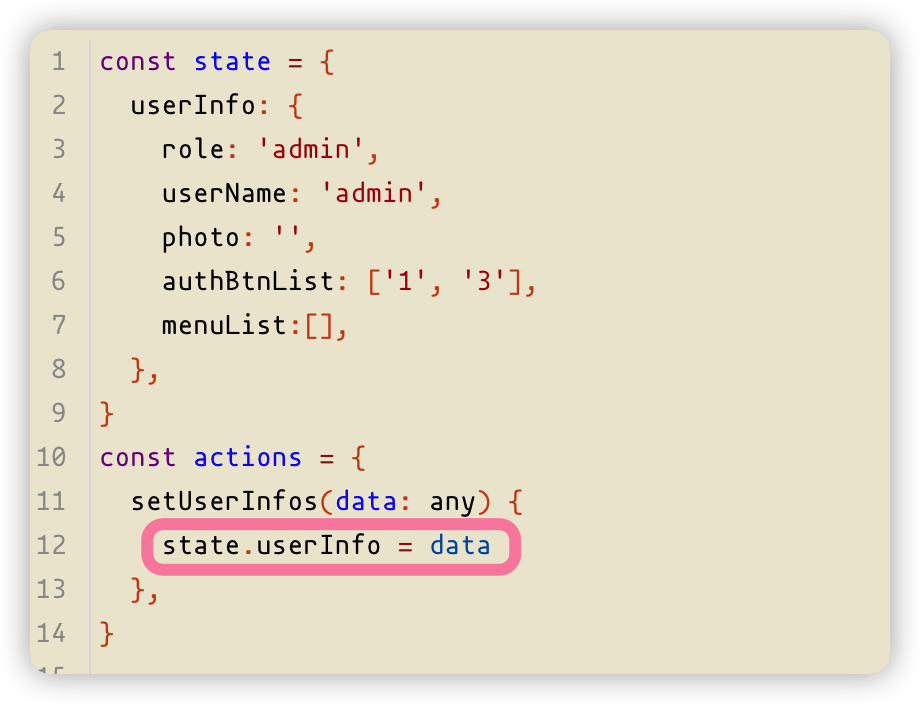
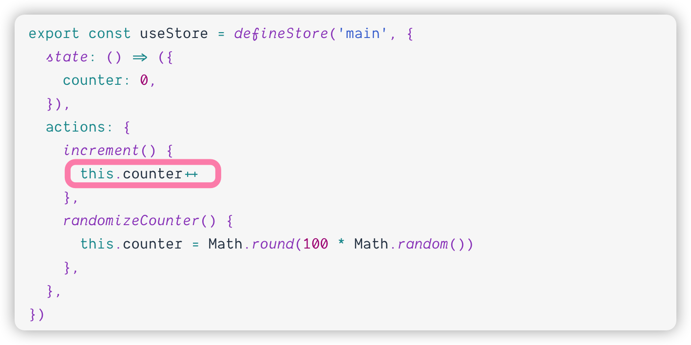
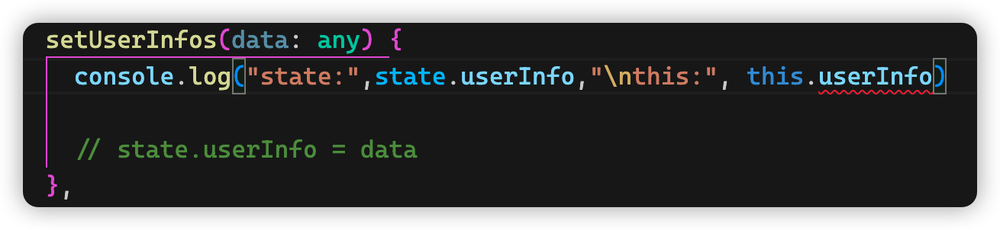
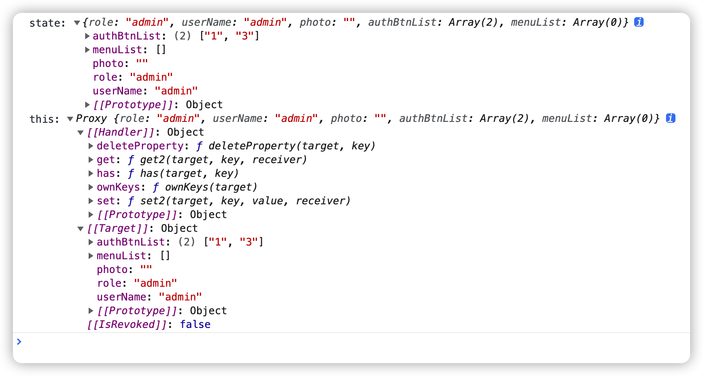
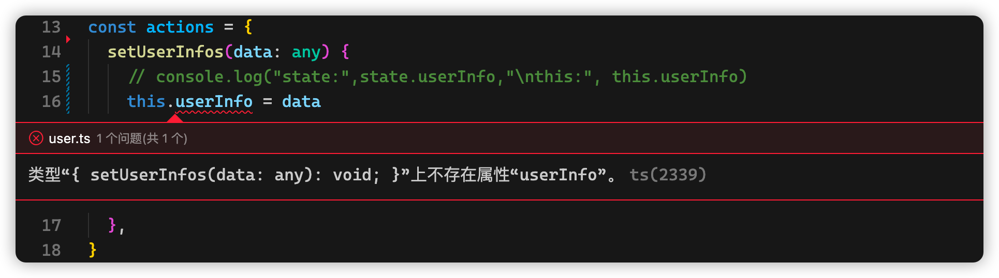
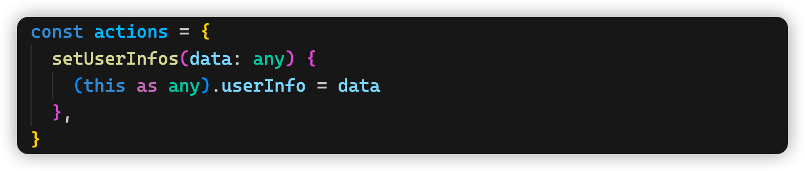

# pinia 踩坑记录（pinia + vue3 + ts）

今天遇到一个pinia的问题，记录一下，首先还是先看代码

state 和action 单独放在一个文件中，

pinia生成store的代码放在一个文件中

store/module/user.ts：

```javascript
const state = {
  userInfo: {
    role: 'admin',
    userName: 'admin',
    photo: '',
    authBtnList: ['1', '3'],
    menuList:[],
  },
}
const actions = {
  setUserInfos(data: any) {
    state.userInfo = data
  },
}
export default {
  state: () => state,
  actions,
}

```

store/index.ts：

```javascript
import { defineStore } from 'pinia'
import user from './modules/user'

export const useUserStore = defineStore('user', user)
```

我们再来看使用store的使用：

```vue
<template>
<div class="header-right flex-end-c">
  <!-- 个人头像 -->
  <el-dropdown trigger="click" @command="handleCommand">
    <el-avatar :size="35" :src="userStore.userInfo.photo || defaultUserImage" />
    <span class="user-name">{{userStore.userInfo.userName}}</span>
  </el-dropdown>
  </div>
</template>
<script lang="ts" setup>
import { useUserStore } from '@/store'

const userStore = useUserStore()

// 此函数返回一个promise对象，用来请求userInfo
const fetchUserInfo = () => {}

const getUserInfo = async () => {
  userStore.setUserInfos(await fetchUserInfo() as any)
}

onMounted(() => {
  getUserInfo()
})

</script>
```


看起来代码没有什么问题，但是运行后出现了一个问题，数据是改变了，但是页面视图并没有更新。

于是，我尝试将getUserInfo中修改store的代码改成了这样：

```js
userStore.userInfo = await fetchUserInfo() as any
```

再运行，一切正常。是不是很奇怪？

一种是通过`action`中的方法改变`state`，另一种是通过 `store` 实例访问状态来直接写入状态，理论上两种方式做了同样的事情，为什么会有不同的表现呢？

跑回去查看了pinia的文档

发现文档里从没有出现过在action中使用`state.xxx`的方式去改状态



我们来看看文档中的代码：



其实这里的`this`指向的是store的实例`useStore`,我们修改状态应该通过store实例来修改，`useStore`中的state是响应式的。我们在控制台把这两个东西打印出来看看；





发现了没，我们之前在`action`中直接修改的state对象与`useStore`中的state并不是一个东西。


但是，这里还有个小问题，看图：



ts报错了

> 类型“{ setUserInfos(data: any): void; }”上不存在属性“userInfo”。ts(2339)

ts认为这里的`this`指向的是`action`这个对象，但是实际上呢，我们我们是在store的实例上调用这个`setUserInofs()`,`this`指向的应该是调用方法的`userStore`这个store实例：

```js
userStore.setUserInfos(data)
```

解决这个问题也简单粗暴，搬出ts中万能的`any`就可以了：



搞定！

---

路漫漫其修远兮，吾将上下而求索