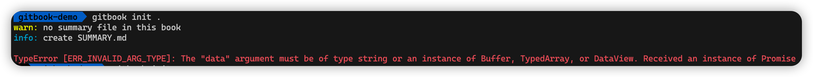
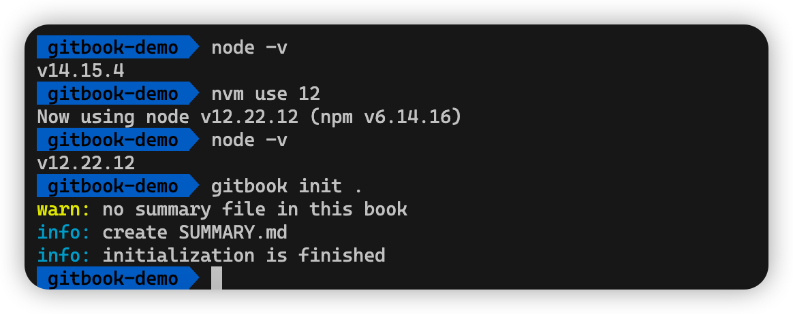
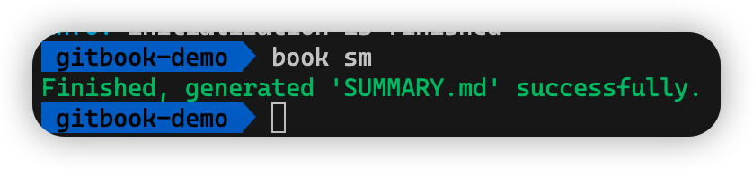
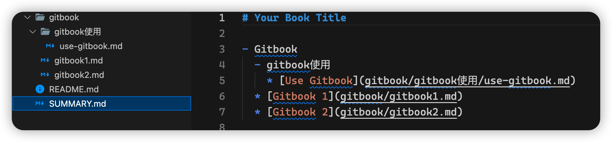
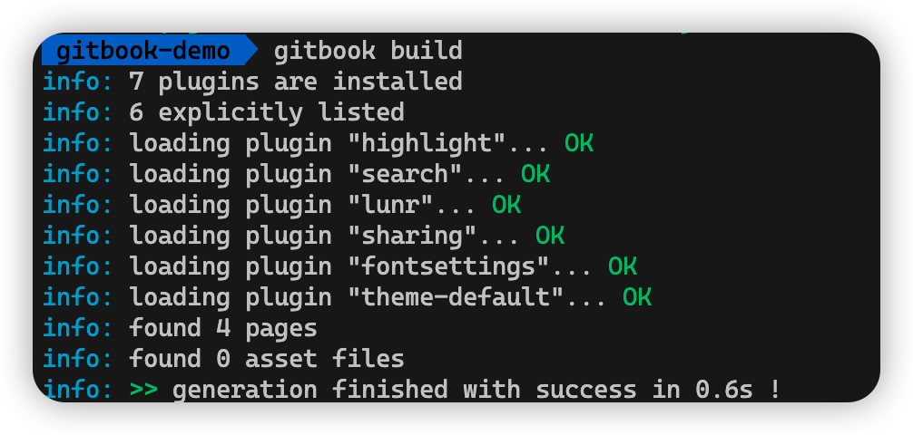
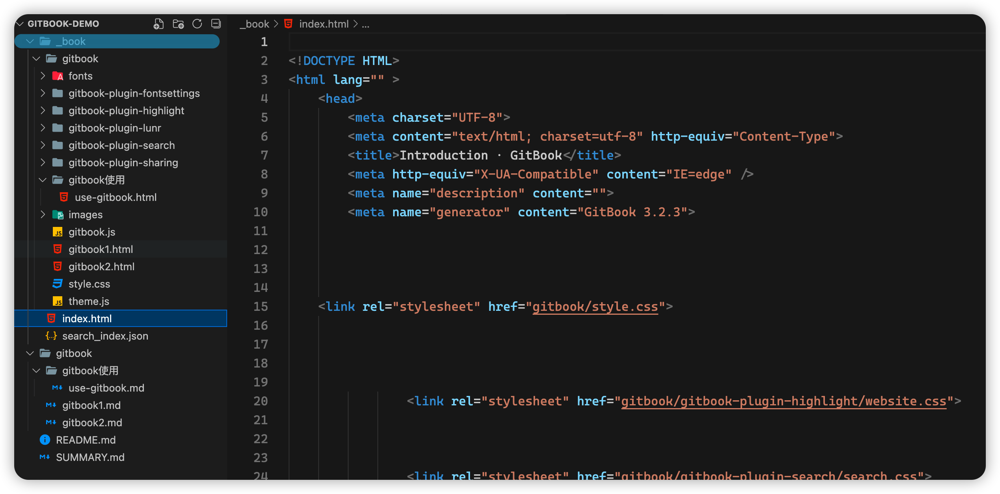
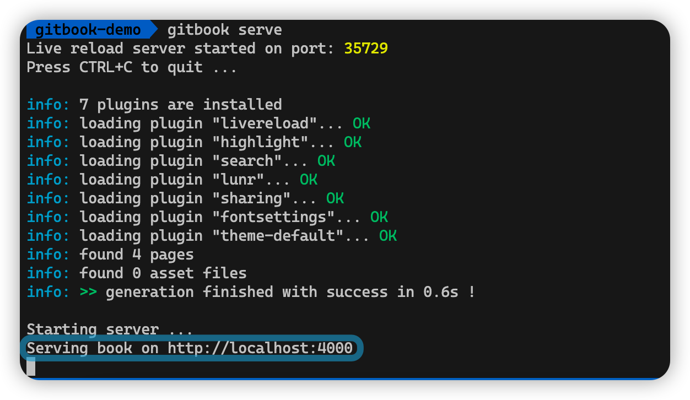
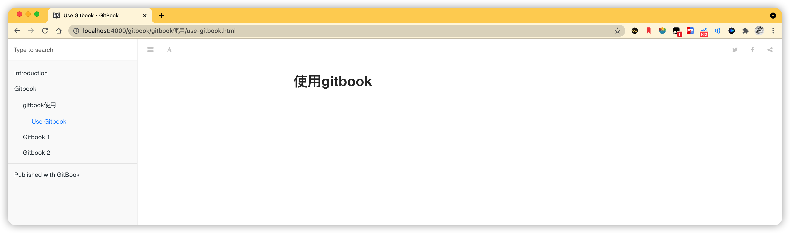

# `GitBook` 入门

今天整理自己的一些笔记，突然想到了`GitBook`， 其实之前也试过，但是由于遇到各种问题，最后都没搞定，今天再来试试。


## 安装 `GitBook`

### 1. 安装`Node.js`

`GitBook` 是一个基于`Node.js`的命令行工具，因此需要先安装`Node.js`

安装`Node.js` 网上有很多教程，这里就不再赘述。

### 2. 安装GitBook

```sh
 npm install -g gitbook-cli
```

如果你去npm官网搜[gitbook-cli](https://www.npmjs.com/package/gitbook-cli)你会发现，这家伙最后一次更新是五年前了(2017)。。。


## 创建 GitBook

### 1. 初始化Gitbook

```sh
gitbook inti [要初始化的目录（gitbook的输出目录）] 
```

初始化完成后项目中会多出两个文件：

- `README.md` 电子书的简介
- `SUMMARY.md` 电子书的目录

但是，在这一步我们并没有那么顺利，你八成会看到这个东西：



不慌，这是因为我们node版本的问题，还记得之前的伏笔吗，这玩意已经五年没有更新了，我们需要安装老一点的node版本。

这里我使用`nvm`来切换到12试试：



搞定！

### 2. 生成静态网页

#### 2.1 编辑SUMMARY.md	

我们需要的book网页是基于上面的`SUMMARY.md`创建的，首先我们要在`SUMMARY.md`中编辑目录。由于我比较懒，这里使用`gitbook-summary`自动生成目录，当然，你可也可以选择手动编辑

```sh
# 全局安装 gitbook-summary
npm i gitbook-summary -g

# 在我们文档库的根目录下运行，生成Summary文件
book sm
```



这时候`SUMMARY.md`中已经有了我们需要的目录信息：



#### 2.2 编译生成静态网页

```sh
gitbook build
```



这时基于目录和文档的网站就生成好了，目录下会多出一个`_book`文件夹，我们的网站就在这个目录下：



### 2.3 预览图书

```sh
gitbook serve
```



这时候我们访问 http://localhost:4000/ 就可以预览我们的gitbook啦，大功告成！





