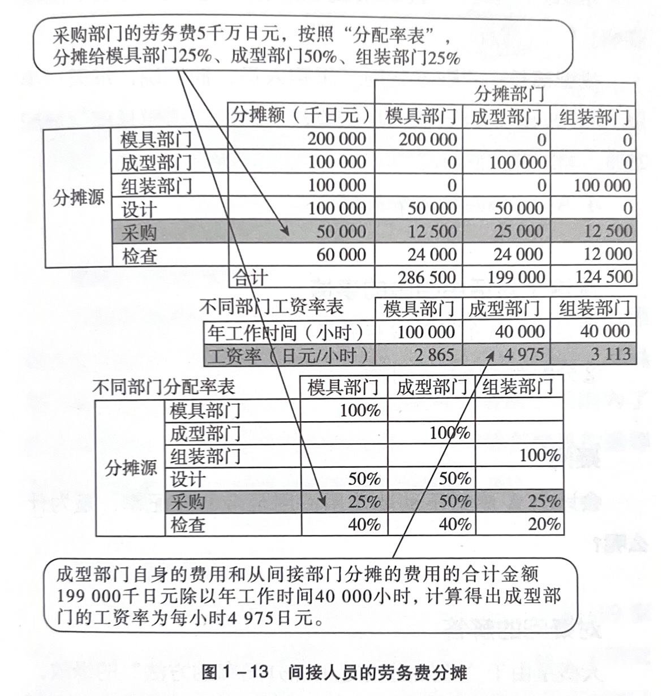
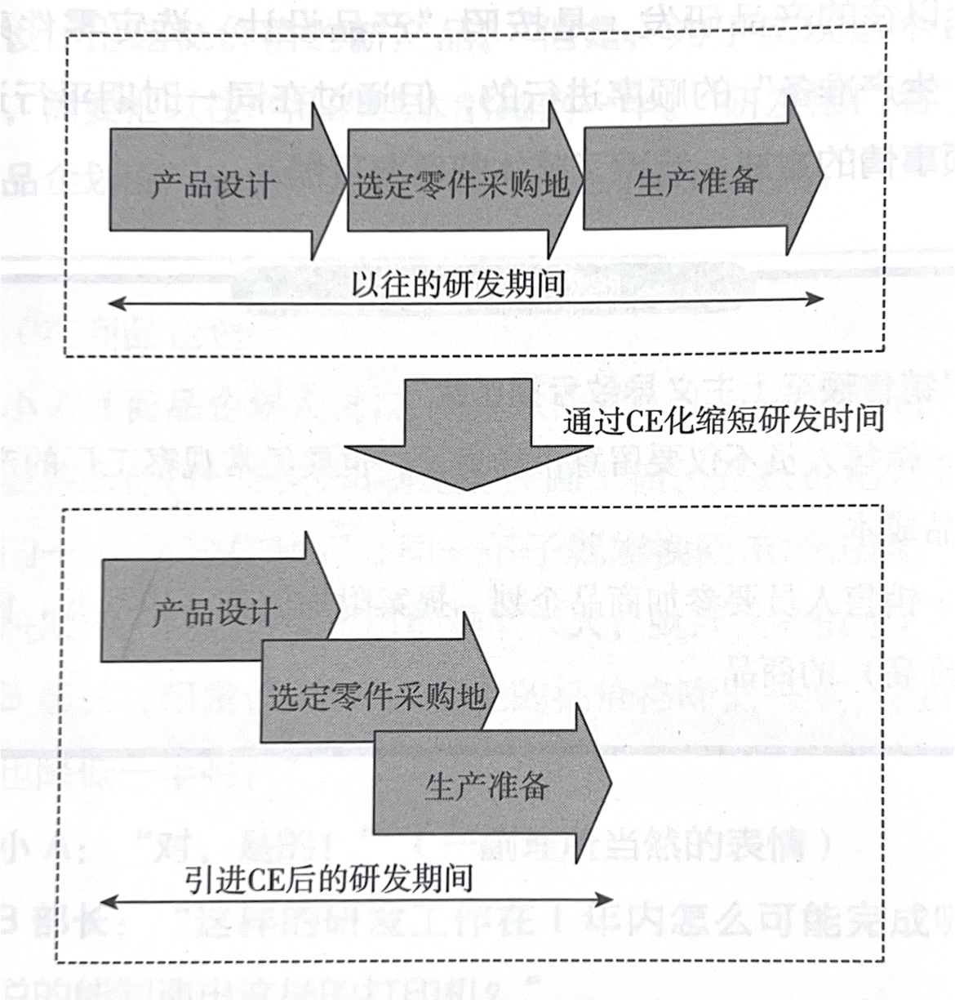

## 第一章 - 成本管理的陷阱 （13 个）
### 1.1 交给税务师的成本管理

---
#### 税务师：财务会计
- 盈利表：
   - 内容：销售额、总成本（制造成本 + 销售管理等成本） => 利润
   - 目的：
      1. 报税
      2. 股东分红

---
#### 经营顾问：管理会计
- 生产成本报告书：
   - 内容：
      1. 直接费用：物料成本、人员成本
      2. 间接费用：折旧费、水电气、其他
   - 目的：
      1. 制定和实施经营战略

---
### 1.2 刚性的成本管理
*大碗经营*：粗放经营
#### 工资率的计算

--- 

1. 以加工时间为标准计算
   - 以加工时间为标准，把简介成本分配到产品上，计算出单个产品的成本
   - 需要测定生产一个罐头所需的加工时间
2. 以物料费为标准来计算
   - 以产品的重量为标准分摊加工费用
--- 
- Machine Rate 机器小时率 ：以产品的机械加工时间为标准
- Man Rate 人工小时率
   eg： 产品成本 = （工资率 * 一台的机械加工时间/组装时间） + 1台的材料费
> 成本的计算应该尽量使用简单的方法
---
### 1.3 “偷工减料的计算成本”
- 虽然是实际成本，没有必要所有的数据都使用“实际值”
- 使用“实际值”或者“计划值”应该更具“**成本计算目的**”来决定：
   - eg： 以降低零件成本为中心的话，加工时间和工资率就可以用去年的数据
   - eg：以改善工艺为中心的话，零件价格使用预算值计算就可以
---
### 1.4 制作公司内部公布用的资料是“头等大事”
- “即使制作成本管理资料，成本也不会下降”
   1. 不制作和成本降低工作无关的资料
   2. 不给不从事成本降低工作的制作资料
   3. 越是不成本管理工作的人越想要详细的资料
   4. 制作资料的实际不如拿去降低成本
- **要从对内的成本管理（仅是合计）转向对外的成本管理（与降低成本工作相关联的管理）**

---

### 1.5 未被使用的成本数据!
- 掌握降低成本部门的真正需求
- 在进行成本合计时，首先调查该数据的使用方法
- **实际成本**： 实际花费的成本，一般使用某个区间的平均值
- **标准成本**： 编入预算的目标成本。
- 比较实际成本和标准成本，进行差异分析。物料费，加工费差异分析

---
### 1.6 分配计算是根本

--- 

**ABC 作业成本分析 Activity-based costing**： 一种把间接费用分摊到直接部门的方法。 

---

这样的纠正作用有多大？

---
- 仅在设立新部门、改变营业内容时使用ABC，变化不大的情况下没有太大的必要关心分配率。
- **与降低成本不相关的分配率，差不多就行了**
---

### 1.7 仅凭经营分析赚不到钱

- **物料费**：如果无良厂家根据当年采购情况，在年末相够放支付折扣，这种场景下，“最新成本”是最新采购价格 扣除预测折扣之后的金额
- **零件费**：采购价格因批量大小变化，这种场景下“最新成本”应该使用某个期间的加权平均
- **每个产品的劳务费**：工资率（人工小时率）是以当年的预测工作时间为依据计算的，真正的工资率，只有年末合计出实际的工作时间后才能知道，所以使用人工小时率计算的劳务费，始终是**预测值**。
- 劳务费 = 人工小时率 * 1个产品的工作时间
- 人工小时率 = （直接人员劳务费 + 间接费）➗ 全部**直接**工作人员的年工作时间
- 设备费：工资率（机器小时率）也是以当年的设备投资计划和设备的预测运转时间为依据计算，也是**预测值**
---
> 所谓最新成本其实是不存在的
> 在成本分析的源头数据中，包含很多预测值
> 考虑数据的用途之后再决定数据的新鲜度和精确度
> 提高数据的新鲜度和精确度需要投入巨额的系统和分析人员，需要考量“投资效果”

---
### 1.8 即使设计出好东西也赚到不钱的研发部门
- 新**产品的目标成本**，必须结构到构成此产品**零件的目标成本**中
- 产品的目标成本由市场需求决定
- 某个零件超出成本，不应该变更其他零件的目标成本

--- 
高性能产品的设计和成本的降低能够并存
- 不能因为设计高性能产品而忽略成本问题
- 无论性能多好，如果达不到目标成本，设计人员也会没饭吃
- 越是复杂的产品，越需要各个零件的设计者互相交流想法（**团队研发**）

---
### 1.9 交货期管理最优先的采购部门
- 采购部门工作的内容：
   1. 交期管理（进货 + 交货） **紧迫**
   2. 降低成本 **不紧迫**但是同样**重要**
- 大家会优先做有紧急性质的工作内容

--- 
- 将采购部人员分为**负责交货期管理**和**负责降低成本**两部分，避免职能交叉

### 1.10 如果增加销售额，利润会随之而来
- 销售人员不仅要关注市场成本，也要关注工厂的生产成本（知道工厂的最新成本）
- 销售人员要参加商品策划，提案附加值高（低成本高售价产品）
---
- 对策：
   1. 研究和其他公司差异化的商品，提高定价
   2. 缩短研发时间，在跌价之前不断投入新产品
   3. 推进领先于其他公司的降低成本工作
---
CE 同时进行设计和生产准备的并行工程 Concurrent Engineering

### 1.11 企划部门的青鸟症候群
- **企划部**： 企业策划部、企业发展规划部、企业营销策划部等
- **青鸟症候群**： 
   >青鸟综合症：特指年轻人中近年来常见的一类职业困惑——它表现为频繁更换职业，频繁跳槽，总是找不到适合自己的职业和[职位](https://baike.baidu.com/item/%E8%81%8C%E4%BD%8D/1076527?fromModule=lemma_inlink)。就像童话《青鸟》，总是找不到心中想象的那只美丽的青鸟，于是一直不停地奔跑寻找，像暴风雪中迷失方向般到处乱撞。

---
- 为了使提案更具说服力，商品策划部应该调查竞争企业的“性能和成本”
- 快速调查其他公司正在销售的便宜产品，调查用此成本如何实现高性能
#### 分解分析
- 分析竞争产品并预测其成本