# 信息系统项目管理师笔记

> 第一部分：项目管理知识（一）

[toc]


## 一、项目管理概述

### 1.1 项目的定义及特点
- 项目的定义：为创造独特的产品、服务或成果而进行的临时性工作。
- 项目的特征
    1. **独特性**：差异化（没有完全一样的项目）。
    2. **临时性**：时间临时（S-F）+团队临时(不同的阶段可能有不同的阶段来参加)。（有始有终）
    3. **渐进明细性**：成果性目标是逐步完成的。
- 信息系统**集成项目**的特点（注意与项目特征的**区别**）
    1. 目标不明确
    2. 需求变化频繁，需求变更控制更复杂
    3. 智力密集型
    4. 设计队伍庞大
    5. 设计人员高度专业化
    6. 涉及的承包商多
    > 指导方法： 总体规划，分步实施
- 项目与运营的定义与特点
|          | 运营（也叫日常工作/日常业务） | 项目           |
| -------- | ----------------------------- | -------------- |
| 定义     | 周而复始的循环运作            | 一次性成功原则 |
| 工作性质 | 常规，重复                    | 独特，创新     |
| 工作环境 | 封闭，确定                    | 开放，风险     |
| 管理组织 | 稳定，持久                    | 临时，变化     |
| 目的     | 持续经营                      | 完成项目       |


- 项目和战略规划
项目：周期短，制定者层次低，是战略实现的手段
战略：周期长，制定者层次高，是项目立项的依据
战略批准项目的依据：市场需求，运营需求，客户要求，技术进步，法律要求

- 项目**目标的特点**（注意与项目的特点区分）
    1. 多目标性：
        通过一个项目的实施，实现一系列的目标，满足多方面的需求。项目目标基本表现为三方面，即时间、成本、技术性能（或质量标准），三个目标之间往往存在冲突。
    2. 优先级：
        不同目标在项目的不同阶段，根据不同需要，其重要性也不一样。
    3. 层次性：
        项目目标的描述需要有一个从抽象到具体的层次结构。
- 目标的SMART原则
    1. Specific 明确性 目标必须是**明确**的
    2. Measurable 可衡量性 目标必须是**可测量的**（可量化的）
    3. Attainable 可实现性 目标必须是**可实现**的
    4. Relevant 相关性 必须**与组织目标相关**
    5. Time-based 时限性 必须有**明确**的可实现**时间**

### 1.2 项目管理知识体系
- 项目管理的定义
    PMI （美国项目管理协会）对项目管理的定义为：项目管理就是把各种知识、技能、手段和技术应用于项目活动之中，以**达到**项目的要求。**达到、满足 ✅** **额外、超过 ❌**
    项目管理是通过应用和综合诸如**启动**、**规划**、**实施**、**监控**和**收尾**（**五大过程组**）等项目管理过程来进行的。**项目经理是负责实现项目目标的个人**。
    
- 项目管理五大过程组：（所有项目都必须）
    1. 启动过程组：项目开始于此。（确定开始，承诺授权，决策立项）
    2. 规划过程组：万事始于计划。（制定计划）
    3. 执行过程组：按照计划做，结果就会好。（执行计划）
    4. 监控过程组：左手计划，右手实际，解决发现的偏差。（执行计划）
    5. 收尾过程组：任何项目都需要收尾（对项目或阶段进行收尾，对采购进行收尾）

- 十大知识领域
  
    1.风险管理 2.人力3.沟通4.采购5.干系人6.时间7.成本8.质量9.范围10.整体
    
- 干系人：
    - 发起人： 提供资金
    - 项目经理： 对项目负责（软技能）
    - 职能经理：掌握资源（设备、人才、物）
    
- 组织过程资产（输入）：
    1. 流程和程序
    2. 共享知识库
    **组织过程资产**包含：项目实施组织的企业计划、政策方针、规程、指南和管理系统，实施项目组织的知识和经验教训，包含正式和非正式的计划、政策、程序和指南，还包括组织的知识库，如经验教训和历史信息。组织过程资产可能包括完整的进度计划、风险数据和挣值数据。
    
- 事业环境因素（输入）：
    消极影响，外部
    工作授权系统：让正确的人按照正确的顺序做正确的事
    - 企业文化与体制
    - 现有人力资源及其管理方法
    - 政府或行业标准与规定
    - 项目所需基础设施
    - 项目工作授权系统
    - 市场发展变化情况
    - 项目各方面风险承受能力
    - 各种信息和商业数据库的情况等。
    
- 凡是**可裁剪**的、**可选择**的均为**组织过程资产**；凡是**不可选择**的、**只能适应**的均为**事业环境因素**。

- 事业环境因素是指项目团队不能控制的， 将对项目产生影响、限制或指令作用的各种条件。**系统是典型的事业环境因素**。

- 项目管理的层次（**英文记**）

  - **项目组合管理**： Portfolio
      直接**和企业战略相关**
      关注资源分配的优先顺序
      强调增加新项目

  - **项目群（集）管理**：Program

  - **单项目管理**：Project 
  项目组合下的项目集不一定有关联关系
  但项目集下的项目一定有关联关系
  项目组合和项目集涉及运营工作


- 系统方法论：
  1. 整体性原则
  2. 相关性原则
  3. 有序性原则

- 项目的制约因素（哪个重要管理层说了算）相互影响，相互牵制：
  1. 范围 Scope
  2. 进度 Time
  3. 成本 Cost
  4. 质量 Quality
- **项目管理方法论**：
  - 在项目计划阶段，项目管理方法论帮助项目管理团队制定项目管理计划和控制项目管理计划的变更，例如组织过程资产中的历史项目信息、标准指导方针、模板、工作指南等对本次项目管理计划的制定有直接的帮助。 
  - **标准格式和模板**属于项目管理方法论的重要组成部分。
  
- **项目监理**：项目建设方和项目承建方都需要开展项目管理工作，而项目监理要由**第三方**负责，项目监理**不属于**项目管理。

>组织文化和组织风格会对项目的执行产生深刻的影响，但具体来说在一个组织中，（**组织沟通**）对项目执行方式有很大的影响。
>
>组织通过对人员和部门的系统化安排，以开展项目等方式实现组织目标。组织文化和组织风格会对如何执行项目产生影响，在一个组织中，项目管理的成功也高度依赖于有效的组织沟通。
>
>项目目标包括**成果性**目标和**约束性**目标。项目的约束性目标**也称为管理性**目标，有时也将项目的成果性目标简称为项目目标。项目成果性目标指通过项目开发出的满足客户要求的产品系统服务或成果。

## 二、信息系统项目管理基础

### 2.1 项目的组织
影响项目的组织结构类型🌟
- 职能行组织（特点：项目经理无权力）
    - 场景：
        - 主要由一个部门完成的项目
        - 技术上比较成熟（小型）
    - 优点：
        - 强大的技术支持，便于支持、技能和经验的交流。
        - 清晰的职业生涯晋升路线
        - 直线沟通、交流简单、责任和权限很清晰
        - 有利于重复性工作为主 的过程管理
    - 缺点
        - 职能利益优先与项目，具有狭隘性
        - 组织横向之间的联系薄弱、部门间协调难度大
        - 项目经理极少或缺少权力
        - 项目发展方向不明、缺少项目基准
- 项目型组织（特点：项目经理具有全部权力）（优缺点正好与职能型互补）
    - 场景：
        - 开拓型、风险比较大的项目
        - 进度、成本、质量等指标由严格要求的项目（大型）
    - 优点：
        - 结构单一，权责分明，利于统一指挥
        - 目标明确单一
        - 沟通简洁、方便
        - 决策快
    - 缺点
        - 管理成本高，如项目的工作量不足则资源配置效率低
        - 项目环境比较封闭，不利于沟通、技术知识等共享
        - 员工缺乏事业上的连续性和保障
- 矩阵型（项目经理）
    - 场景：
        - 前提：用在管理规范、分工明确的公司
        - 一般用作跨职能部门的项目（中型）
    - 分类：
        - 弱矩阵 权力：PM < 职能经理
        - 平衡矩阵 权力相等=
        - 强矩阵 权力：PM > 职能经理
    - 优点：
        - 项目经理责任制、有明确的目标
        - 改善了项目经理对整体资源的控制
        - 及时响应
|                                   | 职能型组织 | 弱矩阵型组织 | 平衡矩阵型组织 | 强矩阵型组织 | 项目型组织 |
| --------------------------------- | ---------- | ------------ | -------------- | ------------ | ---------- |
| 项目经理的权力                    | 很少或没有 | 有限         | 小-中等        | 中等-大      | 大-全权    |
| 可用的资源                        | 很少或没有 | 少           | 少-中等        | 中-多        | 几乎全部   |
| **项目预算控制者**                    | 职能经理   | 职能经理     | 混合           | 项目经理     | 项目经理   |
| 组织中全职参与项目工作的职员比例% | 没有       | 0-25         | 15-60          | 50-90        | 85-100     |

- PMO（项目管理办公室）在组织结构中的作用**：**永久性的职能组织🌟
    - 项目管理办公室（PMO）是在**所辖范围**内集中、协调地管理项目的组织内的结构
    - PMO监控项目、大型项目或各类项目组合的管理
        - 关注项目或子项目之闻的协调计划、优先级和执行情况。
        - 根据需要，可以为一个项目设立PMO，也可以为一个部门、一个企业设立PMO，这三级也可同时存在。
        - PMO关注于其内部项目之间的协调计划、优先级、执行情况监控等。
    - PMO的关键特征（职能）✨ 
        1. 在所有PMO管理的项目之询共享和协调资源
        2. 明确和制定项目管理方法、最佳实践和标准（标准格式和模板属于项目管理方法论的重要组成部分。）
        3. 负责制定项目方针、流程、模版和其他共享资料
        4. 为所有项目集中进行配置管理
        5. 对所有项目集中的共同风险加以管理
        6. 项目工具（如企业级项目管理软件）的实施和管理中心
        7. 项目之间的沟通管理协调中心
        8. 对项目经理进行指导的平台
        9. 对所有PMO管理的项目的时间基线和预算进行集中监控
        10. 在项目经理和任何内部或外部的质量人员或标准化组织之间协调整体项目的质量标准 
    - 分类： 支持型、控制型、指令型（控制程度递增）
    - 项目经理和PMO区别：
        - 项目经理强调**单一**项目、**专一**
        - PMO强调**所辖**、**全**
        - 追求目标不同：
            1. 项目经理负责在项目约束条件下完成特定的项目成果性目标，PMO工作目标包含组织级的观点。
            2. 项目经理关注于特定项目目标，PMO管理重要的大型项目范围的变化。
            3. 项目经理控制项目资源更好实现目标，PMO对所有项目之间共享资源优化使用。
            4. 项目经理关注中间产品的范围、进度、质量、成本，PMO关注整体风险、机会和项目依赖关系。
        - 汇报关系： 项目成员 -> 项目经理 ->  PMO

### 2.2 项目的生命周期
- 项目划分为四个阶段： 概念、计划、实施、结束
- 生命期：项目阶段合在一起称为生命期
- 每个阶段都以**交付物（deliverable）的完成**为标志，这种交付物事可度量、可验证的工作成果。
- 可交付物： 可行性报告、详细设计报告、原型或样机、测试报告、试运行报告
- **阶段的正式完成，不包括对后续阶段的批准。明确该阶段的任务作为正式启动。**

- 阶段评审的**目的**：
   - 判断当前阶段是否满足结束标准并进入下一个阶段
   - 发现当前阶段中存在的问题和错误。 形成组织过程资产

- 阶段评审**内容**：
   - 当前阶段的交付物。产品/技术评审
   - 当前阶段的项目执行情况。管理/过程评审

- 项目里程碑（Project Milestones）
    - **里程碑不是任务，不是计划活动，仅是一个事件**

- 成本和人力投入曲线： 两头低中间高
- 风险与不确定性、干系人的影响。 前高后低
- 变更的代价。前低后高

- 软件产品生命周期与项目生命周期的关系
    - 项目生命周期定义项目的开始与结束，通常**按顺序排列**但有时**又相互交叉**的一系列项目阶段的集合。
    - 软件产品的生命周期是产品从无到有、再到无的整个过程，是一系列按顺序排列的产品阶段的集合。从提出软件产品研发开始，直到最后停止使用该软件产品为止。
    - 软件产品的生命周期包括产品项目筛选、概念形成、产品开发、产品上市、市场增长、成熟和衰退直到退出市场为止。
- 产品生命周期 = 项目生命周期 + 运营阶段 + 退出市场阶段。
  

### 2.3 典型信息系统项目的生命周期
- 瀑布模型：也叫预测型生命周期、完全 计划驱动型生命周期
    - 适用于规模较小、周期较短、**需求明确**时
- V模型🌟
    - 开发过程：需求分析、概要设计、详细设计、编码
    - 测试过程：单元测试、集成测试、系统测试、验收测试
    - 需求分析--验收测试
    - 概要设计--系统测试
    - 详细设计--集成测试
    - 编码--单元测试
    - 验收测试的主要指标：需求文档定义的**功能**全部实现，**非功能**指标达到目标要求。
- 原型化模型
    - 为弥补瀑布的不去产生
    - 适用于**需求不明确**需要澄清需求时
    - 原型化模型的第一步是建造一个快速原型？实现客户或未来用户与系统的交互，经过和用户针对原型的讨论和交流，弄清需求以便真正把握用户需要的软件产品是什么。
    - 原型化模型的思想用于需求分析环节，来解决因为需求不明确而导致产品出现严重后果的缺陷。
- 增量模型
    - 适用于周期短、规模大
- **螺旋模型**
    - **强调风险分析**，适用于庞大而复杂的高风险项目。
- 迭代模型
    - 适用于**变更频繁**，大型复杂项目、**多期开发**
- 敏捷模型
    - 适用于小项目
    - 没有或不能完整地确定需求和范围的项目；
    - 应对快速变化的环境；
    - 需求和范围难以事先确定；
    - 有利于干系人的方式定义较小的增量改进。
- 喷泉模型
    - 强调面向对象；需求渐进式给予。
- RUP（统一软件过程管理）
    - 适用于大型项目
    - 强调每个过程都有里程碑的发布
    
### 2.4 单个项目的管理过程
- 过程：
    - 过程就是一组为了完成一系列事先指定的产品、成果或服务而需执行的互相联系的行动和活动。
    - 分两类
        - **通用项目管理过程**：适用于绝大部分项目的管理过程，例如时问管理、质量管理、成本管理、风险管理等具有普遍的适用性。
        - **产品（技术）实现过程**：面向产品的过程一般都由项目规定定并因应用领域而异。
    - 项目过程和创造产品的过程，从项目开始到其结束始终**彼此重叠**与**交互作用**
    - 每一阶段或子项目**都要重复**过程组的所有子过程

| 知识领域         | 启动过程组   | 规划过程组（制定项目计划）                                                                                | 执行过程组（指导和管理项目执行）                    | 监控过程组(监督和控制项目工作)   | 收尾过程组     |
| ---------------- | ------------ | ------------------------------------------------------------------------------------------------- | ---------------------------------------------- | ----------------------------------- | -------------- |
| 项目整体管理     | 制定项目章程 | 制定项目管理计划                                                                                  | 指导和管理项目工作                             | 监控项目工作 <br> 实施整体变更控制 | 结束项目或阶段 |
| 项目范围管理（三大基准）     |              | 规划范围管理<br>收集需求<br>定义范围<br>创建WBS（Work Breakdown Structure 工作分解结构）              |                                                | 确认范围<br>控制范围               |                |
| 项目进度管理（三大基准）    |              | 规划进度管理<br>定义活动<br>排列活动顺序<br>估算活动资源<br>估算活动持续时间<br>制定进度计划 |                                                | 控制进度                            |                |
| 项目成本管理（三大基准）    |              | 规划成本管理<br>估算成本<br>制定预算                                                            |                                                | 控制成本                            |                |
| 项目质量管理     |              | 规划质量管理                                                                                      | **实施质量保证**                               | 控制质量                            |                |
| 项目人力资源管理 |              | 规划人力资源管理                                                                                  | 组建项目团队<br>建设项目团队<br>管理项目团队 |                                     |                |
| 项目沟通管理     |              | 规划沟通管理                                                                                      | 管理沟通                                       | 控制沟通                            |                |
| 项目风险管理     |              | 规划风险管理<br>识别风险<br>实施定性风险分析<br>实施定量风险分析<br>规划风险应对              |                                                | 控制风险                            |                |
| 项目采购管理     |              | 规划采购管理                                                                                      | 采购实施                                       | 监控采购                            | 结束采购       |
| 项目干系人管理   | 识别干系人   | 规划干系人管理                                                                                    | 管理关系人参与                                 | 控制干系人参与                                    |                |
- 助记：
    - **采购无启动，干系人无收尾**
    - **三大基准+风险管理 只有启动和监控**
    - 凡是**规划**开头的都是**规划**过程组的过程
    - 管事**管理**开头的都是**执行**过程组的过程
    - 凡是以**监督控制**开头的都是**监控**过程组的过程
    - 特殊**实施**：
       - 实施**定性/定量**在**规划**过程组
       - 实施**质量保证/采购**在**执行**过程组
       - 实施整体**变更控制**在**监控**过程组
    
    - **大**项目关注**过程**，**单**项目关注**活动**

- **PDCA**循环：
      PDCA循环的含义是将质量管理分为四个阶段，即
      	1. Plan（计划）
          2. Do（执行）执行后的检查
          3. Check（检查）
          4. Act（处理）

## 三、项目立项管理

### 3.1 立项管理的内容
- 立项包括
    1. 提交项目建议书
    2. 项目可行性研究
    3. 项目招标一投标

- 项目立项过程🌟
    1. **需求分析找机会**
    2. **立项建议写申请**
    3. **初步可研判盈利**（初步可行性研究与盈利判断）
    4. **详细可研做优选**（选择较好方案）
    5. **项目论证出总评**
    6. **项目评估做决策**

- **立项流程**🌟
    - 甲方（建设方）
        - 需求调研 -> 编写项目申请书 -> 可行性研究 -> 项目论证 -> 项目评估 -> 评审获得批准 -> 发布招标文件
    - 乙方（承建方）
       - 看到招标文件 -> 进行**项目识别** -> 可行性研究 -> 项目论证 -> 项目评估 -> 参加投标 -> 中标拿到项目 -> 签订合同

- 需求分析
    - 确定**做什么**
    - 特点：
        1. 用户与开发人员之间存在沟通方面的困难；
        2. 用户的需求是动态变化的；
        3. 生命周期中不同阶段系统变更的代价呈非线性增长等。
- 立项管理的内容：
    - 项目建议书（立项申请）
        - 是项目建设单位向上级主管部门提交项目申请时所必须的文件
        - 是可行性研究的依据
        - 是该**项目建设筹建单位**或**项目法人**，**提出**的某一具体项目的建议文件
    - 项目建议书内容🌟
        - **项目的必要性**
        - **项目的市场预测**
        - **产品方案或服务**
        - **项目建设必须的条件**
    - 项目建议书**三不含**：
        1. **不含后期分工**
        2. **不含详细计划**
        3. **不含设备选型**
    - 项目建议书批准后的主要工作：（了解）
        - 确定项目建设的机构、人员。
        - 选定建设地址，申请规划设计条件，做规划设计方案。
        - 落实筹措资金方案。
        - 落实原料的供应、配套方案、安全消防措施等。
        - 外商投资企业申请企业名称预登记。
        - 进行详细的市场调查分析。
        - 编制可行性研究报告。
- 项目可行性研究报告，是为项目决策提供依据的一宗综合性的分析方法，内容一般有：
    - 项目概述
    - 项目技术背景与发展概况
    - 先行系统业务、资源、设施情况分析
    - **项目技术方家**
    - **实施进度训划**
    - **投资估算与资金筹划**，**钱** -> 优先考虑
    - 人员及培训计划
    - 不确定性（风险）分析
    - 经济和社会效益预测与评价

- **可行性研究内容一般包括以下内容**：🌟🌟（简答题列举标题内容即可），理解区分概念做选择题
    1. **投资必要性**：主要根据市场调查及预测的结果，以及有关的产业政策等因素，论证项目投资建设的必要性。
    2. **技术可行性**：主要从事项目实施的**技术角度**，合理设计技术方案，并进行比较、选择和评价。（考虑项目**开发的风险**、**人力资源的有效性**、**技术能力的可能性**、**物资（产品）的可用性**）
    3. **财务可行性**：主要从项目及**投资者**的角度，设计合理财务方案，从企业理财的角度进行资本预算，评价项目的财务盈利能力，进行投资决策，并从融资主体（企业）的角度评价股东投资收益、现金流量计划及债务偿还能力。
    4. **组织可行性**： 制定合理的项目**实施进度计划、设计合理的组织机构、选择经验丰富**的管理人员、立良好的协作关系、制定合适的培训计划等，保证项目顺利热行。
    5. **经济可行性**：主要是从**资源配置**的角度衡量项目的价值，评价项目在实现区域经济发展目标、经济资源、增加供应、创造就业、改善环境、提高人民生插等方面的效益。
    6. **社会可行性**：主要分析项目对社会的影响，包括**政治体制、方针政策、经济结构、法律道德、宗教民族、妇女儿童及社会稳定性**等。
    7. **风险因素及对策**：主要是对项目的**市场风险**、**技术风险**、**财务风险**、**组织风险**、**法律风险**、**经济及社会风险**等因素进行评价，制定规避风险的对策，为项目全过程的风险管理提供依据。
- 信息系统可行性研究中，经济可行性分析主要是对整个项目的技资及所产生的经济效益进行分析，具体包括**支出分析**、**收益分析**、 **技资回报分析**以及**敏感性分析**等
    - 敏感性分析：
        1. 确定影响项目经济效益的敏感因素
        2. 寻找影响最大最敏感的变量因素以进一步分析
- **经营成本不包括财务费用**，财务费用是指企业为筹集生产经营所需资金等而发生的费用，包括利息支出（减利息收入）、汇兑损失（减汇兑收益）以及相关的手续费等。

### 3.2 可行性研究
- 一般分三个基本阶段
    1. **初步可行性研究**
    2. **详细可行性研究**
    3. **可行性研究报告**
- 信息系统可行性研究的内容
    1. 技术可行性分析
    2. 经济可行性分析
    3. 运行环境可行性分析
    4. 其他方面的可行性分析
- **初步可行性研究**：
    - 介于机会研究和详细可行性研究的中间阶段，是在项目意向确定之后对项目的初步估计。
    - 在 **立项申请书（项目建议书）** 获批后对项目做的粗略论证估计，其目的有：
        1. 分析项目**是否有前途**（盈利），决定是否应该继续深入调查研究
        2. 项目中是否有**关键性的技术**或项目需要解决
        3. 必须要做哪些职能研究或辅助（功能）研究（如实验室实验、重大事件处理等）
    - 解决问题
        - 必要性问题
        - 周期
        - 人，财
        - 功能目标是否可实现
        - 经济效益社会效益是否可保证
        - 技术上、经济上是否合理
- **详细可行性研究**（必须）
    - **原则**：
        科学性、客观性、公正性、
    - 目的是做**多种方案的优选**，主要的选择方法有：
        1. 经济评价法：分为财务评价和国名经济评价
        2. 市场预测法：直接根据市场中的汇率价格**预测未来汇率**的方法
        3. **投资估算法**：根据同类项目单位生产能力所耗费的资产投资额来估算拟建项目固定投资额
        4. **增量净收益法**🌟：将有项目时的成本（效益）与吴项目时的成本（效益）进行比较，求得两者差额，即为增量成本（效益）
    - 详细可行性研究所涉及的**内容**很多，每一方面都有其**处理问题的方法**，**软件项目详细可行性研究**的内容，其中**包括需求确定**：调查研究国内外客户的需求情况，对国内外的技术趋势进行分析，确定项目的规模、目标、产品、方案和发展方向。

### 3.3 项目论证与评估
- **项目论证**
    是指对拟实施项目技术上的先进性、适用性，经济上的合理性、盈利性，实施上的可能性、风险性进行全面科学的综合分析，为项目决策提供客观依据的一种技术经济研究活动。
- 作用：
    1. 确定项目是否实施的**依据**；
    2. 筹措资金、向银行货款的**依据**；
    3. 编制计划、设计、采购、施工以及机构设置、资源配置的**依据**；
    4. 是防范风险、提高项目效率。
- 项目论证应该围绕着**市场需求**、**开发技术**、**财务经济**三个方面展开调查和分析，市场是前提、技术是手段、财务经济是核心。
- 项目论证分为两种，即内部论证和外部论证。
    - 前者的执行主体为项目承建单位内部没有参加过可行性研究的市场专家、财务专家、技术专家，必要时可邀请客户代表或单位外专家参与；
    - 后者的执行主体为项目投资者或其委托的第三方权威机构。
- 另外，项目论证可以**贯穿于可行性研究的整个阶段**，也可以在**可行性研究完成之后才开始执行**。
- **项目论证的费用**属于立项前的工作费用，**不计入项目的总投资之内**。
- 项目**论证的一般步骤**：（有真题）
    1. 明确项目范围和业主目标；
    2. 收集并分析相关资料；
    3. 拟定多种可行的能够相互替代的实施方案；
    4. 多方案分析、比较；
    5. 选择最优方案进一步详细全面地论证；
    6. 编制项目论证报告、环境影响报告和采购方式审批报告；
    7. 编制资金筹措计划和项目实施进度计划。
- 建设方（甲方）项目论证的内容：🌟
    1. 项自财务评价；
    2. 项目国民经济评价；
    3. 项目环境影响评价；
    4. 项目社会影响评价。 
- 承建方（乙方）项目论证的内容：🌟
    1. 承建方技术可行性分析
    2. 承建方人力及其他资源配置能力可行性分析；
    3. 项目财务可行性分析；
    4. 项目风险分析；
    5. 对可能的其他投标者的相关情况分析。
- 项目**论证**与**评估**：
    - 论证（项目方案的设计，变更过程中的论述推理和证明）决策者
    - 评估（项目完成后对项目**方案**的评价）一般**第三方**进行
    - 项目评估是在可行性研究的基础上，由第三方开展的判断项目是否可行的一个评估过程，而项目论证一般分为了**机会研究**、**初步可行性研究**和**详细可行性研究**三个阶段，所以也可以说项目**评估是在项目论证的基础上**，由**第三方**开展的判断项目是否可行的一个评估过程。
- **评估的依据**：（了解）（有真题）
    1. 项自建议书及其**批准文件**；
    2. 项目**可行性研究报告**；
    3. 报送单位的申请报告及主管部门的**初审意见**；
    4. 有关资源、配件、燃料、水、电、交通、通信、资金（包括外汇） 等方面的**协议文件**；
    5. 必需的其他文件和资料。
- 项目评估的程序：（熟悉）
    1. 成立评估小组，进行分工，制定评估工作计划；
    2. 开展调查研究，收集数据资料，并对可行性研究报告和相关资料进行审查和分析；
    3. 分析与评估；
    4. 编写评估报告；
    5. 讨论、修改报告；
    6. 专家论证会；
    7. 评估报告定稿。（项目评估的最终成果是项目评估报告）

### 3.4 项目招投标（招投标法）
- 国有资金占控股或者主导地位的依法必须进行招标的项目，应当公开招标：但有下列情形之一的，可以邀请招标：
    1. 技术复杂、有特殊要求或者受自然环境限制，只有少量潜在投标人可供选择；
    2. 采用公开招标方式的费用占项目合同金额的比例过大。
- 有下列情形之一的，可以不进行招标：
    1. 需要采用不可替代的专利或专有技术；
    2. 采购人依法能够自行建设、生产或者提供；
    3. 已通过招标方式选定的特许经营项目投资人依法能够自行建设、生产或者提供；
    4. 需要向原中标人采购工程、货物或者服务，否则将影响施工或者功能配套要求；
    5. 国家规定的其他特殊情形。
- 评标委员会可以要求投标人对投标文件中含义不明确的内容作必要的澄清或者说明，但是澄清或者说明不得超出投标文件的范围或者改变投标文件的实质性内容。
- 招标文件中未要求提交备选投标，就应该否决其投标。**不允许出现选择性**投标或报价。
- 招标文件开始发出之日起至投标人提交投标文件止，最短**不得少于20天**。
- 根据系统集成项目招投标实践，项目投标活动的主体为系统集成供应商。系统集成供应商在项目投标阶段的主要工作包含：（熟悉）
    1. 项目意向识别
    2. 项目售前交流
    3. 获取招标文件
    4. 编写投标文件
    5. 参加投标活动
- 合同谈判：
    - 在确定中标人后，即进入合同谈判阶段。
    - 合同谈判的方法一般是**先谈技术条款，后谈商务条款**。
        1. 技术谈判的主要内容，即合同技术附件内容、合同实施技本路线一质量评定标准、采购设备和系统报价以及人员投入开发的比重等。
        2. 商务谈判的主要内容，即投标函中的基本条件，包括：投标价的优惠条件质量、工期、服务违约处罚；其他需要谈判的内容。
    - 合同谈判的技巧是机动灵活，有退有进；既不怕对立又不使会谈破裂；即追求最大利益又注意照顾平衡使对方可接受。
- 签订合同
    - **合同的条款（熟悉）** 一般应包括：当事入的名称和地址；标的；数量；质量；价款和报酬；履行期限、地点和方式；违约责任和解决争议的方法等。
    - 对于**系统集成类的技术合同**，一般应包括：项目名称；标的内容、范围和要求；履行的计划、进度、期限、地点、地域和方式；技术文档和资料的保密；风险责任的承担；技术成果的归属和收益的分成方法；解决争议的方法；名词术语的解释等。
    - 如果中标人不同意按照招标文件规定的条件或条款按时进行签约，招标方有权宣布该标作废币与第二最低评估价投标人进行签约。

## 四、项目整体管理

### 4.1 项目整体管理概述

- 二定四做

  1. 制定项目章程：一定章程出授权（给项目经理授权）

  2. 制定项目管理计划：二定计划出平衡

  3. 指导与管理项目执行：三做执行应指导

  4. 项目监控工作：四做监控应定期

  5. 实施整体变更控制：五做变控走流程

  6. 结束项目或阶段：六做收尾看两项

     a. 合同收尾 ：条款、审计、采购

     b. 行政/管理收尾：经验、教训、文档

- 项目整体管理包括为识别、定义、组合，**统一和协调**各项目管理过程组的各种过程和活动而开展的工作，是项目管理中一项综合性和全房性的管理工作。

- 项目整体管理是项目管理的**核心**。（项目整体管理的地位与其他九大知识领域是并行的，十大知识领域地位一样）

- 是为了实现项目各要素之间的**相互协调**，并在相互矛盾与相互竞争的目标中**寻找最佳平衡点**。

- **项目经理**是整合者，必须：

  - 通过与项目干系人主动、全面的沟通，来了解他们对项目的需求；
  - 在相互竞争的众多干系人之间寻找平衡点；
  - 通过认真、細致的协调工作，来达到各种需求间的平衡，实现整合。

### 4.2 制定项目章程

- 制定项目章程是编写一份正式批准项目并授权项目经理在项目活动中使用资源的文件的过程。宣告了一个项目的正式启动、项目经理的任命，并对项目的目标、范围、主要可交付成果、主要制约因素与主要假设条件等进行**总体性**描述。（**高层次的需求与总体性的描述**）
- 通常由**高级管理层签发**项目章程，并分发给与项目有关的所有组织、部门和人员。用来体现高级管理层对项目的原则性要求，**授权**项目经理为实施项目而动用组织资源。也是项目经理寻求各主要干系人支持的的依据。
- 项目章程**不能太抽象也不能太具体**。项目经理可以**参与甚至起草**项目章程，但项目章程是**由项目以外的实体来发布**的，如**发起人**、**项目集或项目管理办公室职员**，或**项目组合治理委员会主席或授权代表**。**项目经理是项目章程的实施者**（项目经理可以参与起草，但不能发布）。
- 项目章程所规定的是一些比较大的、原则性的问题，通常不会因项目变更而对项目章程进行修改。当项目目标发生变化，需要对项目**章程进行修改**时，**只有管理层和发起人有权进行变更**，**项目经理对项目章程的修改不在其职责范围之内**。项目章程遵循“**谁签发，谁有权修改**〞的原则。
- 项目章程的作用：

  1. 正式确认项目的存在，给项目一个合法的地位。——没有项目章程就没有项目的存在
  2. 确定项目经理，规定了项目经理**权力**
  3. 明确了项目的总体目标，包括范围，进度，成本，质量等（粗略） 
  4. 把项目与执行组织的**日常经营运作及战略计划**等联系起来
  5. 多阶段项目中需要项目章程来正式启动一个新阶段（多个阶段可以用多个章程启动）


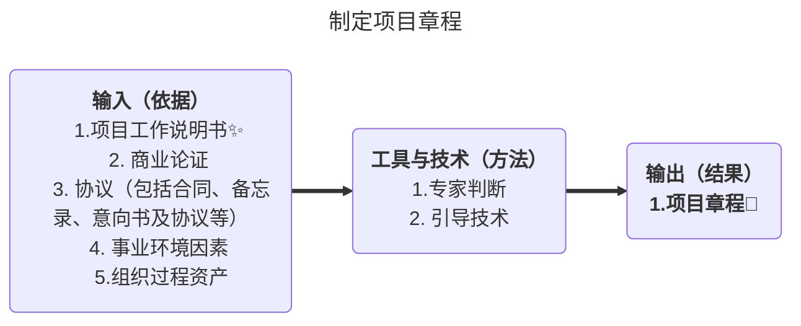

- 输入：

  1. 工作说明书（SOW）：是对项目所需交付的产品、服务或成果的叙述性说明。对于内部项目项目启动者或发起人根据业务需要及对产品或服务的需求，来提供工作说明书。对于外部项目工作说明书则由客户提供，可以是**招标文件**（例如，建议邀请书、信息邀请书、投标邀请书）的一部分，或合同的一部分。SOW涉及**业务需要**，**产品范围描述**和**战略计划**。
     1. **业务需要**。组织的业务需要可基于市场需求、技术进步、法律要求、政府法规或环境考虑。通常，会在商业论证中，进行业务需要和成本效益分析，对项目进行论证。 
     2. **产品范围描述**。记录项目所需产出的产品、服务或成果的特征，以及这些产品、服务或成果与项目所对应的业务需要之间的关系。
     3. **战略计划**。战略计划文件记录了组织的愿景、目的和目标，也可包括高层级的使命阐述。所有项目都应该支持组织的战略计划。确认项目符合战略计划，才能确保每个项目都能为组织的整体目标做贡献。 
  2. 商业论证。商业论证或类似文件能从商业角度提供必要的信息，决定项目**是否值得投资**。高于项目级别的经理和高管们往往使用该文件作为决策的依据。发起人应该认可商业论证的范围和局限。
  3. **协议**：定义了启动项目的初衷。**包括合同**，谅解备忘录（ MOUs）、服务品质协议（ SLA）、协议书、意向书、口头协议、电子邮件或其他书面协议。通常，为外部客户做项目时，就用合同。

- **输出**：

  项目章程记录业务需要、对客户需求的理解，以及需要交付的新产品、服务或成果，例如：（**项目章程的内容🌟**应有尽有没有具体）

  1. 项目的或批准项目的原因；
  2. 可测量的**项且目标**和相关的成功标准；
  3. **项目的总体要求**；
  4. 概括性的项目描述；
  5. 项目的主要风险；
  6. 总体里程碑进度计划；
  7. **总体预算**；
  8. 项目审批要求（用什么标准评价项目成功，由谁对项目成功下结论，由谁来签署项目结束）；
  9. **委派的项目经理及其职责和职权**；
  10. 发起人或其他批准项目章程的人员的姓名和职权。

  

### 4.3 制定项目管理计划

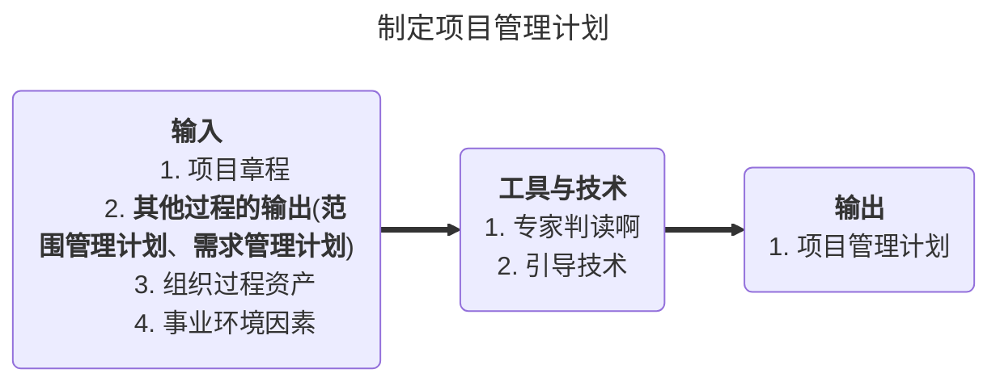

- 输出：

  1. 项目管理计划是说明项目讲如何执行、监督和控制项目的一份文件。它合并与整合了其他各规划程所产生的所有子管理计划和基准（范围基准、进度基准和成本基准等）。
  2. 项目管理计划还包括如下内容
     1. 所使用的项目管理过程；
     2. 每个特定项目管理过程的实施程度；
     3. 完成这些过程的工具和技术的描述；
     4. 项目所选用的生命周期及各阶段将采用的过程；
     5. 如何用选定的过程来管理具体的项目；
     6. 如何执行工作来完成项目目标及对项目目标的描述；
     7. 如何监督和控制变更，明确如何对变更进行监控；
     8. 配置管理计划，用来明确如何开展配置管理；
     9. **对维护项目绩效基线的完整性的说明**；
     10. 与项目干系人进行沟通的要求和技术；
     11. 为项目选择的生命周期模型；
     12. 为解决某些遗留问题和未定的决策，对于其内容、严重程度和紧迫程度进行的关键管理评审。

- **项目计划内容**：🌟🌟🌟（简答题）

  **13个子计划+3个基准+2个补充**

  | 项目管理计划🌟🌟                           | 项目文件                                                     | 项目文件                                                     |
  | ---------------------------------------- | ------------------------------------------------------------ | ------------------------------------------------------------ |
  | 变更管理计划                             | 活动属性                                                     | 项目人员分派                                                 |
  | **沟通管理计划**                         | 活动成本估算                                                 | 项目工作说明书                                               |
  | 配置管理计划                             | 活动维持时间估算                                             | 质量核对单                                                   |
  | 成本基准                                 | 活动清单                                                     | 质量控制测量结果                                             |
  | **成本管理计划**                         | 活动资源需求                                                 | 质量测量指标                                                 |
  | **人力资源管理计划**                     | 协议                                                         | 需求文件                                                     |
  | **过程改进计划**                         | 估算输入                                                     | 需求跟踪矩阵                                                 |
  | **采购管理计划**                         | 变更日志                                                     | 资源分解结构                                                 |
  | 范围基准（项目范围说明说、WBS、WBS词典） | 变更请求                                                     | 资源日历                                                     |
  | **质量管理计划**                         | 预测：成本预测、进度预测                                     | 风向登记手册                                                 |
  | **需求管理计划**                         | 问题日志                                                     | 进度数据                                                     |
  | **风险管理计划**                         | 里程碑清单                                                   | 卖方建议书                                                   |
  | 进度基准                                 | 采购文件                                                     | 供方选择标准                                                 |
  | **进度管理计划**（粗略的、总体地）       | 采购工作说明书                                               | 干系人登记册                                                 |
  | **范围管理计划**                         | 项目日历                                                     | 团队绩效评估                                                 |
  | **干系人管理计划**                       | 项目章程、项目资金需求、**项目进度计划**（详细说明，⚠️与进度管理计划区别）、项目进度网络图 | 工作绩效数据、工作绩效信息、工作绩效报告（工作绩效报告可以包括**项目的整体状况**和各方面信息。） |
  | 绩效测量基准                             |                                                              |                                                              |
  | 生命周期模型                             |                                                              |                                                              |

- 编写计划的过程（了解）：
  1. 各具体知识领域制订各自的分项计划。
  2. 整体管理知识领域收集各分项计划，整合成项目管理计划。
  3. 用项目管理计划指导项目的执行和监控工作，并在执行过程中监控。
  4. 对提出的必要的变更请求，报实施整体变更控制过程审批。
  5. 根据经批准的变更请求，更新项目管理计划。

### 4.4 指导与管理项目执行

- 指导与管理项目工作是为实现项目目标而领导和执行项目管理计划中所确定的工作，并**实施已批准变更**的过程。

- 指导与管理项目工作通常以“**开踢会议**〞为开始标志。该会议是项目计划制订工作结束、执行工作开始时由项目的主要干系人联合召开的会议，以便加强他们之间的沟通与协调。

- 本过程的主要作用是，对项目工作提供全面指导和管理。指导与管理项目工作需要项目经理和项目团队执行多项行动来执行项目管理计划以完成项目范用说明书中所定义的工作。

- 指导与变更项目工作还须对项目所有变更的影响进行审查，并**实施已批准的变更**，活动包括：

  1. **纠正措施**

     为使项目工作绩效重新与项目计划一致而进行的有目的的活动

  2. **预防措施**

     为确保项目工作的未来绩效符合项目管理计划而进行的有目的的活动

  3. **缺陷补救**🌟（针对产品）

     为修正不一致的产品或**产品**组件而进行的有目的的活动

  4. **更新**

     对正规受控的文件或计划等的变更，以反映修改或增加的意见或内容

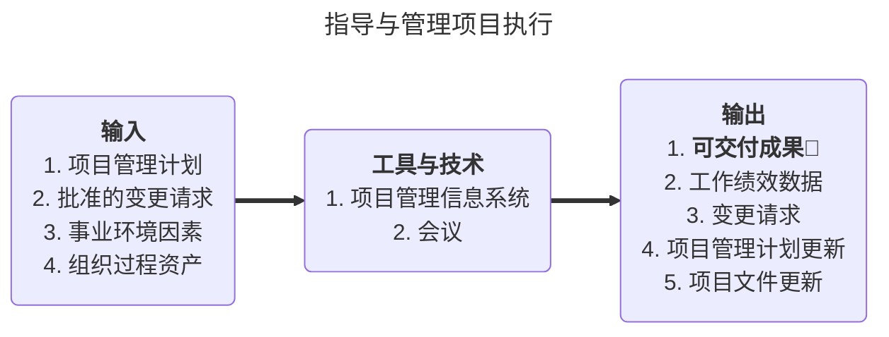

- 项目开工会议Kik-off meeting（开踢会议）
  - 召开时间：**通常说规划阶段结束执行阶段开始**
  - 会议任务：**传达项目目标、获得团队对项且的承送，以及阐明每个相关方的角色和职责**；
  - 会议目的：
    1. 项目团队成员互相认识；
    2. 介绍项目背景及计划，正式批准综合性项目管理计划，并在干系人之间达成共识。
    3. 落实具体项目工作，明确个人和团队职责范围，获得团队成员承渃，为进入项目执行阶段做准备。
  - 已做事项：开踢会议（开工会议）召开前，通常己经确定了项目的组织结构，并已经对团队成员的角色与职责进行定义。
  - 已有文件：此时用于指导项目的项目管理计划己经制定出来，因此，在开工会议中，通常需要对项目的范围、进度、成本、风险应对等事项进行确认，并在干系人之间达成共识。

### 4.5 监控项目工作

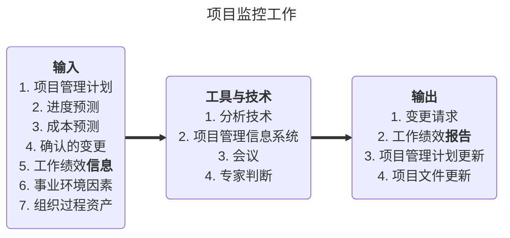

- 工具和技术
  
  分析技术：（理解）
  1. 回归分析(是确定两种或两种以上变量问相互依赖的定量关系的一种统计分析方法。）；
  2. 分组方法：通过统计分组的计質和分析，从定性和定量的角度来认识所要分析对象的不同特征，不同性质及相互关系的方法。根据研究的的目的和客观现象的内在特点，按某个标志或几个标志把被研究的总体划分为若干个不同性质的组使组内的差异尽可能小，组间的差距尽可能大。
  3. 因果分析：见质量管理章节。
  4. **根本原因分析(RCA )**是一项结构化的问题处理法，用以逐步找出问题的根本原因井加以解决，而不是仅仅关注问题
     的表征。
  5. 预测方法：比如假设情景分析、模拟（蒙特卡洛分析）等，请参考质量管理.。
  6. 趋势分析：又称趋势预测法，用于检查项目绩效随时间的变化情况，以确定绩效是在改善还是在恶化。主要优点是考虑时间序列发展趋势，是预测结果能更好地符合实际。

### 4.6 实施整体变更控制🌟🌟

- 实施整体变更控制是**审查**所有变更请求，**批准或否决**变更，管理对可交付成果、组织过程资产、项目文件和项目管理计划的变更，并对变更处理结果进行沟通的过程。
- 该过程审查所有针对项目文件、可交付成果、基准或项目管理计划的变更请求，并批准或否决这些变更。
- 实施整体变更控制过程的主要作用是，从整合的角度考虑记录在案的项目变更，从而降低因未考虑变更对整个项目目标或计划的影响而产生的项目风险。

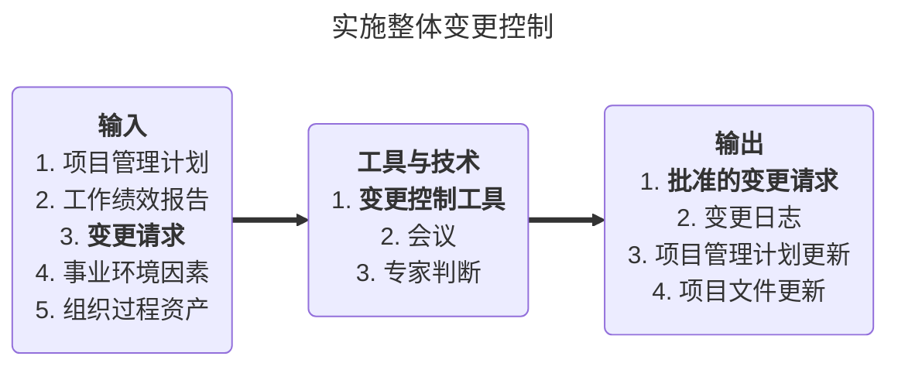
- 变更请求：项目的任何干系人都可以提出变更请求。尽管也可以口头提出，但所有变更请求都必须以**正式书面形式**记录，并纳入变更管理或配置管理系统中。

- **项目变更控制委员会（CCB）是决策机构，不是作业机构**。通常，CCB的工作是通过平审手段来决定项目是否变更，但不提出变更方案。（CCB只能有一个）

- 项目经理的作用：**响应**变更提出者的要求，**评估**变更对项目的影响及应对方案，要求由技术要求转化为资源需求，供授权人决策；依据评审结果实施即调整项目基准，确保项目基准反映项目实施情况。

- **配置**控制重点**关注**可交付成果及各个过程的**技术规范**，而变更控制则着眼于识别、记录、批准或否决对项目文件、可交付成果或基准的变更。

- 部分配置管理活动如下：

  - 配置识别
  - 配置状态记录
  - 配置核实与审计

- 项目变更是指在信息系统项目的实施过程中，由于项目环境或者其他原因而对项目产品的功能、性能、架构、技术指标、集成方法、项目的范围基准、进度基准和成本基准等方面做出的改变。常见的引发变更请求的原因如下：

  | 含义                                                         | 举例                                               |
  | ------------------------------------------------------------ | -------------------------------------------------- |
  | 一个外部事件An external event                                | 市场环境变化，因为竞争对手举动引发的变更           |
  | 产品范围（Product scope）定义的一个过失或者疏忽（error/omission） | 软件需求分析时，对某个模块定义不清楚               |
  | 项目范围（Project scope）定义的过失或者疏忽（error/omission） | 原来考虑的项目实施方法，遇到技术问题，不能如期执行 |
  | 一个有增加值（value-adding change）的变更                    | 市场研发出了新的材料，可以替代原来材料，而且成本低 |
  | 应对风险的紧急计划或回避计划（contingency plan or workaround plan） | 由于发生特定风险，需要调整项目计划                 |

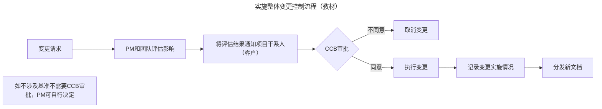


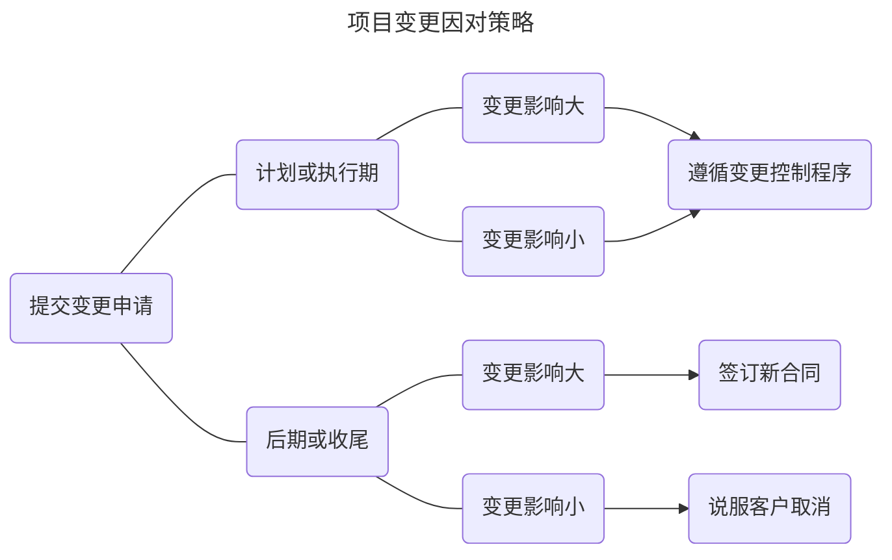


### 4.7 结束项目或阶段

- 结束项目或阶段是完成并结束所有项目管理过程组的所有活动，以正式结束项目或项目阶段的过程。
- 本过程的主要作用：
  1. 总结经验教训
  2. 正式结束项目工作
  3. 为行展新元作而释放组织资源
- 结束阶段的主要管理内容是**收尾管理**。

- **行政收尾**（管理收尾）

  - 当项目结束后或项目提前终止时，又或项目每个阶段结束时需要开展行政收尾工作。**行政收尾**主要工作包括：
    1. 产品核实。确认全部工作都按项目产品的既定要求完成了。
    2. 财务收尾。支付最后的项目款项，完成财务结算。
    3.  更新项目记录。完成最终的项目绩效报告和项目团队成员的业绩记录。
    4. 总结经验教训。进行项目完工后评价。
    5. 进行组织过程资产更新。收集、整理和归档各种项目资料。
    6. 结束项目干系人在项目上的关系，解散项目团队。

  - 项目行政收尾产生的结果如下：（经验、教训、文档）
    1. 对项目产品的正式接受；
    2. 完整的项目档案；
    3. 组织过程资产更新（经验教训总结）；
    4. 资源释放（包括人力和非人力资源）。
  - 项目总结属于管理收尾（行政收尾），就是检查项目团队成员及相关干系人是否按规定履行了所有责任。实施行政结尾过程还包括收集项目记录、分析项目成败、收集应吸取的教训，以及将项目信息存档供本组织将来使用等活动统一为一个整体。
  - 管理收尾包括下面提到的按部就班的行动和活动：
    1. 确认项目或者阶段已满足所有赞助者、客户，以及其他项目干系人需求的行动和活动。
    2. 确认已满足项目阶段或者整个项目的完成标准，或者确认项目阶段或者整个项目的退出标准的行动和活动。
    3. 当需要时，把项目产品或者服务转移到下一个阶段，或者移交到生产或运作的行动和活动。
    4. 活动需要收集项目或者项目阶段记录、检查项目成功或者失败、收集教训、归档项目信息，以方便组织未来的项目管理。

- 合同收尾

  结束项目或阶段过程中，还要一个结束采购过程，旨在进行合同收尾。合同收尾是指结束合同工作，进行采购审计，结束当事人之间的合同关系，并将有关资料收集归档。

- 行政收尾与合同收尾既有联系又有区别。

  - **联系**在于：都需要进行产品核实，都需要总结经验教训，对相关资料进行整理和归档，更新组织过程资产。
  - **区别**在于：
    1. 行政收尾是针对项目和项目各阶段的，不仅整个项目要进行一次行政收尾，而且**每个项目阶段结束时**都要进行相应的行政收尾；而合同收尾是针对合同的，**每一个合同需要而且只需要进行一次合同收尾**。
    2. 从整个项目说，**合同收尾发生在行政收尾之前**；如果是以合同形式进行的项目，在收尾阶段，先要进行采购审计和合同收尾，然后进行行政收尾。
    3. 行政收尾要由项**目发起人或高级项目管理层**给项目经理签发项目阶段结束或项目整体结束的书面确认，而合同收尾则要由负责采购管理成员（可能是项目经理或其他人）向卖方签发合同结束的书面确认。

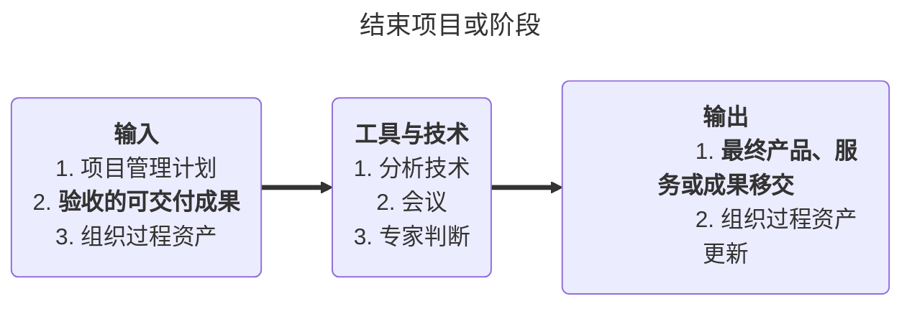


>- 虚拟项目小组：不在同一地方办公，为同一项目工作

## 五、项目范围管理

> 项目范围管理：
>
> - 产品范围
> - 项目范围（狭义）
>
> **一谋五求**：
>
>  1.  规划范围管理：谋 行动方案
>
>  2.  收集需求：求全
>
>  3.  定义范围：求细
>
>  4.  创建WBS：求分
>
>  5.  确认范围：求果
>
>  6.  控制范围：求控
>
>      1-4 规划过程组
>
>      5-6 监控过程组

### 5.1 项目范围管理概述

- 项目管理的难点：

  - 对项目进行监控，确保所有该做的工作都做了。
  - 监控项目工作，防止发生范围潜变（Scope Creep）
  - 确定什么是项目之内的，什么是项目之外的。**做且只做**范围内的事

- 项目范围包括两方面含义：

  1. **项目产品范围**：

     项目产品范围：包含产品规格、性能技术指标的描述，即产品所包含的特征和具体的功能性能情况等。随着项目的开展，其产品特征会逐渐细化。**是否完成：由性能指标/产品要求衡量**。

  2. **项目范围**：

     为了完成具有所规定特征和功能的产品和服务必须完成的工作。**是否完成：由项目管理计划衡量**

  - **产品范围以用户需求为导向，项目范围以产品范围为导向**。
  - **产品范围决定项目范围，项目范围服务于产品范围**。
  - **先确定产品范围，再确定项目范围**。
  - **产品范围主要由发起人和客户决定，项目范围由项目经理和项目管理团队决定**。
  - **产品范围变化可能引起项目范围变化，但不一定绝对引起变化**。

### 5.2 规划范围管理

- 规划范围管理是编制**范围管理计划**，书面描述将如何定义、确认和控制范围的过程其主要作用是在整个项目中对如何管理范围**提供指南和方向**。
- **范围的确定是逐渐进行的**，从最初对于项目最终交付成果的概念，到在项目发展中对于交付成果越来越细节描述的文件，逐步深入。
- **项目应该交付所有在项目范围内所描述的内容**。范围内不包括的任何工作都不应该在项目中开展（**反对镀金，镀金指做了项目之外的工作**）。项目范围的确定与管理直接关系到项目的整体成功。
- 对项目经理而言，项目范围计划和软件规模的控制既是技术工作的一部分，也是管理工作的一部分。

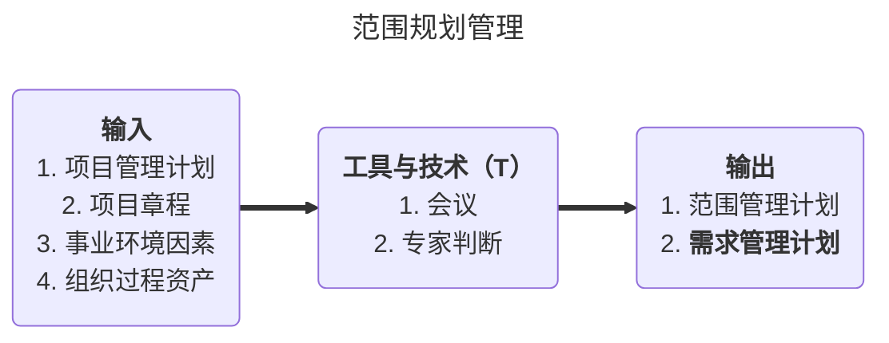

- 输出：范围管理计划
  - 项目范围管理计划是项目或项目集管理计划的组成部分，描述了如何定义、制定、监督、控制和确认项目范围。根据具体项目的实际情况，**项目范围管理计划可以是正式的或非正式的、详细的或粗略的**。
  - 项目范围管理计划的内容有：
    1. 根据项目初步范围说明书编制详细项目范围说明书的一个过程；（范围定义）
    2. 能够根据详细的项目范围说明书制作工作分解结构，并确定如何维持与批准该工作分解结构的一个过程；（范围分解）
    3. 规定如何正式核实与验收项目已完成可交付成果的一个过程；（确认范围）
    4. 控制详细项目范围说明书变更请求处理方式的一个过程。该过程同整体变更控制过程有直接联系。（范围控制）
- 输出：**需求管理计划**
  - 需求管理计划：是项目管理计划的组成部分，描述了如何分析、记录和管理需求，以及阶段与阶段间的关系对管理需求的影响。需求管理计划等许多内容都是以阶段关系为基础的。
  - **主要内容**至少包括：🌟🌟🌟（出过简答题）
    1. 如何规划、跟踪和报告各种需求活动；
    2. 配置管理活动，如：如何启动产品变更，如何分析其影响，如何进行追溯、跟踪和报告，以及变更审批权限；
    3. **需求优先级排序过程**；
    4. 产品测量指标及使用这些指标的理由；
    5. 用来反映哪些需求属性将被列入跟踪矩阵的跟踪结构；
    6. 收集需求过程。

### 5.3 收集需求

- 收集需求：为实现项目目标而确定、记录并管理干系人的需要和需求的过程。
- 本过程的主要作用是为定义和管理项目范围（包括产品范围）奠定基础。

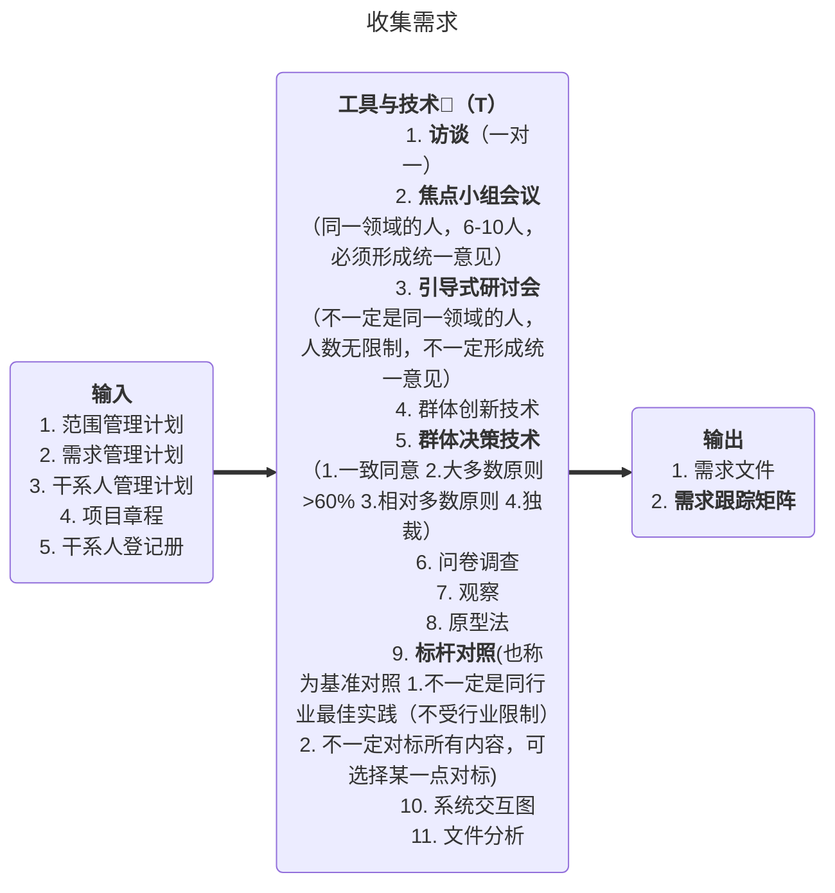

- **QFD-目标优化矩阵**（了解）

  **质量功能展开**是采用一定的规范化方法将顾客所需特性转化为一系列工程特性。所用的基本工具是“质量屋”

  将纵轴上的项目依次与横轴上的项目对比，相对重要填1，相对不重要则填0；最后将数字相加，根据合计的数值进行优先排序。

- **群体创新技术（必考）**🌟🌟🌟

  1. 头脑风暴法

     **适用于前期的信息收集**。召集相关人员，发表各自意见，面对面（实名），自由联想和讨论。

  2. 德尔菲技术（delphi）

     强调**匿名**与**风险识别**。是专家法的一种，强调多次有控制的反馈，达成一致的结果结束。

     背对背（匿名），适用于后期评审

- 输出：

  - **需求跟踪矩阵**

    需求跟踪矩阵是记录每一个具体需求与高层目标之间的对应关系、以及与WBS可交付成果及相关技术要求之间的对应关系的表格。

  - 需求文件

    - 需求文件描述各种单一需求将如何满足与项目相关的业务需求。一开始，可能只有高层级的需求。然后随着有关需求信息的增加而逐步细化。
    - 只有明确的（可测量和可测试的）、可跟踪的、完整的、相互协调的，且主要干系人愿意认可的需求，才能作为基准。
    - 即可以是一份按干系人和优先级分类列出全部需求的简单文件，也可以是一份包括内容提要、细节描述和附件等的详细文件。 

    **需求文件内容**🌟：(简答背，选择对应)
    1. **业务需求**，包括：可跟踪的业务目标和项目目标、执行组织的业务规则、组织的指导原则；
    2. **干系人需求**，包括：对组织其他领域的影响、对执行组织内部或外部团体的影响、干系人对沟通和报告的需求；
    3. **解决方案需求**，包括：功能和非功能需求、技术和标准合规性需求、支持和培湖的需求、质量需求、报告需求（可用文本记录或用模型展示解决方案需求）
    4. **项目需求**，如：服务水平、绩效、安全和合规性，以及验收标准。
    5. **过渡需求**：从当前状态过渡到将来状态所需的临时能力，如数据转换和培训需求
    6. **与需求相关的假设条件、依赖关系和制约因素**。

### 5.4 定义范围

- 定义范围：**详细**描述产品范围和项目范围，编制项目范围说明书，作为以后项目决策的基础。定义范围最重要的任务就是详细定义项目的**范围边界**，范围边界是应该做的工作和不需要进行的工作分界线。
- 定义范围是根据范围规划过程定义的范围管理计划，采取一定的方法，逐步得到精确的项目范围。
- 与范围要素相关联的质量、时间、成本。它们**相互影响、相互牵制**。

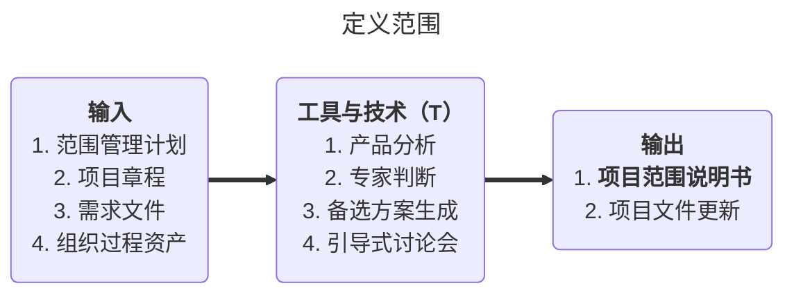

- 定义范围的典型工具

  1. 产品分析：🌟

     - 旨在弄清产品范围，并把对产品的要求转化成项目的要求。将项目目标变成有形的可交付成果和要求说明书。

     - **产品分析包括诸如产品分解、系统分析、系统工程、价值工程、价值分析和功能/需求分析等技术**🌟。

- **项目范围说明书**：（常考简答）

  - **内容**包括：🌟🌟
    1. **项目目标**
    2. 产品范围描述
    3. 项目需求
    4. 项目边界
    5. 项目可交付成果
    6. 制约因素
    7. 假设条件
  - 项目范围说明书**详细描述**项目的**可交付成果**，以及为提交这些可交付成果而必须**开展的工作**。

### 5.5 创建WBS

- 分解就是把项目可交付成果划分为更小的、更便干管理的组成部分，直到工作和可交付成果被定义到工作包的层次。工作包是工作分解结构的底层，是能够可靠地估算和管理工作成本和活动持续时间的位置。
- 工作包的详细程度因项目大小与复杂程度而异。
- **工作分解结构**( Work Breakdown Structure，WBS）是一种为了便于管理和控制而将项目工作任务分解的技术。
- 工作分解结构**面向可交付物**的项目元素进行层次分解，详细描述了项目所要完成的工作。
- **WBS的最低层次元素是能够被评估的、安排进度的和被跟踪的**。它是组织管理工作的主要依据。
- WBS的最底层工作单元被称为**工作包**，它易定义范围、规格、估算费用、时间、进度安排的基础。

- 意义：（理解，做选择题）
  1. 通过工作结构分解，把项目范围分解开来，使项目相关人员对项目一目了然，能够使项目的概况和组成明确、清晰、透明和具体。
  2. 保证了项目结构的**系统性和完整性**。
  3. 通过工作结构分解，可以建立完整的**项目保证体系**。
  4. 明确项目相关各方的工作界面，便于**责任划分**和落实。
  5. 最终工作分解结构，可以直接作为**进度计划和控制**的工具。
  6. 为建立项目**沟通管理**提供依据，便于把握信息重点。
  7. 是项目各分计划和控制措施制定的基础和主要依据。
  8. 有助于防止需求和范围蔓延。
- 用途：
  1. WBS确定了**项目**整个范围（而非产品范围），并将其有条理地、分层次地组织在一起。通过WBS，项目工作被分解为较小和更加容易管理的多项工作，而每下降一个层次意味着对其进行了更详尽地说明。
  2. 属于工作分解结构底层组成部分的计划工作叫做“工作细目〞，可以安排在进度表中，用来估算费用，进行监视和控制。WBS是当前批准的项目范围说明书规定的工作。

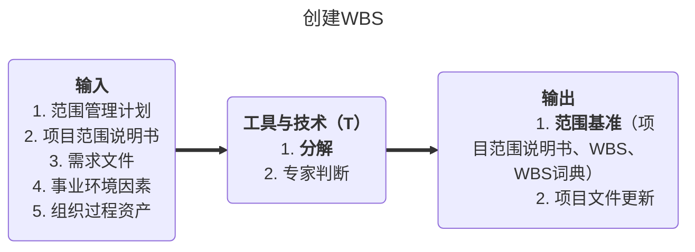


- 分解的目的：便于控制

  要把整个项目分解为工作包，通常要开展以下活动（可能出排序题）

  1. 识别可交付成果和工作
  2. 确定分解结构
  3. 将上层分解为下层
  4. 分配标识号
  5. 核实工作的分解的程度是否必要而又足够

  不能分解：很远的将来要完成的成果

- **在进行项目工作分解的时候，一般遵从以下几个主要步骤**：（可能吃排序题）

  1. **识别**和确认项目的阶段和主要可交付物。
  2. **分解**并确认每一组成部分是否分解得足够详细。
  3.  **确认**项目主要交付成果的组成要素。
  4. **核实**分解的正确性。

- WBS分解原则：

  1. 100%原则（凡是出现在WBS中的工作都属于项目的范围，凡是没有出现在WBS中的工作都不属于项目的范围，要想完成这样的工作 ，必须遵守变更控制流程）
  2. 同层同原则
  3. 4-6层原则
  4. 80小时原则
  5. 重要干系人参与原则
  6. 滚动式规划原则
  
- 常见的WBS结构

  | 形式 | 树形结构                 | 文本/表格形式        |
  | ---- | ------------------------ | -------------------- |
  | 优点 | 层次清晰、直观、结构性强 | 能反映所有工作       |
  | 缺点 | 不容易被修改             | 直观性查             |
  | 范围 | **适用中小项目**🌟        | 适用大项目或复杂项目 |

- 分解的形式：

  - 把**项目生命周期**的各阶段作为分解的第一层，把产品和项目可交付成果放在第二层；
  - 把主要**可交付成果**作为分解的第一层；
  - 按**子项目**进行第一层分解。子项目（如外包工作）可能由项目团队之外的组织实施。然后，作为外包工作的一部分，卖方需编制相应的合同工作分解结构。

- 控制账户CA：

  - 控制账户简称CA，是一种**管理控制点**，是工作包的规划基础。
  - 在该控制点上，把范围、成本和进度加以整合，并把它们与**挣值**相比较，以测量绩效。
  - 控制账户设置在工作分解结构中的特定管理节点上。每一个控制账户都**可以包括一个或多个工作包**，但是**每一个工作包只能属于一个控制账户**。

- WBS字典：

  是对WBS的详细描述（工作描述、假设与制约、负责租住、里程碑、成本、验收标准、参考文献等），与WBS成对出现

- 分解的结构
  - 风险分解结构（RBS）：以层次结构的方式对已识别的风险进行组织，通常是按照风险类别进行划分的。
  - 物料清单（BOM）：描述了生产一个产品所需的实际部件、组件和构件的分级层次表格。
  - 组织分解结构（OBS）：描述了执行组织的层次结构，以便把工作包同执行组织单元相关联。
  - 涉及到成员（人员）：自然是选择组织分解结构OBS。
  - 资源分解结构（RBS）：是另一种层次结构图，它用来分解项目中各种类型的资源,可以作为组织机构图与职位描述的一种方式。

### 5.6 确认范围

- 确认范围是**正式验收**项目品完成的可交付成果的过程。
- 本过程的主要作用是，使验收过程具有客观性；同时通过验收每个可交付成果，提高最终产品、服务或成果获得验收的可能性。
- 确认范围包括与**客户或发起人**一起审查可交付成果，确保可交付成果已圆满完成，并获得客户或发起人的**正式验收**。

- 可能出现的问题：

  - 目标不明确（缺乏范围基准）

  - 范围特别大、特别广（没有对范围仅限阶段式的评审和确认 ）

  - 缺少用户参与、项目干系人不承认（沟通问题）

    **质量控制一般先于范围核实进行，当然也可并行执行。**🌟

    **质量控制**：可交付成果的**正确性**

    **范围确认**：可交付成果的**可接受性**

​	

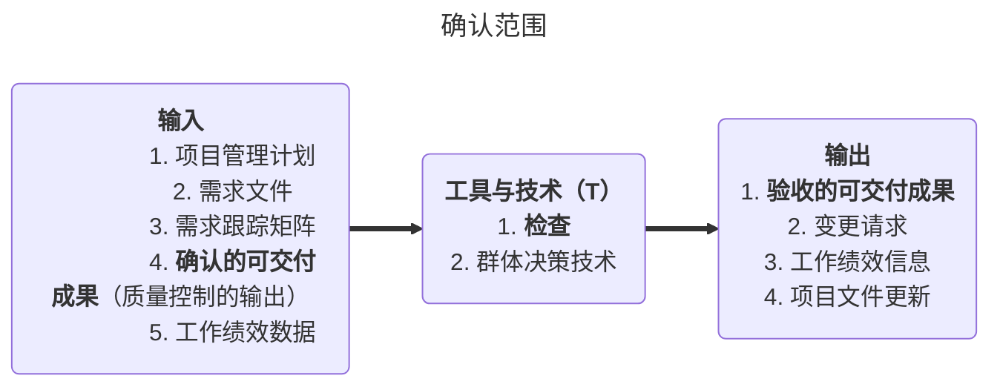


- 为了能使项目范围得以正式认可，项目团队必须形成明确的正式文件，说明项目产品及其评估程序，以评估是否正确和满意地完成了项目产品。
- IT项目范围确认的步骤：🌟🌟🌟
  1. 确定需要进行范围确认的时间
  2. 识别范围确认需要哪些投入
  3. **确定范围正式被接受的标准和要素**
  4. 确定范围确认会议的组织步骤
  5. 组织范围确认会议

- 项目干系人进行确认范围时，一般需要检查以下6个方面的问题：

  1. 可交付成果是否确实的、可确认的或者是可核实的；
  2. 每个交付成果是否有明确的里程碑，里程碑是否明确可辦别的。例如客户的书面认可书等：
  3. 是否有明确的质量标准；
  4. 审核或承诺是否表达清晰；
  5. 顶目范围是否覆盖了需要完成的产品或服务进行的所有活动：
  6. 项目范围的风险发生概率，管理层是否能够降低可预见性的风险对项目的影响。

- 分解中的8个注意点：

  1. WBS 必须是**面向可交付成果**的。
  2. WBS 必须**符合项目的范围**。
  3. WBS 的底层应该支持计划和控制
  4. WBS 中的元素必须有人负责，而且只由**一个人负责**，尽管实际上可能需要**多个人参与**。
  5. WBS 的指导，WBS 应控制在 **4一6层**。
  6. WBS 应包括项目管理工作（因为管理是项目具体工作的一部分），也要**包括分包出去的工作**。
  7. WBS 的编制需要**所有（主要）项目干系人**的参与，需要项目团队成员的参与。
  8. WBS 并非是一成不变的。在完成了 WBS 之后的工作中，仍然有**可能**需要对 WBS 进行**修改**。

- **可交付成果的演变**：🌟🌟🌟

  

### 5.7 控制范围

> 涉及**监督、监控、调整、调节**都与监控过程组有关系

- 控制范围是监督项目和产品的范围状态、管理范围基准变更的过程。
- 对项目范围进行控制，就必须确保所有请求的变更、推荐的纠正措施或预防措施都经过**实施整体变更控制**过程的处理。
- 末得到控制的变更通常被称为**项目范围蔓延**。
- 项目范围控制关心的是**对造成项目范围变更的因素施加影响**，并控制这些变更造成的后果。
- 范围控制确保所有请求的变更与推荐的纠正，通过项目**整体变更控制过程**进行处理。

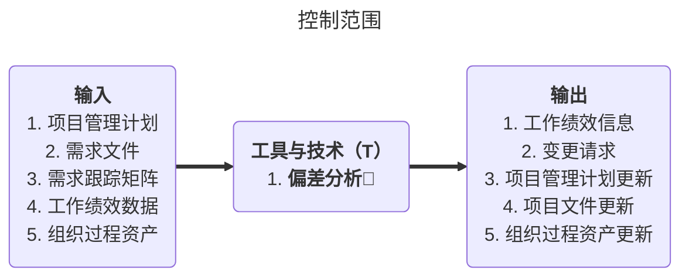

> 案例题偏差步骤：识别偏差 -> 分析偏差 -> 纠正偏差

- **项目范围控制**是指当项目范围变化时对其采取纠正措施的过程，以及为使项目朝着目标方向发展而对项目范围进行调整的过程。

- **进行项目范围控制时，需要重点考虑以下几个方面**：

  - 范围控制是必须的，世界上不存在没有变化的I项目。
  - 项目范围变化，并不仅仅意味着工作量的增加。
  - 项目范围控制的目的不是阻止变更的发生。
  - 积极地、主动地进行项目范围管理，使变更朝着有利于项目顺利完成的方向发展。

  > 如何进行范围控制：
  >
  > 1. 邀请各方干系人参与，形成共识化的范围基准
  > 2. 动态监测项目绩效
  > 3. 识别项目范围偏差
  > 4. 分析范围偏差产生的原因
  > 5. 采取纠正措施
  > 6. 如果有必要，发起范围变更，走整体范围变更控制流程
  > 7. 如果得到批准，调整范围，实施已批准的变更
  > 8. 做好配置管理工作（变更与配置管理成对出现）

- 氛围变更控制的要点：

  - 确定范围变更是否已经发生；
  - 对造成范围变更的因素施加影响，以确保这些变更得到一致的认可；
  - 当范围变更发生时，对实际的变更进行管理

- 范围蔓延（Scope Creeping）

  - 在客户的要求下，没有经过正常的范围变更控制批准程序，而直接扩大了项目范围定义的工作内容。（没有进过变更流程的变更）

- 镀金（Gold Plating）（镀金的项目就是不成功的项目）

  - 指在范围定义的工作范围以外，项目团队主动增加的额外工作。

### 5.8 真题

> WBS 常用于**团队内部**，只包含项目范围，而**项目范围说明书**包含项目范围与产品范围，**产品说明书**在项目后才有。
>
> WBS的元素**只能有一个**负责人
>
> 基线就是**基准**，范围基准是经过批准的范围说明书、**工作分解结构**（WBS）和相应的**WBS词典**，只有通过正式的变更控制程序才能进行变更，它被用作比较的基础。
>
> WBS 不是某个项目团队成员的责任，应该由全体项目团队成员、用户和项目干系人共同完成和一致确认。

## 六、项目进度管理

> **一谋四备两反复**
>
> **谋**： 规划进度管理
>
> **四备**：
>
> 1. 定义活动 **一备定义出清单**（1.活动清单 2.里程碑清单）
> 1. 排列活动顺序 **二备排序出路线**
> 1. 估算活动资源 **三备资源出参数**
> 1. 估算活动持续时间 **四备历时出长短**
>
> **两反复**：
>
> 1. 反复进行进度计划的制定和更新
> 1. 反复进行进度控制的优化

### 6.1 规划进度管理

- 规划进度管理是为实施项目进度管理制定政策、程序、并形成文档化的项目进度计划的过程。
- 本过程的主要作用是，为如何在整个项目过程中管理、执行和控制项目进度提供指南和方向。

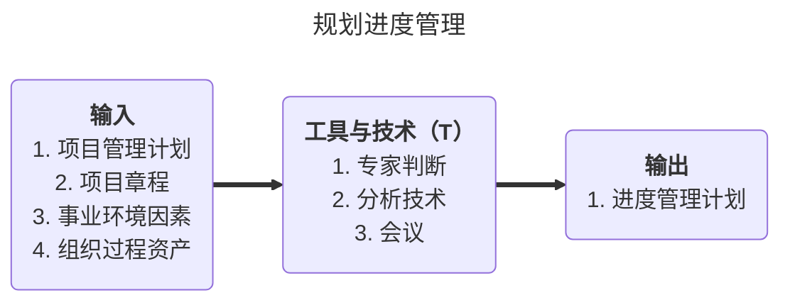


- 项目进度管理计划
  - 项目进度管理计划是**项目管理计划**的组成部分，为编制、监督和控制项目进度建立佳则和明确活动。
  - 根据项目需要，进度管理计划可以是正式或非正式的，非常详细或高度概括的，其中应包括合适的**控制临界值**。（在需要采取措施前，允许出现的最大偏差，**用于监督进度绩效**）

### 6.2 定义活动

- 定义活动是识别为完成项目可交付成果而需采取的具体行动的过程。创建工作分解结构过程已经识别出工作分解结构（**WBS**）中底层的可交付成果，即工作包。
- 项目**工作包**通常还应进一步**细分为**更小的组成部分，即**活动**——为完成工作包而必须开展的工作。活动是开展估算、编制进度计划以及执行和监控项目工作的基础。

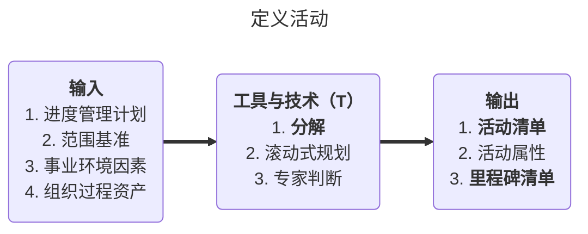


> 分解出现两次 1. 创建WBS，输出范围基准 2. 定义活动
>
> 活动清单与活动属性成对出现（类似于WBS与WBS字典）

- **活动属性**包含：

  - **活动标志**：
  - 活动编号：
  - 活动名称：
  - **先行活动**：
  - **后续活动**：
  - 逻辑关系：
  - 提前或滞后：
  - 资源要求：
  - 强制日期：
  - 制约因素：
  - 假设：
  - **执行人**：
  - ……

  **活动属性不包含成本**🌟


### 6.3 排列活动顺序

- 排列活动顺序是识别和记录项目活动间**逻辑关系**的过程。本过程的主要作用是，定义工作之间的逻辑顺序，以便在既定的所有项目制约因素下获得最高的效率。

- 活动按逻辑关系排序。除了**首尾两项，每项活动和每个里程碑都至少有一项紧前活动和一项紧后活动**。

- 为了使项目进度计划现实、可行，可能需要在活动间加入时间**提前量**或**滞后量**。

- 要想制定出切实可行的进度计划，必须准确、合理地安排并确定项目各项活动的先后顺序，并依据这些顺序排列所生成的各条活动路径构成**项目活动网络**。

- 提前量

  是相对于紧前活动，紧后活动可以提前的时间量。指以紧前活动的完成或开始时间为基点，紧后活动的开始或完成可以提前的时间。例如，在紧前活动完成前3天，紧后活动就可以开始，用公式表示：FS-3天。

- 滞后量

  是相对于紧前活动，紧后活动需要推迟的时间量。或者说，是指以紧前活动的完成或开始时间为基点，紧后活动的开始或完成必须推迟的时间。例如，在紧前活动完成后3 天，紧后活动才能开始，用公式表示：FS+3天。

- 四种逻辑关系：

  1. 紧前活动完成后，紧后活动才能开始：FS
  2. 紧前活动开始后，紧后活动才能开始：SS
  3. 紧前活动完成后，紧后活动才能完成：FF
  4. 紧前活动开始后，紧后活动才能完成：SF

  

- 三种依赖关系：
  1. 硬逻辑（强制性依赖关系）：先有竖向支撑体系，再有横向受力体系
  2. 外部逻辑：依赖于其他因素，如只有天气合适才能滑雪
  3. 软逻辑（自由依赖/选择性依赖）：可以先高尔夫再游泳，反正也可行

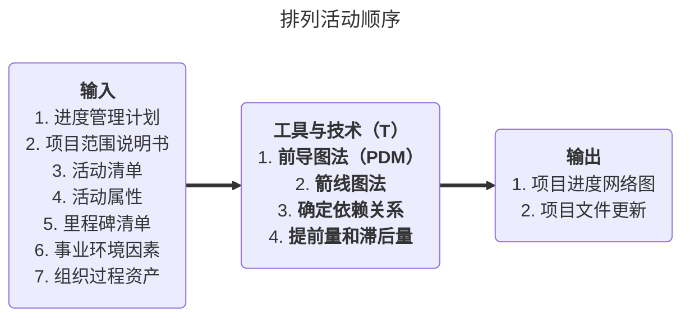

- 活动排序工具与技术
  1. **前导图PDM**/ **紧前关系绘图法**(**单代号网络图**)/**活动节点表示法**/**单优号网络图(AON)**
     是一种用方格或矩形(叫做节点)表示活动，并用表示依赖关系的箭线连接节点构成项目进度网络图的绘制法。
  
     绘制前导图时，需要遵守下列**规则**
  
     - 前导图心须正确表达项目中活动之间够逻辑关系。
     - 在图中不能够出现循环回路。
     - 在图中不能出现双向箭头或无箭头的连线。
     - 图中不能出现无箭尾节点的箭线或无箭头节点的箭线。
     - 图中只能有一个起始节点和一个终止节点。
     - 没有虚线
  
     特点：
  
     - **单代号、AON**
     - **清楚表达4种逻辑关系**
     - **信息量大**
  
  2. 箭线图法（ADM)
     ADM法是—种用箭线表示活动、节点表示活动排序的网络图方法。箭线的箭尾节点和箭头节点是该项活动的起点和终点。
  
     依据是否需消耗时间或资源，可将活动分为**实活动**或**虚活动**。
  
     特点：
  
     - **双代号、AOA**
     - **只有F-S表达的清楚**（强制性依赖关系）
     - **有虚活动**
  
     **虚活动**( dummy activity)：
  
     - 虚线表示，无实际意义，仅代表逻辑关系，耗时为0
     - 为了绘图的方便，人们引入了一种额外的、特殊的活动。
       由于它既**不消耗时间，也不消耗资源**，仅**仅表示工作的优先次序**，所以被称为“虚
       活动〞，主要用在双代号网络图中。借助虚活动，我们可以更好地、更清楚地表达
       活动之间的关系。
  
  3. 条件绘图法CDM
  
     - 允许分支和回路
     - 与图形评車技术(GERT）共同使用
     - 强调决策检查点的引入（有是否）

### 6.4 估算活动资源

- 估算活动资源是估算每项活动所需材料、人员、设备或用品的种类和数量的过程。
- 本过程的主要作用：明确完成活动所需的资源种类、数量和特性，以便做出更准确的成本和持续时间估算。
- **估算活动资源**过程与**估算成本**过程紧密相关。

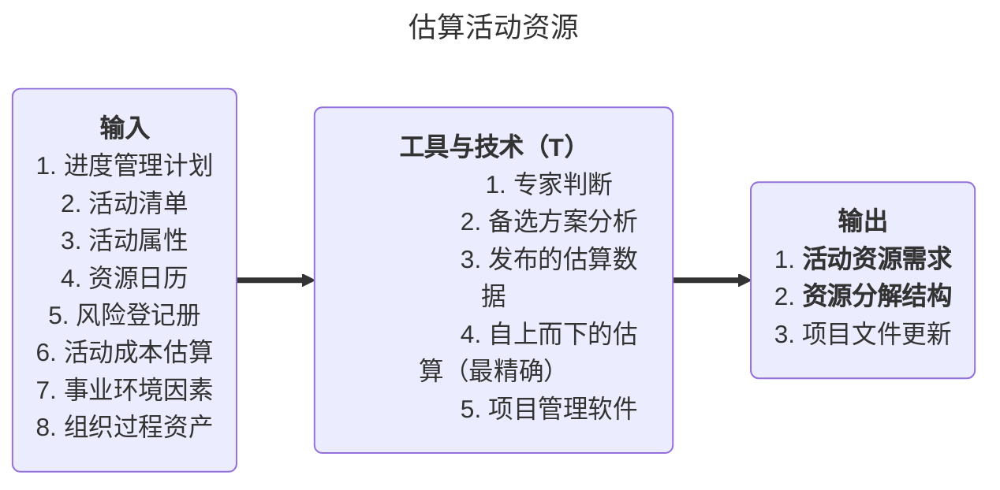

- 输入

  - **资源日历**

    每种具体资源的可用工作日或工作班次的日历。在估算资源需求情况时，需要了解在规划的活动期间，哪些资源（如人力资源、设备和材料）可用。资源日历规定了在项目期间特定的项目资源何时可用、可用多久。

- 输出

  - **活动资源需求**（WBS）明确了工作包中每个活动所需的资源类型和数量

  - **资源分解结构**（RBS）是资源依类别和类型的层级展现

    活动资源需求针对**活动**，资源分解结构针对**项目**

    活动资源需求供项目**团队内部**使用，项目分解结构供为项目提供的**职能部门**使用。

​		

### 6.5 估算活动持续时间

- 估算活动持续时间是根据资源估算的结果，估算完成单项活动所需工作时段数的过程。
- 需要依据活动工作范围、所需资源类型、所需资源数量以及资源日历等，进行活动持续时间估算。
- 应该由项目团队中**最熟悉具体活动的个人或小组**，来提供活动持续时间估算所需的各种输入。

```mermaid
---
title: 估算活动持续时间
---
flowchart LR
	in("
		<b>输入</b>
		1. 进度管理计划
		2. 活动清单
		3. 活动属性
		4. 活动资源需求
		5. 资源日历
		6. 项目范围说明书
		7. 风险等级手册
		8. 资源分解结构
		9. 事业环境因素
		10. 组织过程资产
	")
	==>
	center("
		<b>工具与技术（T）</b>🌟🌟
		1. 专家判断
		2. <b>类比估算</b>
		3. <b>参数估算</b>
		4. <b>三点估算</b>
		5. 群体决策技术
		6. 储备分析
	")
	==>
	out("
		<b>输出</b>
		1. 活动持续时间估算
		2. 项目文件更新
	")
```

- 工具与技术

  - **类比估算**：所知信息较少时，**自上而下**的估算。是根据已经完成的类似项目或活动的实际工期或成本，凭经验来主观估算即将开展的项目或活动所需的工期或成本。

  - **参数估算**：是基于已完成项目或活动的历史数据，在一个或多个自变量与一个因变量之问建立起某种定量的统计关系，再依据这种统计关系来预测因变量的值。常见的两种参数估算方法是回归分析和学习曲线。

  - 联系：可以在**信息不足**的时候用**类比**估算，待获得更多数据后，再用参数估算。

  - 区别：（类比看以往，参数用公式）

    1. 通常，类比估算在项目**启动阶段**和规划阶段**早期**使用，而参数估算则在规划阶段**中期**（可以获得自变量的数据时）使用。
    2. **类别估算**是凭经验进行的**主观估算**，**参数估算**是依据历史数据之间的统计关系而进行的**客观估算**。
    3. 类比估算比较方便、快捷，需要**较少数据**，但**准确性较低**。而参数估算则需要**大量历史数据**，比较费时费力，但**准确性较高**。

  - **三点估算**：（来自于计划评审技术：RERT分析，关注风险、完成概率），为以下三个时间的平均值。

    1. **最可能持续时间**。最可能持续时间是在为计划活动分派的资源、资源生产率、可供该计划活动使用的现实可能性，对于其他参与者的依赖性，以及可能的中断都已给定时，该计划活动的持续时间。
    2. **乐观持续时间**。当估算最可能续时间依据的条件形成最有利的组合时，估算出来的持续时间就是活动的乐观持续时间。
    3. **悲观持续时间**。当估算最可能持续时间依据的条件形成最不利的组合时，估算出来的持续时间就是活动的悲观持续时间。

    > 三角分布： 平均值 = (a1+a2+a3+...+an)/n
    >
    > **贝塔分布： 平均值𝜇 = (最可能*4 + 最乐观 + 最悲观)/6**
    >
    > 一般问题用贝塔分布计算
    >
    > **标准差𝛿 = (最悲观 - 最乐观)/6**
    >
    > 平均值为正态分布图的对称轴
    >
    > **68.26%**：**𝜇±𝛿**
    >
    > **95.46%**：**𝜇±2𝛿**
    >
    > **99.73%**：**𝜇±3𝛿**

### 6.6 制定进度计划

- 制定进度计划是分析活动顺序、持续时间、资源需求和进度约束，编制项目进度计划的过程。
- 编制可行的项目进度计划，往往是一个**反复**进行的过程。
- 这一过程旨在确定项目活动的计划开始日期与计划完成日期，并确定相应的里程碑。在得到批准后，该进度计划即成为**基准**，用来跟踪项目绩效。

```mermaid
---
title: 制定进度计划
---
flowchart LR
	in("
		<b>输入</b>
		1. 进度管理计划
		2. 活动清单
		3. 活动属性
		4. 项目进度网络图
		5. 活动资源需求
		6. 资源日历
		7. 活动历时估算
		8. 项目范围说明书
		9. 风险等级手册
		10. 项目人员分派
		11. 资源分解结构
		12. 事业环境因素
		13. 组织过程资产
	")
	==>
	center("
		<b>工具与技术（T）</b>🌟🌟
		1. 进度网络分析
		2. <b>关键路径法</b>
		3. <b>关键链法</b>
		4. <b>资源优化技术</b>
		5. 建模技术
		6. 提前量与滞后量
		7. <b>进度压缩</b>
		8. 进度计划编制工具
	")
	==>
	out("
		<b>输出</b>
		1. <b>进度基准</b>
		2. <b>项目进度计划</b>
		3. 进度数据
		4. 项目日历
		5. 项目管理计划更新
		6. 项目文件更新
	")
```

- 工具与技术

  - **关键路径与关键链**：关键路径不考虑资源限制问题，而关键链需要考虑资源限制。

  - **关键路径法CPM(Critical Path Method)**：

    - 不考虑任何资源限制的情况下，沿着项目进度网络路径进行**顺推与逆推分析**，计算出全部活动理论上的最早开始和完成日期、最迟开始和完成日期。
  
    - 关键路线：
      - 网络图中**最长工期的那条路线**，决定项目最短的完成时间
      - 在关键路径上的进度活动叫“关键活动”
  
    - 时间计算规则
  
      - **沿网络前推法来计算最早时间**：
  
        某一个活动的最早开始时间=指向它的所有前置活动的最早结束时间中的最大值（**正推取最大**）
        **EF=ES+T（作业时间）**
  
      - **沿网络倒序朝前法来计算最迟时间：**
  
      - 某一活动的最迟结束时间=它指向的所有后续活动的最迟开时间中的最小值（**逆推取最小**）
        **LS=LF-T（作业时间）**
  
      - 在任何网络路线上，进度灵活余地的大小由最早与最迟日期两者之间正的差值决定，该差值叫做“总时差〞。关键路线有零或负值总时差
      - **自由时差**：在没有延误任何后续活动的最早开始日期情况下，一项活动可以被推迟的时间
  
    - 步骤：
  
      1. 找关键路径TF=0
      2. 正推法算上面的三个参数
      3. 算关键路径上的关键活动
      4. 逆推法算自由节点其他参数
  
    - 关键路径的其他信息
      如果关键路径中的一个活动延迟了，就要采取正确地措施来处理，否则整个项目进度计划将被延迟。
  
    - 常使人迷惑的地方：
  
      1. 关键路径并不包括所有重要的活动，它只是考虑时间问题；
      2. 如果有两个或两个以上的路径长度一样，就可能有多个关键路径；(关键路径越多，风险越高)
      3. 关键路径可随项目的进展而改变。
  
    > ES:最早开始日期
    > EF:最早结束日期
    >
    > LS:最晚开始日期
    > LF:最晚结束日期
    >
    > DU:活动历时 = EF-ES = LF-LS=右-左
    >
    > TF:总时差=LS-ES=LF-EF=下-上（当TF=0时，活动在关键路径上）
    >
    > FF:自由时差，不影响后置活动的最早开始时间
    >
    > TF >= FF
    >
    > 相关公式：
    > EF=ES+DU
    > LS=LF-DU
    > ES=取最大值（前置活动的EF)
    > LF=取最小值（后续活动的LS）
  
  - 关键链法：
    **问题**：帕金森定律工作会自动地膨胀占满所有可用的时间。如果安排给一个任务的时间有富余，人们就会放慢节奏消耗掉所有富余时间。
  
    **解决**：最早开始法则，所有活动都越早越好，砍掉每个活动的安全时间，集中到路径未段就是准备项目缓冲
  
    - 接驳缓冲Feeding buffer
    - 项目缓冲Project buffer
    - 资源缓冲 Resource buffer
  
    **提出者**
  
    - 艾利.高德拉特(Eliyahu Goldratt)-物理学家-TOC制约理论
  
    关键链法是另一种进度网络分析技术，可以根据有限的**资源**对项目进度表进行调整。关键链法结合了**确定性与随机性办法**
  
    考虑资源约束的关键路径
    把缓冲时间放在路径或项目的末尾。
  
    
  
  - **资源优化技术**：
  
    1. 资源的**平滑**：强调不改变关键路径的情况下分配资源 
  
    2. 资源的**平衡**：通常会导致关键路径的改变，工期延长
  
       先平滑后平衡
  
- 选择不同的进度制定方法：

  

  > PERT 关注分险，关注完成概率

- **压缩工期的方法**（简答题🌟🌟🌟）

  1. **赶工**（必须掌握）

     Crashing：增大资源投入，用资源换时间，需要计算哪个最合适

     会带来人员疲惫，士气低落的风险

  2. **快速跟进法**（必须掌握）

     Fast tracking：改变活动逻辑关系（串行改并行），增大了项目风险（返工风险）

  3. 使用高素质的资源或经验更丰富的人员；

  4. 减小活动范围或降低活动要求；

  5. 改进方法或技术，以提高生产效率；

  6. 加强质量管理，及时发现问题，减少返工，从而缩短工期。

- **甘特图（Gantt chart）**

  - 甘特图通过日历形式列出项目活动及其相应的开始和日期，为反映项目进度信息提供了一种标准格式。
  - 甘特图的早期版本只是在左边的一栏中列出项目活动或任务、在右边的一栏中列出日历时间单位，人们形象地叫它为**横道图**。
  - 甘特图中的活动应该与WBS中的活动相一致。
  - 分类：
    - 详细进度计划一逻辑横道图，也叫进度网络图
    - 概括性进度计划一横道图，也叫甘特图
    -   里程碑计划一里程碑图


### 6.7 控制进度

- 对于项目进度控制工作，应明确一个基本思想：**计划的不变是相对的，变是绝对的**。
- 项目进度控制的关键是监控项目的实际进度，及时地将它与计划进度进行比较，采取必要的措施纠正偏差。
- **进度控制的内容主要包括**，确定进度是否发生变化，找出变化的原因，采取有效的措施纠正偏差；对影响进度变化的因素进行控制，从而确保变化朝着有利于项目目标实现的方向发展。

```mermaid
---
title: 控制进度
---
flowchart LR
	in("
		<b>输入</b>
		1. 项目管理计划
		2. 项目进度计划
		3. 工作绩效数据
		4. 项目日历
		5. 进度数据
		6. 组织过程资产
	")
	==>
	center("
		<b>工具与技术（T）</b>
		1. <b>绩效审查</b>
		2. 项目管理软件
		3. 资源优化技术
		4. 建模技术
		5. 提前量与滞后量
		6. 进度压缩
		7. 进度计划编制工具
	")
	==>
	out("
		<b>输出</b>
		1. 工作绩效信息
		2. 进度预测
		3. 变更请求
		4. 项目管理计划变更
		5. 项目文件更新
		6. 组织过程资产
	")
```

-  进度控制方法
  - 关键的干系人参与制定和一致认可项目进度计划，是计划**可用**的基础。
  - 建立现实的项目进度计划是计划**可行**的基础。
  - 项目经理清楚而如实地汇报项目的状态是计划**可控**的基础。
- **进度提前的变更方法**：（可能考案例简答题🌟）
  1. 分析进度，找出哪些地方需要采取纠正措施；
  2. 确定应采取哪种具体纠正措施；
  3. 修改进度计划，并将纠正措施列入计划；
  4. 重新计算进度，估计计划采取的纠正措施。
- **如何保证满足项目的进度要求**：(可能考案例简答题🌟)
  1. 进行计划的贯彻；
  2. 调整工作；
  3. 抓住关键路径；
  4. 提高资源利用率；
  5. 加强组织管理工作；
  6. 加强进度控制。


## 七、成本管理

> 一谋 制定成本管理计划
>
> 二估 成本估算
>
> 三定 成本预算
>
> 四控 成本控制

- 项目成本概念及其构成：
  - 在项目中，成本是指项目活动或其组成部分的货币价值或价格，包括为实施、完成或创造该活动或其组成部分所需资源的货币价值。具体的成本一般包括**直接工时**、**其他直接费用**、**间接工时**、**其他间接费用**以及**采购价格**。


- 项目成本的定义：

  - 项目成本是指项目活动或其组成部分的货币价值或价格，包括为实施、完成或创造该活动或其组成部分所需资源的货币价值。

  - **沉没成本**：已付出的不可收回的成本，例如未中标项目的投标费用。


- 成本的类别；

| 名称         | 含义                                                         | 举例                                                         |
| ------------ | ------------------------------------------------------------ | ------------------------------------------------------------ |
| 直接成本     | 可以从项目上直接找到出处                                     | 团队差旅费、工资、项目使用的物料及设备使用费                 |
| 间接成本     | 多个项目分摊                                                 | 水费、房租、管理费用、税金、额外福利、保卫费用、公司为员工缴纳商业保险费 |
| 固定成本     | 不会随着产品生产数量而增加                                   | 计算机                                                       |
| 可变成本     | 随着生产产品的数量增加而增加                                 | 原材料                                                       |
| 不可控成本   | 项目经理不能直接控制                                         | 间接成本、固定成本、其他                                     |
| 生产周期成本 | 考虑整个生产生命周期成本                                     | 设计、生产、运维、处置                                       |
| 机会成本     | 应为选择一个项目而必须放弃另外一个项目，另外一个项目可以带来的收益 |                                                              |
| 可控成本     | 项目经理可以控制的                                           | 直接成本、可变成本                                           |

- 成本管理的定义：

  - 项目成本管理就是在整个项目的实施过程中，为确保项目在批准的预算条件下尽可能保质按期完成，而对所需的各个过程的**管理与控制**。

  - 项目经理必须确信他管理的项目有**恰当的定义**、**精确的时间和成本估算**、以及**他们参与同意的和切合实际的预算**。


### 7.1 制定成本管理计划

- 执行项目成本管理的第一个过程是由项目管理团队制订项目成本管理计划，该过程是编制项目整体管理计划过程的一部分。

  > **项目中所有的计划不是由项目经理一个人决定的，而是由PM组织团队成员制订。**

- ITO

  ```mermaid
  ---
  title: 制定成本管理计划
  ---
  flowchart LR
  	in("
  		<b>输入</b>
  		1. 项目管理计划
  		2. 项目章程
  		3. 事业环境因素
  		4. 组织过程资产
  	")
  	==>
  	center("
  		<b>工具与技术（T）</b>
  		1. 专家判读
  		2. 分析技术
  		3. 会议
  	")
  	==>
  	out("
  		<b>输出</b>
  		1. 成本管理计划
  	")
  ```

  

### 7.2 成本估算

- 成本估算包括识别和考虑各种成本计算方案。成本估算一般以货币单位表示，从而方便地在项目内和项目间比较，是针对完成活动所需资源的可能成本进行的量化评估。

- 在项目过程中，应该根据新近得到的更详细的信息，对成本估算进行优化。

- 在项目生命周期中，项目估算的**准确性**将随着项目的进展而**逐步提高**。因此，成本估算需要在各阶段反复进行。（成本估算是一个持续性的过程）🌟

- ITO

  ```mermaid
  ---
  title: 成本估算
  ---
  flowchart LR
  	in("
  		<b>输入</b>
  		1. 成本管理计划
  		2. 人力资源管理计划
  		3. 范围基准
  		4. 项目进度计划
  		5. 风险登记手册
  		6. 事业环境因素
  		7. 组织过程资产
  	")
  	==>
  	center("
  		<b>工具与技术（T）</b>
  		1. 专家判读
  		2. <b>类比估算</b>
  		3. <b>参数估算</b>
  		4. <b>自下而上估算（最精确）</b>
  		5. <b>三点估算</b>
  		6. <b>储备分析</b>
  		7. <b>质量成本</b>
  		8. 项目管理估算软件
  		9. <b>卖方投标分析</b>
  		10. 群体决策技术
  	")
  	==>
  	out("
  		<b>输出</b>
  		1. 活动成本估算
  		2. 估算依据
  		3. 项目文件更新
  	")
  ```

- 工具和技术：
  - **三点估算**：通过考虑估算中的不确定性与风险，使用3种估算值来界定活动成本的近似区间，可以提高活动成本估算的准确性。
  - **储备分析**：为应对成本的不确定性，成本估算中可以包括应急储备（有时称“应急费用〞）。费用应急储备的管理方法：
    1. 将相关的单个计划活动汇集成一组，并将这些计划活动的费用应急储备汇总起来，赋予到一项计划活动。
    2. 可以是关键链法中的一个缓冲活动，被有意地放置在那组进度活动的网络的未尾。
       单项目——应急储备（已知的未知）**是项目成本基准的一部分**（知道可能发生的风险，但是不知道风险发生的概率和影响范围）
       公司级——管理储备（未知的未知）项目成本之外的费用
  - 质量成本(COQ）：在估算活动成本时，可能要用到关于质量成本的各种假设。
  - 项目管理软件：如成本估算软件、计算机工作表、模拟和统计工具，被广泛用来进行成本估算。
  - 卖方投标分析：在成本估算过程中，可能需要根据合格卖方的投标情况，分析项目成本。在用竞争性招标选择卖方的项目中，项目团队需要开展额外的成本估算工作，以便审查各项可交付成果的价格，并计算出组成项目最终总成本的各分项成本。
  - 群体决策技术：基于团队的方法（如头脑风暴、德尔菲技术或名义小组技术）可以调动团队成员的参与，以提高估算的准确度，并提高对估算结果的责任感。
- **项目成本估算步骤**🌟（记住）
  1. 识别并分析成本的构成科目。
  2. 根据已识别的项目成本构成科目，估算每一科目的成本大小。
  3. 分析成本估算结果，找出各种可以相互替代的成本，协调各种成本之间的比例关系。

### 7.3 成本预算

- **项目成本预算是进行项目成本控制的基础**，它负责为项目活动分配预算，确定成本定额和项目总预算，规定项目不可预见费用的划分与使用规则等。

- **预算主要包括：直接人工费用预算、咨询服务费用预算、资源采购费用预算和不可预见费用预算。**

- **预算的主要依据包括：项目成本估算、工作分解结构和项目进度计划**。

- 成本预算是在成本估算的基础上，**更精确**地将其分摊到项目的**各项具体活动**和**具体项目阶段**上，以确立衡量项目绩效情况的总体**成本基准**。

- **成本预算的特征**

  - **计划性**：对WBS的每一种组成部分估算相应的成本形成预算。预算是另一种形式的项目计划。
  - **约束性**：预算是一种分配资源的计划，预算分配的结果可能并不能满足所涉及的管理人员的利益娶求，而表现为一种约束，所涉及人员只能在这种约束的范围内行动。
  - **控制性**：项目预算是一种控制机制。预算可以作为一种比较标准而使用，一种度量资源实际使用量和计划量之间差异的基线标准。

- **制定项目成本预算的步骤**：（选择排序题）

  1. 将项目总成本分摊到项目工作分解结构的各个工作包。分解按照自顶向下，根据占用资源数量多少而设置不同的分解权重。
  2. 将各个工作包成本再分配到该工作包所包含的各项活动上。
  3. 确定各项成本预算支出的时间计划及项目成本预算计划。

  项目的成本预算为衡量项目绩效情况提供了基准。

- 项目预算的原则：

  1. 要以项目需求为基础
  2. 要切实可行
  3. 要与项目目标相关联、必须同时考虑质量和进度
  4. 应该有弹性（留有余地）

- ITO

  ```mermaid
  ---
  title: 制定预算
  ---
  flowchart LR
  	in("
  		<b>输入</b>
  		1. 成本管理计划
  		2. 范围基准
  		3. 活动成本估算
      4. 估算依据
      5. 项目进度计划
      6. 资源日历
      7. 风险等级册
      8. 协议
      9. 组织过程资产
  	")
  	==>
  	center("
  		<b>工具与技术（T）</b>
  		1. <b>成本汇总🌟🌟</b>
  		2. 储备分析
  		3. 专家判断
  		4. 参数模型
  		5. <b>资金限制平衡</b>
  	")
  	==>
  	out("
  		<b>输出</b>
  		1. <b>成本基准</b>
  		2. <b>项目资金需求</b>（成本基准 + 管理储备）
  		3. 项目文件更新
  	")
  ```

  > 三个基准
  >
  > 1. 范围基准：创建WBS的输出
  > 2. 进度基准：创建进度计划
  > 3. 成本基准：制定预算

- 工具和技术

  - **成本汇总**：先把成本估算汇总到WBS中的工作包，再由工作包汇总至WBS更高层次（如控制账户），最终得出整个项目的总成本。
  - 储备分析：通过预算储备分析，可以计算出项目的应急储备和管理储备。
  - 专家判断：可对制定预算提供帮助。
  - 参数模型：有关变量之间可能存在一些可据以进行参数估算或类比估算的历史关系。可以**基于这些历史关系**，利用项目特征（参数）来建立数学模型，预测项目总成本。
  - **资金限制平衡**：应该根据对项目资金的任何限制，来平衡资金支持水平。这可以通过在项目进度计划中添加强制日期来实现。（与进度相匹配）

- 输出

  - **成本基准**：是经过批准且按时间段分配资金的**完工预算（BAC）**，用于测量、监督和控制项目的总体成本绩效。它是每个时间段的预算之和，通常用**S曲线**表示。

  - **项目资金需求**：根据成本基准，确定总资金需求和阶段性（如季度或年度）资金需求。

    成本基准中既包括预计的支出，也包括预计的债务。如果有管理储备，则**总资金需求**等于**成本基准加上管理储备**。

- **成本基准**

  - 项目成本基准是一个按时间分布的、用于测量和监控成本实施情况的预算，是**项目成本控制的基础**，它为成本控制过程提供有效的依据。通常，成本基准计划随时间的关系是一个S型曲线。
  - 许多项目，特别是大项目，可能有**多个成本基准**（或资源基准） 和消耗品生产基准，来度量项目绩效的不同方面。

- 不可预见费用

  - 不可预见费用是指为项目在实施过程中**发生意外而准备的保证金**，也就是在成本管理原理中提到的储备金。
  - 提高不可预见费用估计的准确性可以减轻项目中意外事件的影响程度。在IT项目实际过程中，不可预见费用的储备是非常必要的，特别是中、大型项目必须准备充足的不可预见费用。

  

  

### 7.4 成本控制

- 控制成本是监督项目状态以更新项目预算、**管理成本基准变更**的过程。更新预算需要记录截至目前的实际成本。只有经过实施整体变更控制过程的批准，才可以增加预算。

- 在成本控制中，应重点分析项目资金支出与相应完成的实体工作之间的关系。

- 项目成本控制必须与项目的其他控制过程紧密结合，防止单纯的控制项目成本而出现项目范围、进度、质量等方面的问题。

- **项目成本控制的主要内容包括**：🌟🌟🌟（考简答题）

  1. 对造成成本基准变更的因素施加影响；
  2. 确保所有变更请求都得到及时处理；
  3. 当变更实际发生时，管理这些变更；
  4. 保证潜在的成本超支不超过授权的项目阶段资金和总体资金；
  5. 监督成本执行（绩效），找出与成本基准的偏差；
  6. 对照资金支出，监督工作绩效；
  7. 防止在成本或资源使用报告中程序未经批准的变更：
  8. 就审定的变更，通知项目干系人；
  9. 采取措施，将预期的成本超支控制在可接受范围内。

- ITO

  ```mermaid
  ---
  title: 控制成本
  ---
  flowchart LR
  	in("
  		<b>输入</b>
  		1. 项目管理计划
  		2. 项目资金需求
  		3. 工作绩效数据
      4. 组织过程资产
  	")
  	==>
  	center("
  		<b>工具与技术（T）</b>
  		1. <b>挣值管理🌟🌟</b>
  		2. 预测
  		3. 完工尚需绩效指数
  		4. 绩效审查
  		5. 项目管理软件
  		6. 储备分析
  	")
  	==>
  	out("
  		<b>输出</b>
  		1. 工作绩效信息
  		2. 成本预测
  		3. 变更请求
  		4. 项目管理计划更新
  		5. 项目文件更新
  		6. 组织过程资产更新
  	")
  ```

- 工具和技术

  1. **挣值管理**：是把范围、进度和资源绩效家合起来考虑，以评估项目绩效和进展的方法。（！控制成本）
  2. 预测：随项目进展，项目团队可根据项目绩效，对完工估算（EAC）进行预测，预测的结果可能与完工预算（BAC ）存在差异。
  3. 完工尚需绩效指数（TCPI）：是一种为了实现特定的管理目标，剩余资源的使用必须达到的成本绩效指标，是完成剩余工作所需的成本与剩余预算之比。
  4. 绩效审查：其对象包括成本绩效随时间的变化、进度活动或工作包超出和低于预算的情况，以及完成工作所需的资金估算。
  5. 项目管理软件：常用于监测PV、EV、AC这三个指标，绘制趋势图，并预测最终项目结果的可能区间。
  6. 储备分析：在控制成本过程中，可以采用储备分析来监督项目中应急储备和管理储备的使用情况，从而判断是否还需要这些储备，或者是否需要增加额外的储备。

- **挣值分析法**🌟🌟🌟

  - 挣值分析法是一种项目绩效衡量方法，它综合了**范围、时间和成本数据**，主要用于实际成本的绩效测量。
  - 其基本思想是，通过测量和计算已完成的工作的**预算费用和实际费用以及计划工作的预算费用得到计划实施的进度和费用的偏差**，达到判断项目预算和进度计划执行情况的目的。
  - **挣值法三个基本参数**
    1. PV（计划价值）
       - 截止某时间点计划工作量的预算价值
       - 计划工作量-> 预算价值【计划做了多少】
    2. EV（挣值）
       - 截止某时间点实际工作量的预算价值
       - 实际工作量->预算价值【实际做了多少】
    3. AC（实际成本）
       - 截止某时间点实际工作量的实际成本
       - 实际工作量->实际价值【实际花了多少】
  - 项目成本偏差CV (Cost Variance)
    - **CV=EV-AC**
    - 如果CV>0，表示I项目实际成本在预算之内；如果CV=0，表示IT项目实际成本符合预算，如果CV<0，表示实际成本超出预算，对于超支的IT项目要及时采取措施。
    - 成本偏差百分比( CV%)：**CV%=CV/EV*100%**
  - 成本绩效指数CPI (Cost Performance Index)
    - **CPI=EV/AC**
    - 如果CPI>1，表示T项目实际成本低于预算；如果CPI=1，表示I项目实际成本符合预算；如果CPI<1， 表示实际成本超出预算，对于超支的IT项目要及时采取措施。
  - 项目进度偏差SV (Schedule Variance)
    - **SV=EV-PV**
    - 如果SV>0，表示I项目进度提前；如果SV=0，表示进度符合计划；如果SV<0，表示进度拖后，对于进度拖后的IT项目要及时采取措施。
    - 进度偏差百分比(SV%）：**SV%=SV/PV*100%**
  - 进度绩效指数SPI (Schedule Performance Index)
    - **SPI=EV/PV**
    - 如果SPI>1，表示T项目进度提前；如果SPI-1，表示进度符合计划；如果SPI<1，表示进度拖后，对于进度拖后的IT项目要及时采取措施。

- **挣值术语**

  - BAC= Budgeted Cost at Completion（完工预算）
    【全部预算成本，即完成整个项目的预算成本】
  - EAC=Estimate at Completion（完工估算）
    【全部预估的最终成本，即最新一次对完工总成本的估算】
  - ETC= Estimate to Completion(完工尚需估算）
    【要完成项目，还需要多少资金】
  - **BAC计划时产生的预算，是一直不变的；在计划时就可以有BAC了，执行时也有BAC，是作为比较基准的**；
  - **EAC根据实际进展预测的完工预算，不同时间和不同的情况会有不同的EAC。EAC 只有在开始执行后才有**。

- **完工估算(EAC）**：

  - 公式1:EAC=AC+ETC（实际支出+剩余工作的新估算）
    - 适用情况：过去的实施情况表明原来所作的估算彻底过时或条件变化原来估算不适合
    - **表示不可预测、也非例外只得重估未来剩余工作的ETC**
  - 公式2：EAC=AC+BAC-EV=BAC-CV（实际支出+剩余工作的预算BAC-EV）
    - 适用情况：目前的偏差被视为特例，且不会再次发生类似的偏差，BAC-EV是剩余预算
    -  **例外型-非典型性偏差（已有偏差是个例外，减掉即可）**
  - 公式3：EAC=AC+(BAC-EV)/CPI(实际支出+经实际成本绩效指数修改的剩余项目的预算）
    - 适用情况：将目前的偏差视为将来的典型形式来使用
    - **预测型-典型性偏差**
      **EAC=BAC/CPI**(使用成本绩效稳定，工作完成10%以上)

> PV：应该完成多少工作，（按照计划截止目前应该花费的预算）
> AC：完成工作的实际成本是多少（截止目前实际的花费）
> EV：完成了多少预算的工作（实际完成的工作，按照预算标准应该有的花费）以上三个指标是成本管理最基本的三个概念；
> BAC：全部工作的预算是多少（按照原计划，完成所有工作所需的预算成本）
> EAC：完工估算(全部工作的成本是多少？)它是根据项目的绩效和风险量化对项目最可能的总成本所做的一种预测。（根据截止目前的工作效率和工作方法，如果不采取任何措施，到完工时，需要花费的成本预算）
> ETC：完工尚需估算 剩余工作在当前的估算是多少？（截止目前，剩余工作到完工时，需要花费的成本预算）

- 关键比率
  - 进度和成本发生比较严重偏差，用关键比率计算。
  - 关键比率=CPI*SPI
  - **EAC=BAC/关键比率**🌟
- 完工尚需绩效指数
  - To Completion Performance Index
  - TCPI=剩余工作/剩余资金
  - TCPI=(BAC-EV/(BAC-AC)
  - 如果BAC已经明显不可再行，经批准，用EAC取代BAC。
  - 此时：TCPI=(BAC-EV)/(EAC-AC)
- 成本超支进度落后措施：用高效人员、在预防风险的情况下并行施工等、提高工作效率；
- 成本超支进度超前措施：抽调人员、放慢进度，采取措施控制成本，必要时调整基线。

### 习题

> 项目回收期一般从“建设年”开始算起，而不是投产开始年算
>
> 投资回收起的判别基准是基准投资回收起
>
> 成本估算的方法：
>
> 1. 类比估算法
> 2. 参数估算法
> 3. 自下而上估算法
> 4. 三点估算法
> 5. 决策树估算法
> 6. 模拟估算法
> 7. 确定资源费率
> 8. 工料清单法
>
> - 50-50原则：开始就算完成了一半
>
> - **成本控制**的**单位**一般为**工作包**，以工作包为单位，监督成本的实施情况，发现实际成本与预算成本之间的偏差，查出产生偏差的原因，作好实际成本的分析评估工作。
> - ？折现 与现金流 与 净现值

## 八、质量管理

> 质量管理发展的四个阶段
>
> 1. 手工艺人时代
> 2. 质量检验阶段
> 3. 统计质量管理阶段
> 4. **TQM 全面的质量管理阶段（全面、全过程、全员参与）**
>
> TOM的“5Q”法：
>
> 1. QS：遵从质量管理体系（组织是责任人）
> 2. QP：制定质量管理计划（项目经理是责任人）
> 3. QA：实施质量保证
> 4. QC：实施质量控制
> 5. QI：实施质量的持续改进（用户）

### 8.1 质量管理概述

- 质量的概念

  1. ISO9000：质量是一组固有特性满足露求的程度。
  2. 美国质量管理协会：过程、产品或服务满足**明确或隐含**的需求能力的特征。

- 软件质量特性：

  软件质量除了具有一般产品的质量特征以外 ，还具有6个方面的质量特性 ，每个方面包含若干子特

  性：🌟🌟🌟（标题记忆，具体子特性要能够区分对应）

  - **功能性**：**适合性**、准确性、互操作性、依从性、安全性

  - **可靠性**：成熟性、**容错性**、**易恢复**性

  - **易用性** ：易理解性、**易学**性、易操作性

  - **效率**：**时间**特性、资源特性
  - **可维护性**：**易分析性**、**易改变性**、稳定性、易测试性

  - **可移植性**：**适应性**、易安装性、遵循性、易替换性

- 质量管理体系：

  - **质量管理体系**是指在质量方面指挥和控制组织的管理体系。它由建立质量方针和目标并实现这些目标的相互关联或相互作用的**一组要素**组成。
  - 质量管理体系将影响质量的技术、管理、人员和资源等因素都综合在一起，在质量方针的指子下 ，为达到质量目标相互配合、努力工作。
  - 质量体系文件包括：质量手册、程序文件、作业指导书、规范、外来文件、表单、记录等。
  - **质量体系面向组织，质量计划面向项目**🌟🌟。

- 项目质量管理：

  - 质量是一系列内在系列特征**满足要求的程度**。（达到要求和适合使用）

  - 项目质量管理

    项目质量管理包括执行组织确定质量政策、目标与职责的各过程和活动，从而使项目满足其预定的需求。它通过适当的政策和程序，采用持续的过程改进活动来实施质量管理体系。

  - 规划质量管理(QP)：识别项目及其产品的质量要求和/或**标准**，并书面描述项目将如何达到这些要求和/或标准的过程。

  - 实施质量保证(QA)：**申计**质量要求和质量控制测量结果，确保采用合理的质量标准和操作性定义的**过程**。（强调过程中努力，提高干系人的信心）

  - 实施质量控制(QC)：监测并记录执行质量活动的**结果**，从而评估绩效并建议必要变更的过程。（强调结果处的检查和纠偏）

- **质量规划：找适合于当前项目的质量标准与质量方案;确定适合于项目的质量标准并决定如何满足这些标准。**🌟🌟🌟

- **质量保证：做质量，强调过程中的努力，注重保证干系人信心；开展有计划、有系统的质量活动，确保项目的所有过程满足干系人的期望。**🌟🌟🌟

- **质量控制：检查质量，强调结果处的检查和纠偏；监控具体项目过程与结果，以确定其是否符合相关质量标准。制定有效方案，以消除产生质量问题的原因。**🌟🌟🌟

- **质量保证跟质量控制的区别：**

  **质量保证**主要是按照既定的质量计划来对**过程**进行追踪，并且还包含质量改进；

  而**质量控制**则监控项目的**具体结果**，确定其是否符合项目的质量标准，并进行不合格情况的追踪。

- **质量大师的声音-戴明**

  戴明不仅仅是从科学的层面来改进生产程序。

  他特别指出：“质量管理98%的挑战在于发掘企业上下的知识诀窍。〞 他推崇**团队精神、跨部门合作、严格的培训以及同供应商的紧密合作**。

  强调持续该井或凯斯恩（日语改善的音译）

  > P：计划，设定为了达到目标所必须的方法或标准
  >
  > D：实施：按计划逐步实施具体工作
  >
  > C：确认（检查）：确认并检查实施的效果
  >
  > A：措施：确认实际效果与计划差异，并根据需要采取措施

  

- 朱兰-质量螺旋曲线

  - 核心思想是“适用性”
  - 定义了质量和等级的区别和联系
  - 提出了质量规划——质量控制——质量提高的质量三元论，被称为“朱兰三部曲”。
  - 此外提出了质量改进的10个步骤。

- 克劳士比-零缺陷

  - 概念：
    1. 质量就是符合要求
    2. 质量系统是预防
    3. 工作标准是零缺陷
    4. 质量的衡量标准是“不符合要求的的代价”

- 六西格玛水平的含义：

  - 六西格玛（Six Sigma）是一项以数据为基础，追求几乎完美的质量管理方法。

    六个西格玛可解释为每**一百万个机会中有3.4个出错的机会**，即合格率是99.99966%。

    六个西格玛的管理方法重点是将所有的工作作为一种流程，采用量化的方法分析流程中影响质量的因素，找出最关键的因素加以改进从而达到更高的客户满意度。

  - 六西格玛是在九十年代中期开始从一种全面质量管理方法演变成为一个高度有效的企业流程设计、改善和优化技术，并提供了一系列同等地适用于设计、生产和服务的新产品开发工具。

    

- 质量观点对比：

  - 过程质量决定产品质量，产品质量反映过程质量

  | 传统质量观点                     | 现代质量管理观点🌟                                    |
  | -------------------------------- | ---------------------------------------------------- |
  | 质量是检查出来的                 | 质量是规划出来的，而非检查处理出来的                 |
  | 质量就是产品的质量               | 质量不止是产品还包括过程                             |
  | 缺陷是不可避免的                 | 事情一次做对成本最低-零缺陷                          |
  | 质量管理是质量部门人员的事情     | 质量管理，人人有责                                   |
  | 对于质量事故，基层人员负主要责任 | 质量责任高层管理者承担85%                            |
  | 质量越高越好                     | 质量就是符合要求、适用、客户满意，需要考虑成本与收益 |
  | 改进质量主要靠检查和返工         | 改进质量靠预防和评估                                 |

- 质量与等级：等级是指多少，质量是指好坏

  - 等级(Grade)是 “对用途相同但技术特性不同的产品或服务的级别分类〞。

  - 质量(Quality)偏低永远是个问题。

  - 等级较低则不见得是个问题。

  - 低等级、高质量的产品是许多厂商市场份额的重要杀手铜。

  - 确定并交付所要求的质量与等级水准乃是项目经理与项目管理团队的职责。

### 8.2 规划质量管理

- IOT

  ```mermaid
  ---
  title: 规划质量管理
  ---
  flowchart LR
  	in("
  		<b>输入</b>
  		1. 项目管理计划
  		2. 干系人登记手册
  		3. 风险等级册
      4. 需求文件
      5. 事业环境因素
      6. 组织过程资产
  	")
  	==>
  	center("
  		<b>工具与技术（T）</b>
  		1. <b>成本收益分析</b>
  		2. <b>质量成本</b>
  		3. <b>七种基本质量工具</b>
  		4. <b>标杆对照</b>
  		5. <b>实验设计</b>
  		6. <b>统计抽样</b>
  		7. 其他的质量规划工具
  		8. 会议
  	")
  	==>
  	out("
  		<b>输出</b>
  		1. 质量管理计划
  		2. <b>过程改进计划</b>
  		3. 质量测试标准
  		4. 质量核对单
  		5. 项目文件更新
  	")
  ```

- **规划质量管理的任务**是**识别哪些质量标准**适用于本项目，并确定如何满足这些标准的要求。

- 项目质量管理计划，首先必须确定项目的范围、中间产品和最终产品，然后明确关于中间产品和最終产品的有关规定、标准，确定可能影响产品质量的技术要点，并找出能够确保高效满足相关规定、标准的过程方法。

- 应该强调现代质量管理中的一项基本原则，即“**质量在计划中确定，而非在检验中确定**〞

- **质量规划工具与技术**

  1. 质量的成本效益分析

     1. 满足质量要求主要的回报是**更少的返工** ，而返工的减少意味着生产率提高、费用降低、客户满意度的提高。
     2. 质量管理方面的费用则主要与项目质量管理活动相关
     3. 质量管理观点是**回报大于投入**

  2. 质量成本法

     - 质量成本是在产品生命周期中发生的所有成本，包括为预防不符合要求、为评价产品或服务是否符合要求，以及因未达到要求而发生的所有成本。

     - 质量成本 = 一致成本 + 非一致成本

       > 一致成本： 在项目期间，用于防止失败的的成本
       >
       > 非一致成本： 在项目期间和项目完成后，用于处理失败的成本

     - 一致成本 = 预防成本 + 评估成本

       > 预防成本： 培训
       >
       > 评估成本： 测试、检查、审计

     - 非一致成本 = 内部失败成本 + 外部失败成本

       > 内部失败成本：废品、废料、返工
       >
       > 外部失败成本：保修、召回

     - 一致成本 > 非一致成本

  3. 标杆对照

     - 标杆对照是将实际或计划的项目实践与可比项目的实践进行对照 ，以便识别最佳实践 ，形成改进意见 ，并为绩效考核提供依据。

       

  4. 实验设计：
     - **实验设计（DOE）：是一种统计方法 ，用来识别哪些因素会对正在生产的产品或正在开发的流程的特定变量产生影响**。DOE可以在质量规划管理过程中使用，以确定测试的数量和类别，以及这些测试对质量成本的影响。
     - **DOE也有助于产品或过程的优化。**
     - **强调多个因素对结果的影响。**（找方案）
     - 使用统计分析方法：使用正交法、优选法等
       1. **正交实验法（或正交设计法）**利用正交表合理安排和分析多种因素的方法 ，它用较少的试验次数获得较优的结果
       2. **优选法**以较少的实验次数迅速找到试验的最佳方案黄金分割法

- 规划质量管理的输出：

  - 质量管理计划是项目管理计划的组成部分，描述将如何实施组织的质量政策，以及项目管理团队准备如何达到项目的质量要求。**应该在项目早期就对质量管理计划进行评审，以确保決策是基于准确信息的**。
  - **质量管理计划包括**🌟（可能靠简答）：质量政策，质量目标，质量管理活动。具体归纳为：
    1. 质量责任和人员分工。
    2. 组织结构。
    3. 程序与过程。
    4. 质量控制的方法、工具、重点（质量评审、质量保证方法）
    5. 质量管理需要的资源
    6. 验收标准。
  - 过程改进计划🌟（可能考简答）
    - 过程改进计划：是项目管理计划的子计划，详细说明将如何对产品开发过程和项目管理过程进行过程分析和过程改进。**过程改进计划的主要内容为**：
      1. **过程边界；**（描述过程目的，过程的开始与结束，过程的输入输出，责任人，干系人 ）
      2. **过程配置；**（含有确定界面的过程图形以便于分析）
      3. **过程测量绩效指标；**（与控制界限一起，用于分析过程的效率 ）
      4. **绩效改进目标。**（用户指导过程改进的活动）
  - 质量测量指标：专用于描述项目或产品属性，以及控制质量过程将如何对属性进行测量。通过测量 ，得到实际数值。
  - 质量核对单：是一种结构化的工具，通常具体列出各项内容，用来核实所要求的一系列步骤是否已得到执行。可繁可简。

### 8.3 实施质量保证

- 信息系统项目管理的**质量保证**主要有以下几方面的**作用**：🌟🌟🌟（简答题）
  1. 是保证质量的一个重要环节
  2. 为持续的质量改进提供基础和方法。
  3. 为项目千系人提供对于 质量的信任。
  4. 是项目质量管理的一个重要内容。
  5. 与质量控制共同构成对质量的跟踪和保证。
- 质量保证人员在整个项目管理中该完成哪些工作？
  1. 完成计划阶段制定质量管理计划和相应的质量标准
  2. 按质量计划实施质量检查，是否按标准过程实施项目工作。每次检查之前应准备检查清单，并将质量管理相关情况记录下来
  3. 依据检查的情况和记录，分析问题发现问题，与当事人协商进行解决，解决后还需要验证，如果无法与当事人达成一致，需要报告项目经理或更高层的领导，直到问题解决
  4. 定期给项目干系人发质量报告
  5. 为项目组成员提供质量管理要求方面的培训或指导

- ITO

  ```mermaid
  ---
  title: 实施质量保证
  ---
  flowchart LR
  	in("
  		<b>输入</b>
  		1. 质量管理计划
  		2. 过程改进计划
  		3. 质量测量指标
      4. <b>质量控制测量结果</b>
      5. 项目文件
  	")
  	==>
  	center("
  		<b>工具与技术（T）</b>
  		1. 质量管理与控制工具
  		2. <b>质量审计🌟</b>
  		3. <b>过程分析🌟</b>
  	")
  	==>
  	out("
  		<b>输出</b>
  		1. 变更请求
  		2. 项目管理计划更新
  		3. 项目文件更新
  		4. 组织过程资产更新
  	")
  ```

- **质量审计**与**过程分析**

  - 质量审计

    **质量审计**是一种**独立的结构化申查**，用来确定项目活动是**否遵循了组织和项目的政策、过程与程序**。

    - 质量审计的目标是：
      1. 识别全部正在实施的良好/最佳实践
      2. 识别全部差距/不足
      3. 分享所在组织/或行业中类似项目的良好实践
      4. 积极、主动的提供协助，以改进过程的执行，从而帮助团队提高生产效率
      5. 强调每次审计都应对组织经验教训的积累作出贡献

    - 质量审计还可确认已批准的变更请求的实施情况

  - **过程分析**

    过程分析是指按照**过程改进计划**中概括的步骤来识别所需的改进。过程分析**包括根本原因分析**——用于识别问题、探究根本原因，并制定预防措施的一种具体技术。

- **项目质量保证活动基本内容**：

  1. 制定质量标准
  2. 制定质量控制流程
  3. 提出质量保证所采用的方法和技术
  4. 建立质量保证体系

- **实施质量保证的方法**：🌟

  1. 首先执行项目的质量管理计划；
  2. 采用质量保证的工具和技术；
  3. 提出相应质量整改措施，如建议的纠正措施、对项目计划可能的更新、对组织资产可能更新、变更请求。

  

### 8.4 质量控制

- 质量控制是监督并记录质量活动执行结果，以便评估绩效，并推荐必要的变更的过程。本过程主要作用包括：

  1. 识别过程低效或产品质量低劣的原因，**建议并采取相应措施消除这些原因**；
  2. 确认项目的可交付成果及工作满足主要干系人的既定需求，**足以进行最终验收**。

- ITO

  ```mermaid
  ---
  title: 质量控制
  ---
  flowchart LR
  	in("
  		<b>输入</b>
  		1. 项目管理计划
  		2. 质量测量指标
  		3. 质量核对单
      4. 工作绩效数据
      5. 批准的变更请求
      6. <b>可交付成果</b>
      7. 项目文件
      8. 组织过程资产
  	")
  	==>
  	center("
  		<b>工具与技术（T）</b>
  		1. 七种基本质量工具
  		2. 统计抽样
  		3. <b>检查🌟</b>
  		4. 审查已批准的变更请求
  	")
  	==>
  	out("
  		<b>输出</b>
  		1. <b>质量控制测量结果</b>
  		2. 确认的变更
  		3. <b>核实的可交付成果</b>
  		4. 工作绩效信息
  		5. 变更请求
  		6. 项目管理计划更新
  		7. 项目文件更新
  		8. 组织过程资产更新
  	")
  ```

- 统计抽样

  - 统计抽样是指从目标总体中选取部分样本用于检查。**抽样的频率和规模应在规划质量过程中确定**，以便在质量成本中考虑测试数量和预期废料等。

  - 抽样测试：

    - 好处是不用全部检查就可得到与全部检查近似的结果；

    - 并非所有检查都可使用统计抽样，只有可以使用或必须使用统计抽样的检查才使用；

    - 结果是节省时间、费用、减少破坏。

  - **属性抽样**：对一个产品的一个或多个属性的测试。产品的属性可以是重量、规模、功能等。结果或为合格，或为不合格。

  - **变量抽样**：在连续的量表上标明结果所处的位置，以此表明合格的程度，一个流程的变化过程被测量并且记录下来，一次决定流程的能力。它是建立控制图的基础。

- 质量控制的工作应做好以下几方面内容：（了解）

  1. 对维护工作进行质量控制，做好相关文档工作；
  2. 在有条件情况下，开始对已交付系统进行文档建设，尤其是用户手册的建设工作；
  3. 建立组织级的质量管理体系和相关的标准及规范，取得高层领导的支持和信任，开展整体质量控制观念的培养，在以后工作中实施严格的质量控制工作

- 质量控制的**流程或步骤**：🌟（记）

  1. 选择控制对象；
  2. 为控制对象确定标准或目标；
  3. 制定实施计划，确定保证措施；
  4. 按计划执行；
  5. 对项目实施情况进行跟踪监测、检查 ，并将监测的结果与计划或标准相比较；
  6. 发现并分析偏差；
  7. 根据偏差采取相应对策。

- 七种工具🌟🌟🌟

  1. 核查表/数据检查表/计数表

     收集与显示数据

     收集具体过程的数据确定活动发生的频率

     强调**短板识别、过程改进，常用帕累托图体现**

     - 帕累托分析图（二八定律）
       - 1897年由**意大利**经济学家Vilfred Pareto所提出
       - Duran 将其发展为一般的帕累托原则**80-20**原则
       - 帕累托图中数据的重要性按**优先顺序**表示数据，并将注意力集中在关键数据上，一般来说，关注在前两到三个因素就可以解決绝大部分的问题。
       - **对缺陷进行优先级排序，做最有价值的事情，有时引申为排列图**
       - **有时强调集中集中解决少数关键问题**

  2. 因果图

     - **日本**质量管理学者石川馨首先提出，又称石川图或鱼刺图

     - 它把影响产品质量诸因素之问的关系以**树状图**的方式表示出来，使人一目了然，便于分析原因并采取相应的措施 ：“最后细分出来的原因应是**具体的**，便于采取实际措施。在细分原因时，应集思广益，力求分析结果**准确而无遗漏**。
     - **由现象找原因，准确纠错**

  3. 直方图

     - 数据频率分布的示意图
     - 快速理解数据之间的相对频率
     - **强调若干要素上，看缺陷率的分布**

  4. 散布图（散点图）

     - 用于描述两个变量之间的**依赖**关紊
     - 分析变量之间的关系 ，并用**相关系数**描述
     - 对于多变量之间的关系分析，可以采用**多元线性回归**等计算方式

  5. 控制图🌟

     - 过程处于正常范国内，就不应对其进行调整；过程如果失控，则必须对其调整

     过程控制图：标准值、控制上限、控制下限

     质量控制图：规格上限、规格下限（规范上限、规范下限）

     实控的两种情况：

     1. 在界限范围之外（过程/质量失控）
     2. 在控制上/下限与标准值的同一侧连续出现了7个点（过程失控）
     3. 在规格上/下限与标准值的同一侧连续出现了7个点（质量失控）

  6. 流程图

     - 强调分析原因，预见问题

  7. 时序图（Run Chart）

     - 在时间线索上看趋势和规律

  | 情景                                                  | 使用工具       | 特点               |
  | ----------------------------------------------------- | -------------- | ------------------ |
  | 需要找出引发问题的原因                                | 因果图、流程图 | 发散思维           |
  | 需要判断过程是否在控制内、是否出现了偏差，是否稳定    | 过程控制图     | 按时间定义测量数据 |
  | 需要找出影响问题的**关键**/主要原因，指导采取纠正行动 | 帕累托图       | 20/80原理          |
  | 需要看产品是否符合要求，可时间有限、费用有限          | 抽样统计       | 节约成本           |

### 真题

- 质量保证强调**过程改进**

- 识别质量标准是编制质量规划的首要工作

- 规划质量：**识别**与项目相关的质量标准

- 质量保证：**证明**项目满足相关质量标准，强调项目执行**过程中**，属于**执行过程组**

- 质量控制：**评价**整体项目绩效、**监督**项目的具体实施结果

- **质量审计**是对其他质量管理活动的结构性的审查，是决定一个项目质量活动是否符合组织政策、过程和程序的独立的评估。

- **识别问题，分析问题，是因果分析**，只要没提到**主要原因**不选**帕累托**。

- 制定质量管理计划的主要依据是**质量方针**、**项目范国说明书**、**产品描述**以及**质量标准与规则**

  **关于质量的组织政策**、特定的项目范围说明书和产品描述，以及相关标准和准则都是**质量计划编制过程的重要输入**

- 确认预期的可交付成果及工作满足主要干系人的既定要求是**软件质量控制**的主要作用之一

  实施质量控制是监督并记录**执行质量活动**的结果，从而评估绩效并建议必要的变更的过程。

  项目管理计划包括质量管理计划

  核实的可交付成果是确认范国的输出，但不是质量控制的输出。范围确认是有关工作结果的可接受问题，而质量控制是有关工作结果是否满足质量需求的问题。

- 新七种包括亲和图、过程决策程序圈、关联图、树形圈、优先矩阵、活动网络图、矩阵圈。（TODO：细化）

- 老七种包括因果图、流程图、核查表、帕累托图、直方图、控制图和散点图。题中是过程决策程序图的原定义。

- **质量保证人员**的成本本质上应该是一致性成本里的**预防成本**，不产生效益，也更倾向于事先预防。**评价成本**采用的测试工作一般是**测试人员**。

- SIPOC模型

  S: Supplier 供应商

  I: Input 输入

  P: Process 流程

  O: Output 输出

  C: Customer 顾客/客户

  

  

  


