# 信息系统项目管理师笔记

> 第二部分：项目管理知识（二）

## 九、项目人力资源管理

> 强调以可行性为原则，以胜任力为目标，先有专业的个人，再有专业的团队。
>
> 六字诀：
>
> 1. 选：选角色，定计划（人力资源管理计划）
> 2. 定：组建团队，任务分配
> 3. 育：团队建设，使其成长
> 4. 用：绩效用人，绩效考核
> 5. 留：有效激励，激励留人
> 6. 通：有效沟通

### 9.1 项目人力资源原理的相关概念

#### 9.1.1 项目人力资源管理过程

- **编制人力资源管理计划**：确定与识别项目中的角色、所需技能、分配项目职责和汇报关系，并记录下来形成书面文件 ，其中也包括项目人员配备管理计划。
- **项目团队组建**：通过调配、招聘等方式得到需要的项目人力资源。
- **项目团队建设**：培养提高团队个人的技能，改进团队协作，提高团队的整体水平以提升项目绩效。
- **项目团队管理**：跟踪团队成是个人的绩效和团队的绩效，提供反馈，解决问题并协调变更以提高项目绩效。

#### 9.1.2 激励理论（🌟必考）

1. 马斯洛需求层次激励理论

   - 层层激励原则

     

2. 赫兹伯格的双因素理论（也叫卫生理论）
   - 保健因素是指那些与人们的不满情绪有关的因素，始企业政策，工资水平，工作环境，劳动保护，人际关系等。
   - 激励因素是指那些与人们的满意情绪有关的因素，如工作表现机会，工作带来的愉快，工作上的成就感，由于好的成绩而得到的奖励，未来发展的期望，职务上的责任感．
   - 赫兹伯格的双因素理论保健因素和激励因素。前者是导致不满足感的，做得不好就会损害激励，做得好却不会提高激励，如工作条件、工资、同事之间的关系、安全、职位等，相当于马斯洛理论的较低层次的需求（生理、安全、社会需求）；后者是导致满足感的因素，是能够真正起激励作用的，如责任、自我实现、职业发展、得到承认等，相当于马斯洛理论的较高层次需求（尊重、自我实现需求）。

3. 期望理论和成就动机理论

   - 弗鲁姆的期望理论（ Vroom's Expectancy Theory )。一种行为倾向的强度取决于个人对于这种行为可能带来的结果的期望度，以及这种结果对个人的吸引力。如果一个人认为努力工作会带来成功的结果，而这种成功又会带来相应的回报，他就会受到激励而努力工作。

   - 麦克利兰的成就动机理论（McCelland's Achievement Motivation Theory )，又称作“三种需要理论”。该理论认为各人在不同程度上有这三种需要，即成就需要、权力箭婴和亲和需要。管理者应该根据各人更重视的需要来制定激励措施，如为成就需要者设立具有挑战性但可实现的目标，为权力需要者提供较能体现地位的工作环境，为亲和需要者提供合作而非竞争的工作环境。

   - 期望理论关注的不是人们的需要的类型，而是人们用来获取报酬的思维方式，认为当人们预期某一行为能给个人带来预定的结果，且这种结果对个体具有吸引力时，人们就会采取这一特定的行动。

     期望理论认为，一个目标对人的激励程程度受两个因素的影响：

     1. 目标效价，指实现该目标对个人有多大价值的主观判断。如果实现这个目标对个人来说很有价值，积极性高；否则就低。
     2. 期望值，指个人对实现该目标的可能性大小的主观估计。只有个人认为实现的可能性大，才会努力去争取实现；否则没有激励作用。

4. 麦格雷戈-**X理论**🌟（**强调消极负面的，以不信任为前提，适用于新员工，强调定制度，重考核**）

   该理论假定人们：不喜欢他们的工作，尽力逃避工作，缺三进取心 ，没有创造力，喜欢得到指导 ，不愿意承担责任，缺二主动性，只能用低层次需求进行激励，自我为中心，对组织需求反应冷淡，反对变革。

5. 麦格雷戈-Y理论（以信任为前提，适用于老员工，强调定目标，重责任）

   该理论假定人们：如果给予适当的激励与支持性的工作氛国 ，会达到很好的绩效预期，具有创造力、想象力、雄心与信心来实现组织目标，能够自我约束、自我控制、渴望承担责任，受高层次需求的激励。

#### 9.1.3 领导与管理（了解）

- 领导是一种影响力，是指对人们施加影响 ，从而使人们心甘情愿地为实现组织目标而努力的艺术过程。
- 管理者是组织依法任命的，负责某个组织或事件的管理，通过调研、计划、组织、实施和控制来实现管理。
- **项目经理具有领导者和管理者的双重身份**。
- **倾听是一个优秀项目经理必备的关键技能**。

#### 9.1.4 影响和效率-权力理论

- 合法权力来源于项目章程
- 强制权力和奖励权力来源于合法权力
- 专家权力
- 感召权力（参照权力），是由于他人对你的认可和敬佩从而愿意模仿和服从你，以及希望自己成为你那样的人而产生的，这是一种人格魅力。

  

#### 9.1.5 冲突管理

- 冲突来源

  进度、项目优先级、资源、技术、管理过程、成本、个性等7种。

- 冲突的特点

  冲突是不可避免的，应公开的处理冲突，对事不对人，聚焦现在，而不是过去。

- 项目各阶段冲突排序

  - 概念阶段：项目优先级、管理过程、进度

  - 计划阶段：项目优先级、进度、管理过程

  - 执行阶段：进度、技术、资源冲突

  - 收尾阶段：进度冲突、资源冲突、个人冲突

- 冲突的根源

  **资源争抢**、进度优先级、个人风格、项目的高压环境、责任模糊、存在多个上级、新技术的应用等。

- **冲突的解决办法**

  - 解決问题：综合考虑不同的观点和意见，采用合作的态度和开发式对话引导各方**达成共识和承诺**。**最好的方案**。
  - **合作**：集合多方观点和意见，得出一个**多数人**接受和承诺的冲突解决方案。
  - 强制/命令：以辆性其他方为代价 ，推行某一方的观点；只提供输赢方案。通常是利用权力来强行解决紧急问题。一输一赢。**时效性最快**
  - 妥协/调解：就是冲突的各方协商解决并旦寻找一种能够使冲突各方都有一定程度满意、但冲突各方没有任何一方完全满意、是一种都做一些让步的冲突解决方法。**双方各让一步**
  - 求同存异（缓和/包容）：强谓一致、淡化分歧；为维持和谐与关心而单方面退让一步。是一种暂时性的冲突解决方法。
  - 撤退/回避：从实际或潜在冲突中退出 ，将问题推迟到准备充分的时候或者将问题推给其他人员解决。双方在解决问题上都不积极，也不想合作。是一种暂时性的冲突解决方法。**一方主动**

### 9.2 编制人力资源管理计划（规划人力资源管理）

#### 9.2.1 概念

- 项目人力资源管理计划的目的是确定项目的**角色、职责、报告关系**，并制定**人员配备管理计划**。
- 在大多数项目中，项目人力资源规划被作为项目最初阶段的一项主要工作来完成。
- 这一工作的结果应当在项目**全过程**中经常性地复查，以保证它的持续适用性。

#### 9.2.2 ITO

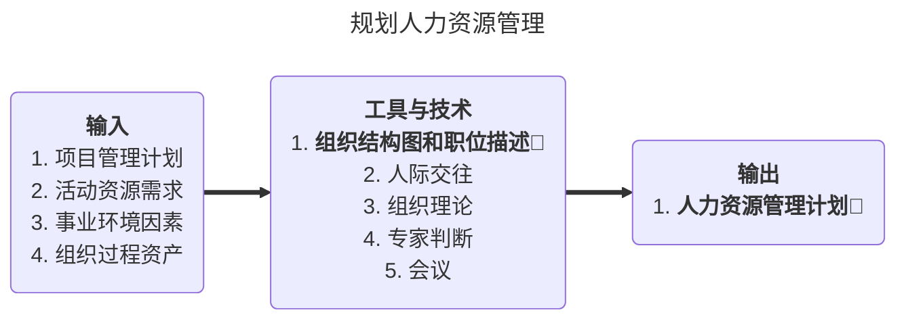

#### 9.2.3 组织结构图🌟

1. 层次结构图

   - 用**工作分解结构**来确定项目的范围，将项目可交付物分解成工作包，即可得到该项目的WBS。也可用WBS来描述不同层次的责任。

   - **组织分解结构（OBS）**与工作分解结构形式上类似 ，是根据组织现有的部门、 单位或团队进行分解。将工作包/可交付成果挂在组织分解结构下

   - **资源分解结构**是另一种层次结构图，它用来分解项目中各种类型的资源。

2. 矩阵图

   - 反映团队成员个人与其承担的工作之间联系的方法有多种，而**责任分配矩阵（RAM）**是最直观的方法。

   - RACI模型

     R=要求审查；A=负责人；P=参与者；I=要求输入；S=要求签字

     每个活动的负责人只能有一个

3. 文本格式
   - 团队成员职责需要详细描述时，可以用文字形式表示。

#### 9.2.4 输出：人力资源管理计划🌟（内容包含以下三点）

- **角色与职责的分配**：定义项目所需的岗位、技能和能力。

- **项目组织结构图** ：用图形表示项目汇报关系。

- **人员配备管理计划**：描述的是何时、以何种方式、他们需要在项目中工作多久以及怎样满足人力资源需求。**包括**：🌟
  1. 人员招募
  2. 资源日历
  3. 人员遣散计划
  4. 培训需求
  5. 表彰和奖励
  6. 遵守的规定
  7. 安全性

### 9.3 组建项目团队

#### 9.3.1 ITO

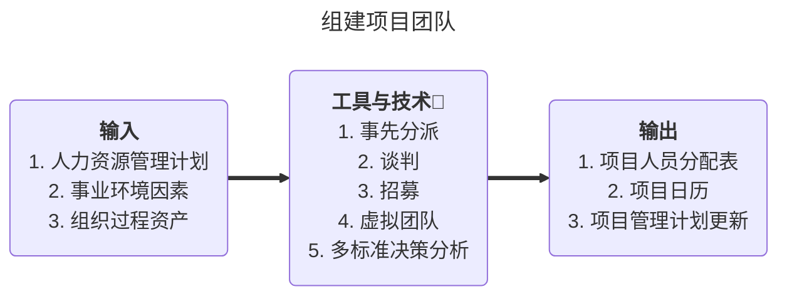

> 助记：**事先分派要授权，沟通谈判借资源，采购招募看缺口，虚拟团队定沟通（定期沟通），**

#### 9.3.2 工具与技术

- 事先分派
- 谈判（职能经理或其他项目经理）
- 采购（外部聘用或分包）
- 虚拟团队（非集中办公）
- **多标准决策分析**：是指制定出用来选择项目团队成员的多种标准，并用这些标准去选择团队成员，以便把最合适的人拉入项目团队中。如果各标准的重要性不同，就应该对各标准赋予不同的权重。应该用各种标准对团队成员候选人进行打分，选择加权汇总得分较高者加入项目团队。用于选择的标准可以包括可用性，成本（工资）、工作经验、工作能力、相关知识、王作技能、工作态度和空间因素等。

#### 9.3.3 团队组建常见的问题

- 问题：

  1. 招募不到合适的项目成员：

  2. 团队的组成人员尽管富有才干，但却很难合作；

  3. 国队气氛不积极 ，造成项目团队成员的士气低落；

  4. 项目团队的任务和职责分配不清楚；

  5. 人员流动过于频繁。

- 产生的原因：

  1. 没有能够建立人力资源获取和培养的稳定机制；
  2. 没有完整识别项目所需的人力资源种类、数量和相关任职条件；
  3. 没有建立一个能充分、有效发挥能力的团队；
  4. 没有清楚地分配工作职责到个人或人力单元。

- 应对措施

  1. 建立稳定的人力资源获取和培养机制；
  2. 在项目早期，进行项目的整体人力资源规划，明确岗位设置、工作职责和协作关系；
  3. 进行项目团队建设，加强团队沟通，建立合作氛围；
  4. 根据项目团队成员的工作职责和目标，跟踪工作绩效，及时予以调整和改进，提升项目整体绩效。

### 9.4 建设项目团队

#### 9.4.1 ITO

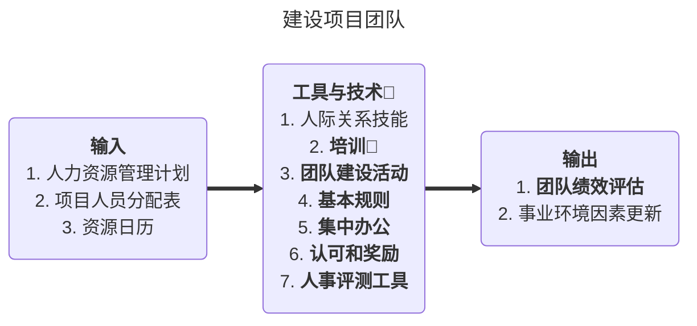

> **人事测评工具即心理偏好指示器**

#### 9.4.2 工具和技术

- 团队建设活动（5分钟的议事日程、拓展训练、娱乐活动）
- 基本规则（界定对团队成员的明确期望）
- **人事评测工具**：是指采 用各种方法 ，如态度调查、细节评估、结构化面谈、能力测试和焦点小组讨论，来充分了解团队成员的优势、劣势、愿望和行为方式、喜好和厌恶等，以便更有针对性地开展团队活动。开展人事测评，有利于增强团队成员之间的理解和信任，有利于提高团队绩效和项目绩效。

#### 9.4.3 输出：团队绩效评估🌟

- **当一些培训、团队建设、集中办公等措施被实施后，项目管理团队可以进行正式或非正式的团队绩效评估。可以包括：**

  1. 提高个人技能，可以使专业人员更高效地完成所分配的活动；
  2. 提高团队能力，可以帮助团队更好的共同工作；
  3. 较低的员工流动率；

  4. 团队凝聚力的加强，从而使团队成员公开分享信息和经验，并互相帮助，来 提高项目绩效。

#### 9.4.4 团队一般成长模型 —— Bruce Tuckmans 模型


- 形成期团队成员相互独立，不一定开诚布公
- 震荡阶段强调冲突不断，彼此相互不信任 1 + 1 < 2
- 规范阶段基本能够协同工作，团队成员开始相互信任 1+ 1 = 2
- 成熟阶段（也叫发挥阶段）团队成员相互依靠，平稳高效地解决问题 1 + 1 > 2
- 解散
- HR为公司新成员培训，而项目经理为项目新成员培训

### 9.5 管理项目团队

#### 9.5.1 ITO

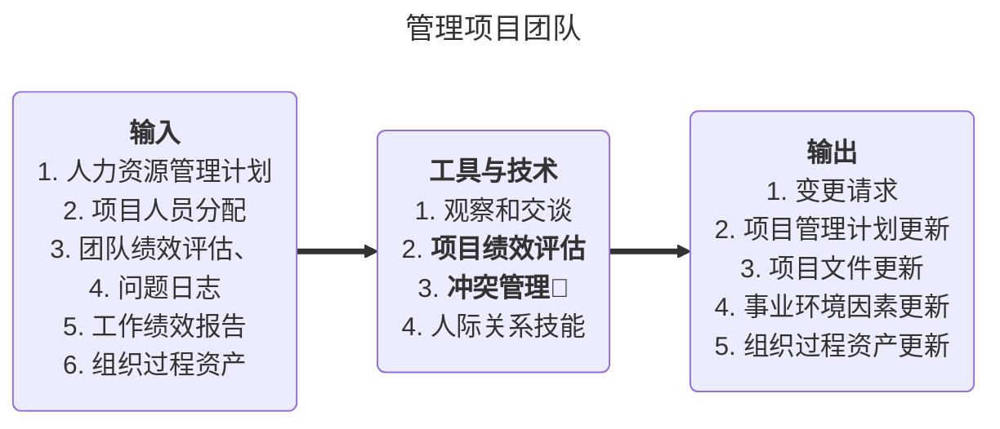

#### 9.5.2 相关概念（了解）

- “**让非管理层的团队成员参与到项目计划制定过程中**〞 的活动则是一种通过提高团队成员的参与意识、增进团队的凝聚力，利用其附属效应来提高团队绩效的措施。
- **资源平衡**指的是在一个时间段内项目保持有大致相同的资源，它与任务分配或管理会议没有关系。
- 项目经理必须知道使项目顺利完成需要哪些技能 ，但是**项目团队没有必要拥有所有技能**，只要找到可以获得必要的**技能**和**知识的来源**以完成项目就可以了。
- 组织/业务关系图描述了业务和部门的关系。
- **项目经理**和**职能经理**应**协商**确保项目所需的员工按时到岗并完成所分配的项目任务。

### 9.6 真题

- **新技术**意味着**新风险**、**新冲突**
- 项目团队中项目经理的管理能力和管理能力二者缺一不可

## 十、项目沟通管理和干系人管理

> 一个宗旨：沟通无止境，共识促发展
>
> 两个原则：沟通要注意**相关性**（相关的人和内容）和**适用性**（合适的沟通方式和技巧）原则
>
> 三个方向：1. 向上沟通要授权 2. 向下沟通要落实 3. 水平沟通要支持
>
> 四个要素：1. 沟通目标 2. 沟通对象 3. 沟通内容 4. 沟通反馈（反馈要明确）

> 规划沟通求有效
>
> 管理沟通求发布
>
> 控制沟通求改进

### 10.1 沟通的基本概念

#### 10.1.1 口沟通的含义与特点

- **沟通**是为了特定的目标，在人与人之间、组织或团队之间进行的信息、思想和情感的**传递或交互的过程**。

- **项目沟通**是为实现项目管理目标，项目团队与其他组织、项目团队成员之间信息、思想、情感的**传递和理解的过程**。

- 软件项目是否达到客户的期望主要取决于**客户在多大程度上 “赞同”** 所交付的项目内容，而不是项目提供者提供了 “多好” 的系统。因此，建立有效和持续的各户沟通机制是项目得到客户认可的基础。

- 应该明确，**沟通并不是一种本能，而是一种能力**。也就是说，沟通不是人天生就具备的，而是在工作实践中培养和训练出来的。

#### 10.1.2 沟通模型 🌟🌟


- 发送方：🌟
  - 选择合适的编码方式
  - 确保信息清楚明确
  - 确保发送的信息完整
  - 确保信息容易被理解
  
- 接收方：🌟
  - 解码
  - 确保完整接收了信息
  - 确保被正确的理解
  - 给出反馈

- 沟通的障碍

  - 缺乏清晰的沟通渠道；

  - 发送者和接收者存在物理距离；
  - 沟通双方彼此技术语言不通；
  - 分散注意力的环境（噪声）；
  - 有害的态度（敌对、不信任）；
  - 权力游戏、滞留信息、隐藏议程和敌对情绪等。

- 沟通渠道数量的计算公式；

  **N(N-1)/2**，N是人数

#### 10.1.3 沟通方式

- 在进行沟通过程中，要根据沟通目标、参与者的特点选择适合的沟通方式。一般沟通过程所采用的方式分为以下几类：参与讨论方式、征询方式、推销方式（说明）、叙述方式（**选择题**）
- 

- 参与程度越强控制强度越弱🌟⬆️

- 沟通方法的分类
  

- **项目经理对外多以正式的方式进行沟通**🌟

  |            | 正式的                                | 非正式                                |
  | ---------- | ------------------------------------- | ------------------------------------- |
  | 口头方式   | 演讲、报告、汇报、谈判、会议          | 谈话、电话、打招呼                    |
  | 书面方式   | 合同、报告、会议纪要、报表            | 笔记、便条、备忘录                    |
  | 非语言沟通 | 手语、信号灯、音乐                    | 表情、声调、握手、拥抱                |
  | 工具沟通   | 电话、传真、Email、手机、面对面、快递 | 电话、传真、Email、手机、面对面、快递 |

  | 方式       | 特点                             | 适用场景                                 |
  | ---------- | -------------------------------- | ---------------------------------------- |
  | 正式书面   | 适合保存、内容不走样、有格式要求 | 根据合同进行的沟通；终止与某供应商的合作 |
  | 正式口头   | 速度快、不易保存、需要很多条件   | 项目启动会                               |
  | 非正式口头 | 效率高                           | 某个团队成员表现不太好                   |
  | 非正式书面 | 适合保存，没有格式要求           | 团队成员的笔记、便条、即时贴             |

### 10.2 制定沟通管理计划

- 规划沟通管理是根据干系人的信息需要和要求及组织的可用资产情况，制订合适的项目沟通方式和计划的过程。

- 本过程的主要作用是，识别和记录与干系人的最有效率且最有效果的沟通方式。

#### 10.2.1 ITO

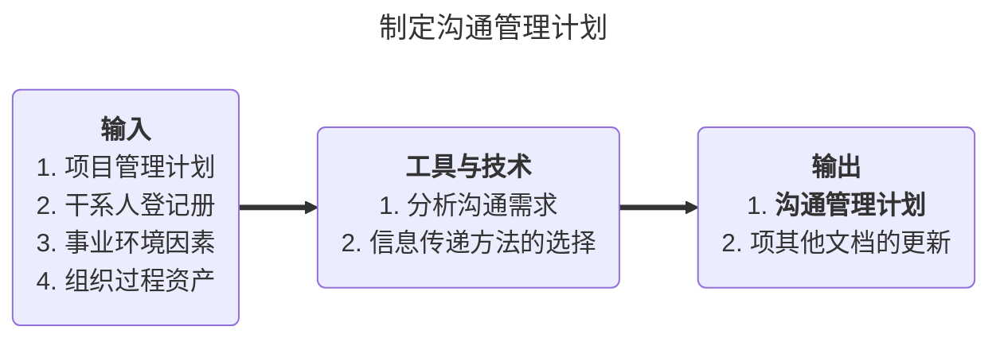

#### 10.2.2 沟通管理计划的编制过程

1. 确定干系人的沟通信息需求，即哪些人需要沟通 ，谁需要什么信息，什么时候需要以及如何把信息发送出去
2. 描述信息收集和文件归档的结构
3. 发送信息和重要信息的格式，主要指创建信息发送的档案，获得信息的访问方法

- 通常，**沟通计划编制的第一步就是干系人分析**🌟，得出项目中沟通的需求和方式，进而形成较为准确的沟通需求表，然后再主动对需求进行计划编制。通过分析可以**辨别出项目对项目干系人的影响和收益**，以此帮助项目经理制定出对项目最有帮助的沟通策略。

- 项目文档应发送给沟通管理计划中规定的人员。根据项目的需要，**沟通管理计划可以是正式的或非正式的，可以是详细的或提纲式的**。

#### 10.2.3 沟通管理计划的主要内容 🌟🌟（考简答）

- **沟通管理计划的主要内容**：项目沟通计划为后续信息发布、绩效报告和项目项目干系人管理等工作提供指导，**主要包括内容有**：
  1. 项目干系人的沟通要求
  2. 对要发布信息的描述，包括格式，内容、详尽程度
  3. 信息接收的个人或组织
  4. 传达信息所需的技术或方法
  5. 沟通频率🌟
  6. 上报过程
  7. 随项目进展对沟通管理计划更新与细化的方法
  8. 通用词语表
- 沟通计划包含：文件名称、频率、接受人、格式/媒介、交付时间、负责人、签收方式、备注（选择题考）

### 10.3 管理沟通

#### 10.3.1 ITO

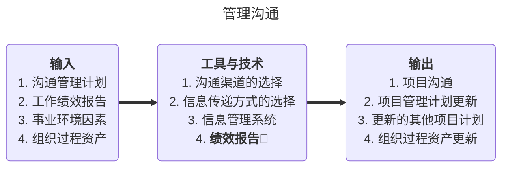

#### 10.3.2 绩效报告

包含： 收集和发布信息、分析现状进展

- 绩效报告的作用和**内容**（乙方准备、多方评估，甲方乙方监理方）

  - 绩效报告是一个收集并发布项目绩效信息的**动态过程**，包括状态报告、进展报告和项目预测。
  - 项目干系人通过申查项目绩效报告 ，可以了解组织为了达到项目的目标，是如何使用资源的，这些资源的状況和对项目的贡献；
  - 通过审查项目绩效报告，可以随时掌握**项目的最新动态和进展**，分析项目的发展态势，及时掌握项目开发过程中遇到的困难与存在的问题，从而能有针对性地制定和采取必要的纠正措施。
  > 绩效报告的内容应包括：
  > 项目的进展和调整情况、项目的完成情况、项目总投入、资金到位情况、项目资金实际支出情况、项目主要效益情况、财务制度执行情况、项目团队各职能团队的绩效、项目执行中存在的问题及改进措施、预测、变更请求、其他需要说明的问题。团队成员考核情况**不属于**需要报告的问题范围。

- 绩效报告的结果

  - 绩效报告**组织与归纳所收集到的信息，并展示依据绩效衡量基准分析的所有结果。**

    - **状况报告**：描达项目在某一特定时间点所处的项目阶段。状况报告是从达到范围、时间和成本三项目标上分析项目所处的状态。

    - **进展报告**：描述项目组在某一特定时间**工作完成情况**。

    - **项目预测** ：预测项目的将来状況与进展。

  - 状态评审会议：定期进行的交流有关项目信息的事件。

- “发布信息”与“报告绩效”的主要区别：

  - 前者是发布在项目执行过程中自然产生的名种信息

  - 后者是报告经汇总、分析和整理后的项目信息

    这也反映了“工作绩效信息〞与“绩效报告”的区别。

### 10.4 控制沟通

- 在项目执行的过程中，需要对沟通过程进行适当的监督和控制，确保沟通过程的目的能够实现。
- 在进行沟通控制的过程中 ，有可能需要重新调整、更新哉者重新制订沟通管理计划，也有可能需要重新调整、更新沟通过程的管理过程。

#### 10.4.1 ITO

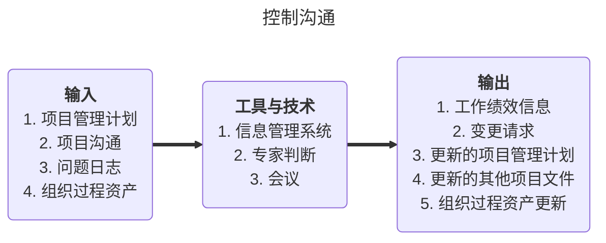

#### 10.4.2 遵循沟通原则

1. 尽早沟通
2. 主动沟通
3. 内外有别
4. 采用对方能接受的沟通风格
5. 沟通的升级原则
6. 正式的事情一定要在正式的时间和地点进行沟通
7. 保留正式沟通的记录/凭据 🌟


### 10.5 干系人管理的基本概念

- 助记

  一步做识别：识别干系人（尽早、尽量全部持续开展）

  二步找策略：先分类再定策略

  三步做沟通：干系人参与项目

  四步做改进：通过策略和计划的改进，调动干系人积极参与

#### 10.5.1 概念

- 项目干系人管理，并不是领导项目的干系人，而是对项目干系人的需要、希望和期望的识别 ，并通过沟通上的管理来满足其需要、与干系人一起解決问题的多个过程。
- 对项目干系人的管理努力争取更多干系人的支持、努力降低干系人中反对者的阻力，持续不断地推动项目向目标前进，从而确保项目成功。
- 项目干系人：是能够影响项目决策、活动或结果的个人、群体或组织，以及会受自认为会受项目决策、活动或结果影响的个人、群体或组织，客户、发起人、执行组织和有关公众等都是典型的项目干系人。

#### 10.5.2 项目主要干系人

- **项目发起人**：起草项目章程、提供资金；
- **项目经理**：项目的惟一责任点、要积极主动
- 客户：最终客户利益至上；关注的始终是如何使自己的投资有最丰厚和深远的回报；不仅仅是项目能否完成，还包括整个项目的进度、费用情况以及施工的质量等环节。
- 用户：项目产品的最終使用者，关心项目产品是否好用？是否大幅度降低本岗位的劳动强度？是否大幅度地提高本岗位的工作质量？
- 高层领导：项目承建方高层领导通常关注项目是否按照计划进行，是否符合项目的目标 ，项目团队的绩效是否能够保持。
- **职能经理**：矩矩式中，项目经理决定做什么，职能经理决定“谁来做，怎么做”。

- 项目的**客户**和项目经理的**主管领导**在权力/利益模型中属于权力大/利益高的干系人，应**重点管理，随时汇报**。

### 10.6 识别干系人

#### 10.6.1 ITO

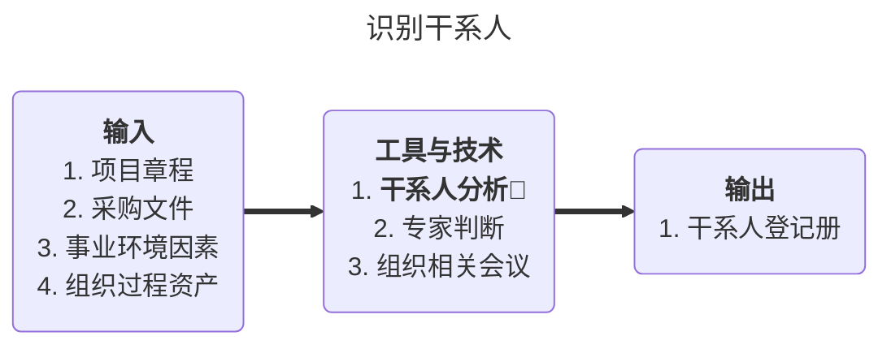

#### 10.6.2 干系人分析

- **如何进行项目干系人分析**：🌟

  1. 进行项目干系人识别；
  2. 分析项目干系人的重要程度；
  3. 进行项目干系人的支持度分折：
  4. 针对不同项目干系人，特别悬重要的项目干系人 ，给出管理项目干系人的建议，并予以实施。

  干系人分析在项目**启动**时进行，而不是项目立项时进行

#### 10.6.3 干系人登记册

- **干系人登记册的内容**🌟
  1. 基本信息，如干系人的姓名、职位、地点、项目角色、联系方式；
  2. 评估信息，如主要需求、主要期望、对小项目的潜在影响、与生命周期的哪个阶段最密切相关；
  3. 干系人分类，如关键干系人/非关键干系人、内部/外部、支持者/中立者/反对者等。

#### 10.6.4 **权力利益方格** 🌟

- 根据项目干系人职权大小及对项目结果的关注（利益）程度进行分类


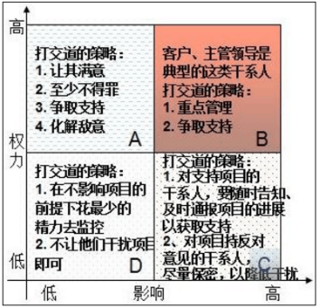

其他：

- 权力/影响方格：根据干系人的职权大小以及主动参与（影响）项目的程度分类
- 影响/作用方格：根据干系人主动参与（影响）项目的程度及改变项目计划或执行的能力分类
- 凸显模型：根据干系人的权力（施加自己的意愿）、紧急程度、合法性进行分类

### 10.7 编制项目干系人管理计划

#### 10.7.1 ITO

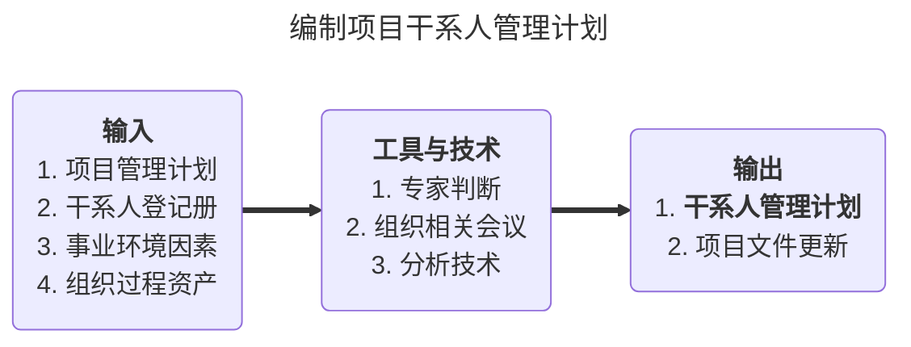

#### 10.7.2 工具和技术

- 会议： 

  把干系人分类以确定所有干系人应有的参与程度。会议上收集的信息可以用来准备编写干系人管理计划。

- 分析技术 ，把干系人分为如下各类：

  - 不了解。对项目和潜在影响不知晓。
  - 抵制。了解项目和潜在影响，抵制项目。
  - 中立。了解项目，既不支持，也不反对。
  - 支持。了解项目和潜在影响 ，支持项目。
  - 领导。了解项目和潜在影响 ，积极致力于保证项目成功。

#### 10.7.3 **干系人管理计划还包含**🌟

1. 关键干系人的所需参与程度和当前参与程度；
2. 干系人变更的范围和影响；
3. 干系人之间的相互关系和潜在交叉；
4. 项目现阶段的干系人沟通需求；
5. 需要分发给干系人的信息，包括语言、格式、内容、详细程度和发送频率；
6. 分发相关信息的理由，以及可能对干系人参与所产生的影响；
7. 随着项目的进展，更新和优化干系人管理计划的方法。

### 10.8 管理干系人参与

#### 10.8.1 概念

- 管理干系人参与过程是一个执行过程。就是依据干系人管理计划，在整个项目生命周期中，与干系人进行日常的沟通和协作，以满足其需要与期望，解决实际出现的问题，并促进干系人合理参与项目活动的过程。
- 本过程主要作用：
  - 帮助项目经理提升来自干系人的支持：
  - 把反对者的抵制降到最低；
  - 提高项目的成功机会。
- 干系人管理工作**项目成员参与**，**项目经理负责**

#### 10.8.2 管理干系人参与的活动：（熟悉，选择题）

1. 让干系人的支持者理解项目、争取支持，反对者降低敌意 ，提高项目成功概率；
2. 调动干系人适时参与，获取或确认他们对项目成功的持续承诺；
3. 管理干系人的期望，确保实现项目目标；
4. 处理尚末成为问题的关注点，预测干系人可能提出的问题；
5. 澄清和解決已识别出的问题；

#### 10.8.3 ITO

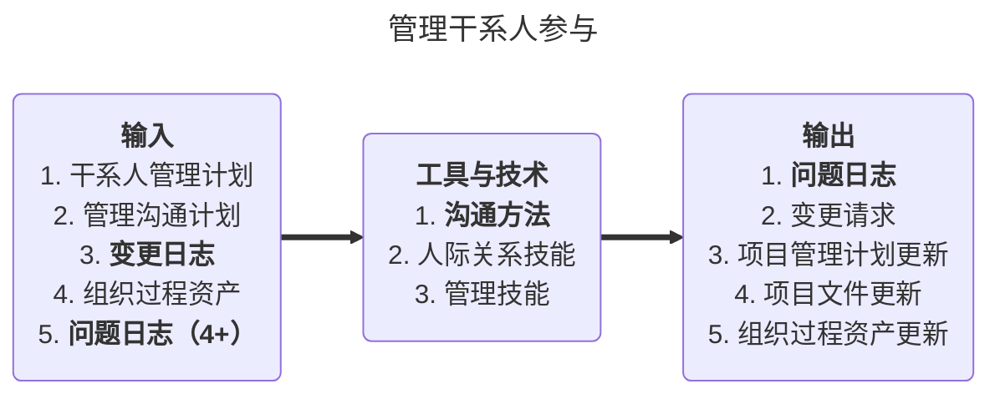

#### 10.8.4 沟通方法

1. **交互式沟通**：在两方或多方之间进行多项信息交换。确保全体参与者对特定话题达成共识的最有效的方法。包括会议、电话、即时通信、视频会议等。（一般，**面对面沟通/会议**是**最有效**的解决干系人问题的方法）
2. **推式沟通**：把信息发送给需要接收这些信息的特定接收方。可以确保信息的发送，但不能确保信息送达受众或被目标受众理解。包括信件、备忘录、报告、电子邮件、传真、语音邮件、日志、 新闻稿等。
3. **拉式沟通**：用于信息量很大或受众很多的情况。要求接收者自主自行地访问信息内容。包括企业内网、电子在线课程、经验教训数据库、知识库等。

#### 10.8.4 人际关系技能与管理技能（了解）

- 人际关系技能，也叫软技能，项目经理用来推进项目的能力，是衡量项目经理管理水平的最重要的指标之一。包括：
  - 与干系人建立信任；
  - 积极聆听；
  - 克服变更的阻力。

- 管理技能，项目经理用来协调各方以实现项目目标。也属于软技能。包括：
  1. 引导干系人对项目目标达成共识；
  2. 对干系人施加影响，使他们支持项目；
  3. 通过谈判达成共识，以满足项目要求；
  4. 调整干系人所在组织的行为，以接受项目成果。

### 10.9 控制干系人参与

#### 10.9.1 概念

- 控制干系人参与是一个监控过程：实时观察计划与实际之间的偏差，全面监督项目干系人之间的关系。发现问题时，及时调整策略和计划，以调动干系人参与的过程。

#### 10.9.2 ITO

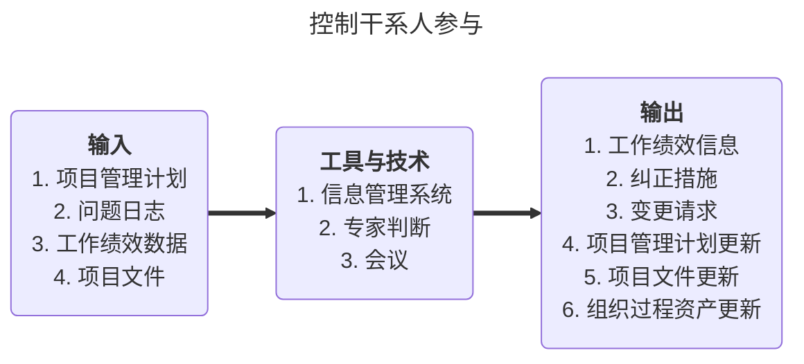

- 干系人管理需注意的点
  1. 重要干系人对项目可能有重大影响 ，有时关键干系人能決定项目成败，在项目早期就要尽早识别干系人；
  2. 项目干系人对项目的影响可能是积极的也可能是消极的；
  3. 项目中干系人的期望可能是互相矛盾的；
  4. 识别干系人，了解和管理干系人的期望、处理好利益冲突，是项目干系人管理的重要内容；
  5. 干系人的满意度是一个关键的项目目标。🌟

#### 10.9 真题
- 会议：
    面向团队的需求收集方法能够鼓励合作，为解决方案的各 个要素提供建议，协商不同的方法，以及说明初步的需求方案。
    在进行面向团队的需求分析时，通常会举行团队需求收集会议，会议由软件工程师、客户和其他利益相关共同举办和参加；
    为会议拟订一个会议议程，既要涵盖所有的重要点，又要鼓励思维的自由交流;
    会议由一位主持人控制会议进度，并保证会议主题不被偏离；
    会议**目的**是为了**识别问题**，提出解决方案的要点，初步刻画解决方案中的需求问题。
- 工作分解结构的作用之一，它是信息沟通的基础。基本的项目沟通内容可以从项目分解结构中获得。而知道工作分解结构的过程，也需要团队成员充分沟通。

## 十一、 项目风险管理
- 五步一循环
    - 一步做规划
    - 二步做识别
    - 三步做分类
    - 四步做量化
    - 五步找措施
- 项目风险管理的**目标**在于在于提高项目积极事件的概率和影响，降低项目消极事件的概率和影响。（风险不会绝对消除）
    - 风险管理规划：定义如何实施项目风险管理活动的过程。
    - **风险识别**🌟：判断**哪些风险**会影响项目并记录其特征的过程。
    - 定性风险分析 ：评估并综合分析风险的发生概率和影响，对风险进行**优先排序**🌟，从而为后续分析或行动提供基础的过程。
    - 定量风险分析：就已识别风险**对项目整体目标的影响**进行定量分析。（可选，在风险比较重大且可以量化时才进行定量分析）
    - 风险应对规划：针对项目目标，制定提高机会、降低威助的**方案和措施**。
    - 风险监控：在整个项目中，实施风,险应对计划、跟踪已识别风,险、监测残余风险、识别新风险和评估风险过程有效性的过程。
### 11.1 风险概述
#### 11.1.1 风险管理的特点
- 项目风险管理是为减经潜在的不利事件对项目的影响而采取的一项活动。
- **风险管理是一种投资，需要成本**。
- 在任何情况下，项目风险管理的成本不应超过项目潜在的收益。
- 需要努力在项目的各个方面寻找风险和机会之间的平衡。
#### 11.1.2 风险的定义
- 风险的定义有广义、狭义之分。狭义的风险表现为负面的影响，而广义的风险是一个中性词，表示在损失、获益之间的任意一种可能。
- 风险是指对无法达到预定目标的可能性和结果的一种测评，是可能给项目的成功带来威胁或损害的可能性。
-  "风险”一词包含着“不确定性”。对于某个既定事件而言，风险包含两个要素：
    - 一是某事件发生的可能性；
    - 二是该事件发生所带来的影响。
#### 11.1.3 风险的含义
- 机会和威胁都属于风险。
- 风险类别：
    - 己知已知风险：已知概率，已知后果；-> 直接成本应对
    - 已知末知风险：已识别出来，不知概率和后果； -> 用应急储备应对（应急储备时间/资金）
    - 未知未知风险：过去从未遇到过。-> 用管理储备来应对
#### 11.1.4 风险预期货币值（EMV，Expected Monetary Value，也叫曝光度）🌟（必考）
- EMV：用货币综合表示风险对项目的影响 EMV=P\*V 
- P：发生概率
- V：结果
- E：事件
#### 11.1.5 项目风险的特点
- 项目风险**贯穿整个项目生命周期**，并且项目的不同阶段会有不同的风险。
- 风险随着项目的进展而变化，其不确定性一般会**逐渐减少**。
- 最大的不确定性存在于项目的**早期**，早期阶段做出的决策对以后阶段和项目目标的实现影响最大。
    - 风险的**随机性** ：风险事件的发生及其后果都具有偶然性。
    - 风险的**相对性** ：风险总是相对于项目活动主体而言的。
#### 11.1.6 影响风险承受能力的因素
- **收益的大小**：收益总是有损失的可能性相伴随，损失的可能性和数额越大 ，人们希望为弥补损失而得到的收益也越大。反过来，收益越大，人们愿意承担的风险也就越大。
- **投入的大小** ：项目活动投入的越多，人们对成功所抱的希望也越大，愿意冒的风险也就越小。
- **项目活动主体的地位和拥有的资源**：管理人员级别高的同级别低的相比，能够承担大的风险。同一风险，不同的个人或组织承受能力也不同。
### 11.2 规划风险管理
#### 11.2.1 定义
- 规划风险管理是定义如何实施项目风险管理活动的过程。
- 本过程的主要作用是确保风险管理的程度、类型和可见度与风险及项目对组织的重要性相匹配。
#### 11.2.2 ITO
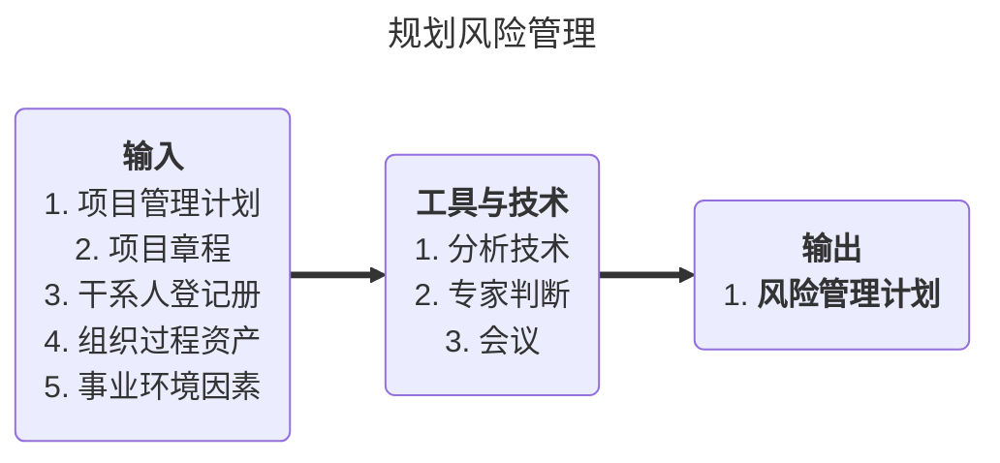
#### 11.2.3 风险管理计划的内容（🌟🌟，选择，案例，简答）
- **必险管理计划**是项目管理计划的组成部分 ，描述将如何安排与实施风险管理活动。
    包括如下内容：
    - 方法论，角色与职责 ，预算，时间交排，**风险类别**；
    - 风险概率和影响的定义；
    - 概率影响矩阵；
    - 修订的干系人承受力；
    - 报告格式；
    - 跟踪。
### 11.3 识别风险
#### 11.3.1 定义
- 风险识别是判断哪些风险会影响项目并记录其特征的过程。**风险识别要采用系统化的方法，识别出项目中已知的和可预测到的风险**。
- 主要作用：把识别的风险记录在案，并为项目团队预测末来事件积累知识和技能。
- 应该鼓励**全体项目人员参与**风险识别工作。
- 识别风险是一个**反复进行**的过程。
- 风险识别包括确定风险的来源、风险产生的条件，描述风;险特征和确定哪些风险事件有可能影响整个项目。
- **风险识别应当在IT项目的生命周期自始至终定期进行**。
- **风险识别分为三步进行**：🌟
    1. 收集资料
    2. 估计项目风险形势
    3. 将潜在的风险识别出来
- 风险识别的特点：🌟
    1. 全员性
    2. 系统性
    3. 动态性
    4. 信息依赖性
    5. 综合性
#### 11.3.2 ITO
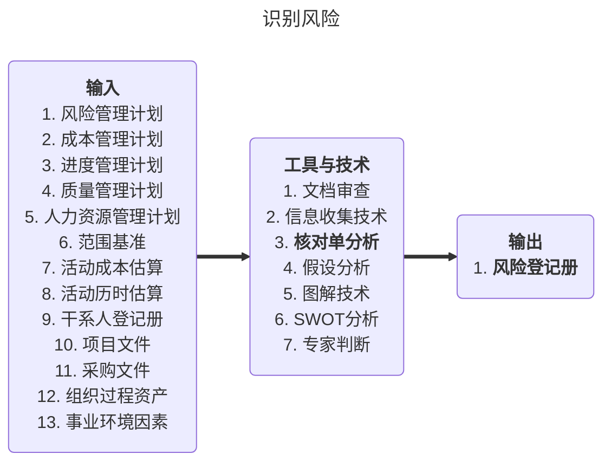
#### 11.3.3 工具和技术
- **文件审查**：对项目计划、假设、先前的项目文档和其他信息等项目文件进行系统和结构性的审查。
- **信息收集技术**：**包括德你菲法、头脑风暴法、访谈法、根本原因分析**。
- **检查表**：用来记录和整理数据的常用工具。
- **假设分析** ：根据一 套假定、设想或假设进行构思与制定。是检验假设条件在项目中的有效性，并识别因其中的不准确、不稳定、不一致或不完整而导致的项目风险。指通过分析假设条件中可能存在的问题，识别与假设条件有关的风险。如果假设条件错了，那后面的一切都会跟着错。
- **图解技术**：因果图、系统或过程流程图、影响图等。
#### 11.3.4 风险登记册🌟
- 识别风险过程的主要输出就是风险登记册中的最初内容。
- 风险登记册还会记录风险分析和风险应对规划的结果，随着其他风险管理过程的实施，风险登记册中还将包括这些过程的输出，也就导致风险登记册中信息种类和数量的逐渐增加。
- 风险登记册的编制**始于识别风险**过程 ，在项目实施过程中供其他风险管埋过程和项目管理过程使用。
- 风险登记册的编制始于风险识别过程，主要依据下列信息编制而成：（内容🌟）
    1. **已识别风险清单**
    2. **潜在应对措施清单**
    3. 风险根本原因
    4. 风险类别更新
### 11.4 实施定性风险分析
#### 11.4.1 定义
- 实施定性风险分析是评估并综合分析风险发生概率和影响，对风险进行**优先排序**从而为后续分析或行动提供基础的过程。
- 本过程的主要作用是使项目经理能够降低项目的不确定性级别，并重点关注高优先级风险。
- 根据风险发生的相对概率或可能性、风险发生后对项目目标的相应影响以及其他因素，来评估已识别风险的优先级。
- 定性风险分析过程需要使用风险管理规划过程和风险识别过程的成果。
#### 11.4.2 ITO
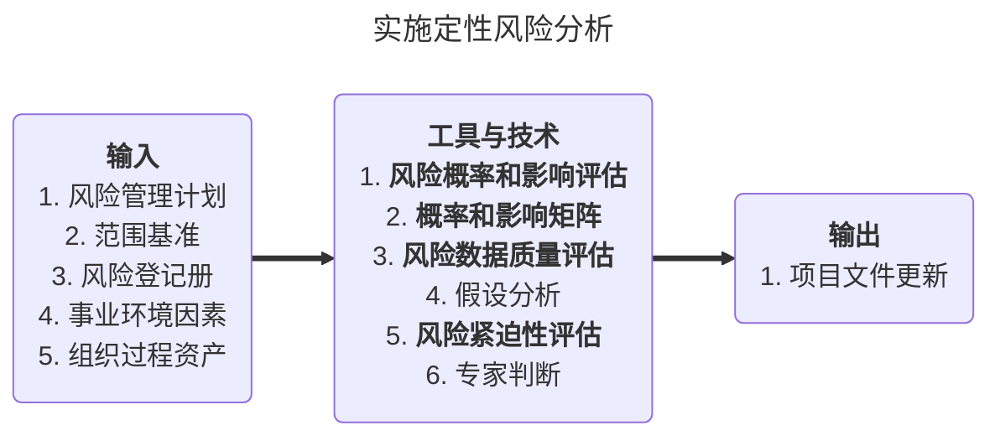
#### 11.4.3 目的
- IT项目定性风险分析的目的
    对I项目风险进行定性分析，可以从宏观上对项目是否可行有一个初步了解，可以加深项目管理人员对项目风险的认识。
- 通过定性分析 ，可以达到如下目的：
    - 确认项目风险的来源
    - 确认项目风险的性质
    - 估计项目风险的影响程度
    - 为项目风险的定量分析提供条件
#### 11.4.4 定性风险分析的方法
- 定性风险分析的方法：（🌟简答）
    - **风险概率与影响评估**
    - **概率和影响矩阵**
    - 风险分类
    - 风险紧迫性评估
    - 风险数据质量评估
    - 专家判断
1. 风险概率与影响评估
    调查每项具体风险发生的可能性 ，以及风险对项目目标的潜在影响。
2. 概率和影响矩阵
    PI矩阵 风险值 = 概率 \* 影响
3. 风险数据质量评估🌟
    是评估风险数据对风险管理的有用程度的一种技术，用来考察人们对风险的理解程度，以及考察风险数据的**准确性、质量、可靠性和完整性**。风险数据的质量，直接影响定性分析的结果。
4. 风险分类
    可以按照风险来源、受影响的项目工作或其他有效分类标准对项目风险进行分类，以确定受不确定性影响最大的项目区域。
5. 风险紧迫性评估
    可以把近期需要应对的风险确定为更紧迫的风险。风险的可检测性、风险应对的时间要求、风险征兆和预警信号，以及风险等级等，都是确定风险优先级应考虑的指标。
### 11.5 实施定量风险分析
#### 11.5.1 定义
- 在定性风险分析之后，为了进一步了解风险发生的可能性到底有多大，后果到底有多严重，就需要对风险进行定量的评估分析。
- 定量风险分析的**目标**是**量化分析**每一个风险的概率及其对项目目标造成的**后果**，分析项目总体风险的程度。
- 实施定量风险分析是就已识别风险**对项目整体目标的影响**进行定量分析的过程。
- 实施定量风险分析过程就是对这些风;险事件的影响进行分析。它可以为每个风险单独进行量化评级，或者可以评估所有风险对项目的总体影响。它也是在不确定情况下进行決策的一种量化方法。
#### 11.5.2 ITO
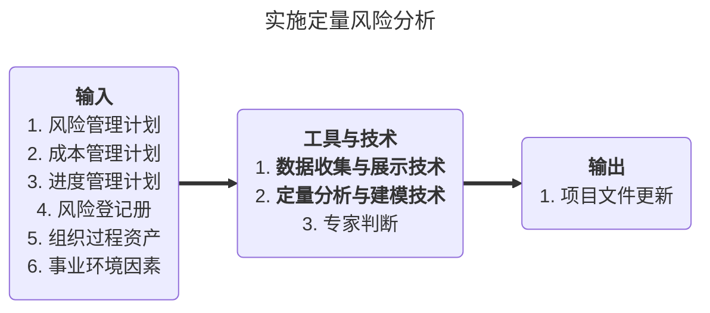
#### 11.5.3 定量分析的方法
1. 数据收集和表示技术：访谈、概率分析 （概率分布）等。
2. 定量风险分析和模型技术：敏感性分析、预期货币价值分析、建模和模拟。
3. 专家判断
- 敏感性分析 - 龙卷风图：用于比较不确定的变量和相对稳定的变量之间的相对重要性和相对影响，也有助于分析冒险情景
- 决策树分析：
    EMV = P \* 净收益（价值）
### 11.6 规划风险应对
#### 11.6.1 定义
- 规划风险应对是针对项目目标，制定提高机会、降低威胁的方案和措施的过程。
- 需要根据风险的优先级来制定应对措施，并把风险应对所需资源和活动**加进项目管理计划中**。（而非风险管理计划）
- 风险应对措施必须**与风险的重要性相匹配** ，能经济有效地应对挑战。
- 在当前项目背暴下现实可行，能获得全体相关方同意，并**由一名负责人负责**。！专人负责
- 风险应对措施还必须及时。需要从被选方案中选择一项最佳的措施。
- **残留风险**是采取了规避、转移、或减轻应对措施后余留的风险，也包括已经被故意接受的风险。**在分析应对计划时要考虑**。
#### 11.6.2 ITO
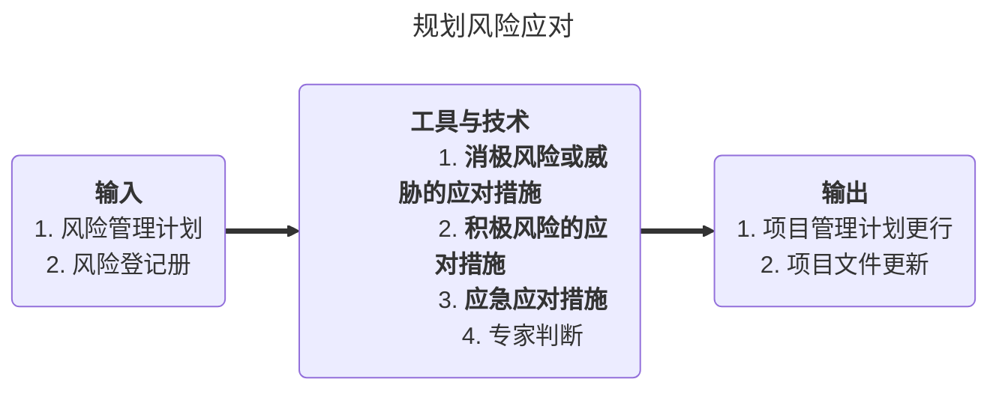
#### 11.6.3 消极风险应对措施🌟🌟
| 名称               | 特点                            | 情景                                         |
| ------------------ | ------------------------------- | -------------------------------------------- |
| 回避Avoid          | 改变计划或范围                  | 去掉WBS中有风险的工作包</br>或由第三方来消除 |
| 缓解Mitigate       | 降低概率或后果                  | 雇佣有经验的雇员                             |
| 转移Transference   | 转给第三方                      | 购买保险或第三方担保                         |
| 积极接受Acceptance | 准备备用计划</br>准备应急储备金 | 有风险不能回避和减轻，准备备用计划           |
| 被动接受Acceptance | 什么都不做                      |                                              |
#### 11.6.4 积极风险应多措施
- 开拓：确保机会得以实现（从无到有）
- 分享：把应对机会的部分或全部责任分配给最能为项目利益抓住该机会的第三方。
- 提高：提高风险发生的概率或积极影响。
- 接受：当机会发生时乐于利用，不主动追求，

### 11.7 控制风险
#### 11.7.1 定义
- 控制风险指**实施风险应对计划**、**跟踪已识别风险**、**监测残余风险**、**识别新风险**和**评估风险过程有效性**的过程。
- 应该**持续监督**项自主作，以便发现新风险、风险变化以及过时的网险。
- 风险责任人应定期向项目经理汇报计划的有效性、未曾预料到的后果，以及为合理应对风险所需采取的纠正措施。
#### 11.7.2 目标 🌟（简答）
- 努力及早识别和度量项目的风险
- 努力避免项目风险事件的发生
- 积极消除项目风险事件的消极后果
- 充分吸取项目风险管理经验与教训
#### 11.7.3 ITO
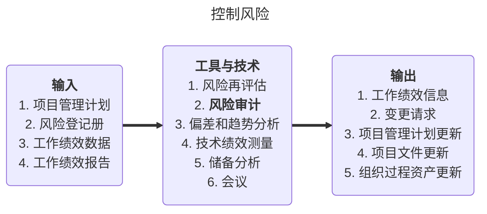

#### 11.7.4 工具与技术
- 风险再评估
    - 监控风险经常需要**识别新风险**；
    - 对现有风险进行再评估以及**删去已过时的风险**；
    - 应该定期进行项目风险再评估；
    - 反复进行再评估的次数和详细水平，应该根据相对于项目目标的项目进展情况而定。
- 风险审计
    - 通过**风险审计**，检查并记录风险应对措施在处理已识别风险及其根源方面的有效性，以及风险管理**过程的有效性**；
    - 项目经理要确保按项目**风险管理计划**所规定的**频率**来实施风险审计；
    - 既可以在日常的项目申查会中进行风险审计，也可单独召开风险审计会议；
    - 在实施申计前，要明确定义审计的格式和目标。
- 偏差和趋势分析
    - 用来比较计划结果与实际结果；
    - 利用绩效信息对项目执行的趋势进行审查；
    - 监控项目总体绩效；
    - 揭示项目的成本及进度偏离程度；
    - 对比基准，表明威胁或机会的潜在影响。
- 技术绩效测量
    - 它是把项目执行期间所取得的技术成果与计划取得的技术成果进行比较；
    - 定义技术绩效的测量指标；
    - 有助于预测项目范围方面的成功程度。
- 储备分析🌟
    - **是指在项目的任何时间点比较剩余应急储备与剩余风险量，从而确定剩余储备是否仍然合理。**

#### 11.7.5 风险监控的结果
- 更新的风险登记册
- 请求的变更
- 更新的组织过程资产
- 更新的项目管理计划
- 弹回计划：针对一个风险制定的备用应对计划，以便在主应对计划不起作用时使用。（针对威胁或机会）
- 权变措施：针对未知的风险通过分配管理储备进行应对，针对已发生的风险，紧急采取的原来计划中没有的应对计划。（只针对威胁）

### 11.8 真题
 - 在风险监控中，如果出现了风险等级单未预测的风险或“观察清单”未创造风险，应该**进行额外的风险应对规划**
 - 审计看效果
 - 纯粹风险和投机风险在一定条件下可以相互转换

## 十二、项目采购管理
> 一步做决策（自治还是外购）
> 二步做准备（准备招投标文件）（一/二合称规划采购）
> 三步做筛选（选出三家或三家以上的供应商，不足三家的需要废掉）
> 四步做选择（选择一家最适合的供应商）（三/四合称实施采购）
> 五步做合同（控制采购）
> 六步做收尾（结束采购）
- 投标的步骤🌟：
    招标->投标->开标->评标->中标->授标->签订合同

### 12.1 采购管理概述
#### 12.1.1 定义
- 项目采购过程: 采购是从项目团队外部获得产品、服务或成果的完整的购买过程。
    - 规划采购：决定采购的内容和在什么时侯采购、如何采购
    - 实施采购：从潜在的供应商处获取适当的信息、报价、投标书或建议书。选择供方，申核所有建议书或报价，并于选中者谈判最终合同。
    - 控制采购：管理合同以及买卖双方之问的关系 ，监控合同的执行情况。申核井记录供应商的绩效以采取必要的纠正措施，并作为将来选择供应商的参考。管理与合同相关的变更。
    - 结束采购 ：完结本次项目采购的过程。
- 概念和术语
    - 项目采购管理是为完成项目工作，从项目团队**外部**购买或获取所需的产品、服务或成果的过程。
    - 采购是从项目团队外部获得产品、服务或成果的完整的购买过程。
    - IT项目采购的对象一般分为**工程**、**产品/货物**和**服务**三大类，有时工程或服务会以项目的形式通过招投标程序实施采购。
    - 对采购的基本要求 ：采购必须要**满足**技术与质量要求，同时应满足经济性或价格合理的要求。
    - 项目采购管理过程包括买方和卖方之间的法律文件——**合同**。一份合同代表一个对合同的各方有约束力的协议，规定卖方有义务提供指定的产品、服务或者成果，并规定买方有义务提供货币或者其他与受益价值相等的报酬。
    - 一份采购合同**包括**条款与付款条件，以及买方所依赖的其他条款，以确定卖方需要完成的任务或提供的产品。
    - 基于不同的应用领域， **卖方也被称为承包商、分包商、销售商、服务商或者供应商。基于项目采购周期中买方的不同位置，买方有时被称为顾客、客户、总承包商、承包商、采购组织、政府机构、服务需求方或者采购方。** 在合同生命周期中，卖方首先作为投标人 ，继而作为选中的卖方，之后作为合同的供应商或者销售商。🌟🌟

#### 12.1.2采购与外包的作用
- 采购方要进行I项目的采购或外包，不管是什么原因，将进行项目的采购和外包至少有如下作用：
    - 有利于专注于核心业务
    - 得到技能和技术
    - 提高效益
    - 规避项目风险
    - 降低企业长期营运成本

#### 12.1.3 采购的基本原则
1. 成本效益原则（性价比）
3. 质量原则
4. 进度配合原则
5. 公平竞争原则

#### 12.1.4 供应商管理（熟悉）
1. 供应商调查
2. 供应商选择指标
3. 供应商评估方法
4. 采购供方的合格评价
5. 供应商质量管理

### 12.2 规划采购
#### 12.2.1 ITO
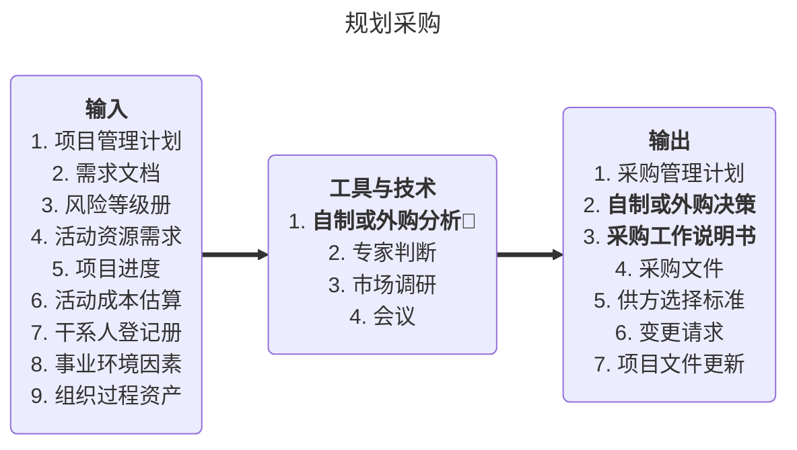

#### 12.2.2 自制外购分析
根据**成本分析**项目是自行开发还是外购，有时也需要考虑一些其它的因素，如某些企业对数据保密性、系统安全性、软件的可靠性要求较育，当自己有足够的人力资源保障，就应当考虑自行研发。自制和外购分析应该**既包括直接成本又包括间接成本**。

#### 12.2.3 采购管理计划🌟（简答 ）
- 采购管理计划：描述从形成采购文件到合同收尾的采购过程。
- 主要包括如下的内容：
    - 拟采用的合同类型；
    - 风险管理事项；
    - 是否采用独立估算作为评估标准，由谁来准备独立估算、何时进行独立估算；
    - 标准的采购文件；
    - 如何进行  “自制外购”决策；
    - 比较合适的潜在供应商的评价标准和优选的初步建议；
    - 提出项目团队的买购工作分工与行动计划等。

#### 12.2.4 采购工作说明书
- 采购工作说明书：对所购买的产品、成果或服务来说，采购工作说明书定义了与合同相关的那部分 项目范围。每个采购工作说明书来自于项目的范围基准。
- 采购说明书描述足够的细节，以允许预期的卖方确定他们是否有提供买方所需的产品、成果或服务的能力。
- 采购说明书中的信息有：
    - 规格说明书
    - 期望的数量和质量的等级；
    - 性能数据；
    - 履约期限、工作地及其他要求。

#### 12.2.5 输出
- 采购文件：用来得到潜在卖方的报价建议书。其详细程度与复杂程度应该与采购事项的价值和风险相关。
- 常见的采购文件有：
    - 方案邀请书(RFP）：用来征求潜在供应商建议的文件。
    - 报价邀请书(RFQ）：依据选择供应商时，用于征求潜在供应商报价的文件。多用于简单产品招标中使用RFQ，也叫请求报价单。 
- 询价计划编制过程常用的的其他文件：
    - 征求供应商意见书(RFI）：用来征求供应商意见，以使需求明确化。
    - 投标邀请书
    - 招标通知
- 供方选择标准：用于从潜在的卖方中选择符合要求的、合格的卖方。（可以是主观的或者客观的）
- "自制/外购〞决策：决定项目的哪些产品、服务或成果需要外购，哪些自制更为合适。自制/外购决策、采购管理计划、采购工作说明书和供方选择标准，为“实施采购〞过程提供了依据。
- 变更申请：编制采购计划时，关于购买产品、服务或资源的决策，通常会导致变更。
- 可能的项目文件更新。包括：
    - 需求文件；
    - 需求跟踪矩阵；
    - 风险登记册。 
### 12.3 实施采购
#### ITO
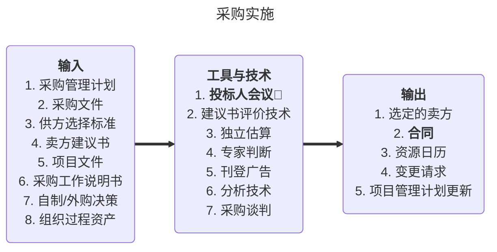

#### 12.4.2 工具和技术
- **投标人会议**：又称承包商会议、供货商会议、投标前会议：就是在投标书或建议书提交前，在买方和所有潜在卖方之问召开的会议。**目的**是**保证所有潜在卖方对采购要求都有清楚目一致的理解，保证没有任何投标人会得到特别的优待。**
- 建议书评价技术：对于复杂的采购，如果要基于卖方对既定加权标准的响应情况来选择卖方 ，则应根据买方的采购政策，规定一个正式的建议书评申流程。在授予合同之前，建议书评价委员会将做出他们的选择，并报管理层批准。
- 独立估算：对许多采购，采购组织可以自行编制独立估算，或者邀请外部专业估算师做出成本估算，并将此作为标杆，用来与潜在卖方的应答做比较的。
- 广告：现有潜在供应商清单通常可以通过在报纸等通用出版物、专业出版物、或有关的网站上刊登广告加以扩充。
- 分析技术：在采购时 ，应该以合理的方式定义需求，以便卖方能够为项目创造价值。
- 采购谈判 ：在合同签署之前，对合同的结构、要求及其他条款加以澄清 ，以取得一致意见。最终的合同措辞应该反映双方达成的全部一直意见。谈判的内容包括责任、进行变更的权限、适用的条款和法律、技术和商务管理办法、所有权、合同融资、技术解決方案、总体进度计划、付款和价格等。谈判过程以形成双方均可执行的合同文件而结束。

### 12.4 控制采购
#### 12.4.1 定义
- 控制采购过程是管理采购关系、监督合同执行情況，并根据需要实施变更和采取纠正措施的过程。
- **控制采购**过程是买卖**双方都需要**的。🌟
- 控制采购还包括记录必要的细节以管理任何合同工作的提前终止（因各种原因、求便利或者违约）。这些细节会在结束采购过程中使用，以终止协议。
#### 12.4.2 ITO
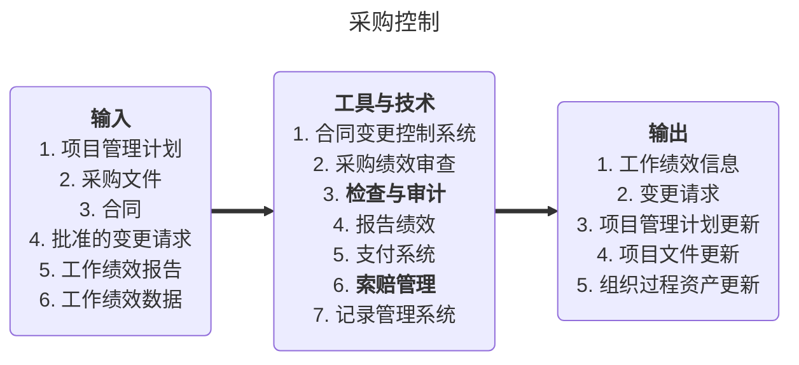
#### 12.4.3 工具与技术
- 合同变更控制系统：包括变更过程的书面记录工作、变更跟踪系统、变更争议解决程序，以及各种变更所需的审批层次。
- **检查与审计**🌟：由买方开展相关的检查与审计，卖方理应对此提供支持。通过检查与审计，验证卖方的工作过程或可交付成果对合同的遵守程度。（区别于结束采购中的采购审计，采购审计是对采购管理过程做结构化审查，总结采购过程中的经验与教训）
- 采购绩效审查：是一种系统的、结构化的审查，买方依据合同来审查卖方在规定的成本和进度内完成项目范围和达到的质量要求的情况。
- 报告绩效：根据合同要求，评估卖方提供的工作绩效数据和工作绩效报告 ，形成工作绩效信息，并向买方管理层报告。报告绩效为管理层提供了卖方的执行信息，如离合同目标多远？卖方正在如何实现合同目标？措施是否有效？
- 支付系统：由负责的项目团队成员证明卖方的工作合格，再通过买方的应付账款系统向卖方付款。
- **索赔管理**：有争议的变更称为索赔、争议或诉求。**谈判是解决所有索赔和争议的首选方法**。
- 记录管理系统：合同的签订、执行、变更等工作涉及大量的款项，也涉及买卖双方的其他利益。出现争议时，“口说无凭〞，口头的说法不会被采纳，因此要对采购过程进行书面记录。它包含一套特定的过程、相关的控制功能，它是项目管理信息系统的一部分。利用该系统，可以检索合同文件、过程记录以及往来的函件。

### 12.5 结束采购
#### 12.5.1 定义
- 结束采购是完结本次项目采购的过程。
- 结束采购过程旨在结束合同工作以及当事人之间的合同关系，进行采购审计，并将有关资料收集归档，更新组织过程资产。
- 两种常见的收尾
    1. 行政收尾（管理收尾，每个项目只有一次）
    2. 合同收尾（每个合同都有收尾，一般先于行政收尾）
- 合同收尾
    - 所有的工作是否都已经完成？
    - 是否正确？
    - 客户是否满意？
- 管理收尾
    - 分析项目中的经验与教训
    - 将所有的项目文档归档
    - 为将来的项目提供参考

#### 12.5.2
```mermaid
---
title: 结束采购
---
flowchart LR
	in("
		<b>输入</b>
		1. 项目管理计划
		2. 采购文件
		3. 合同
		4. 合同收尾程序
	")
	==>
	center("
		<b>工具与技术</b>
		1. <b>采购审计</b>🌟
		2. 采购谈判
		3. 记录管理系统
	")
	==>
	out("
		<b>输出</b>
		1. <b>合同收尾</b>
		2. 组织过程资产更新
	")
```

### 12.6 真题
- 询价：询价是从潜在的卖方处获取如何满足项目需求和答复的过程
- 在外包管理中，需要注意对外包商的监控，以免项目失控。其实不仅仅是在外包中需要注意监控，在项目的实施过程中都需要进行监控。
- 编制采购计划重要的输入就是项目范国说明书，要搞清楚要做什么，再去采购。
- 为分散风险，应该将项目外包给不同的供应商。所谓不要将鸡蛋放在同一个篮子里。
- 采购一般分为招标采购和非招标采购
- 必须**摒弃**“以企业为中心”的传统管理模式，代之以现代战略合作的管理模式。
