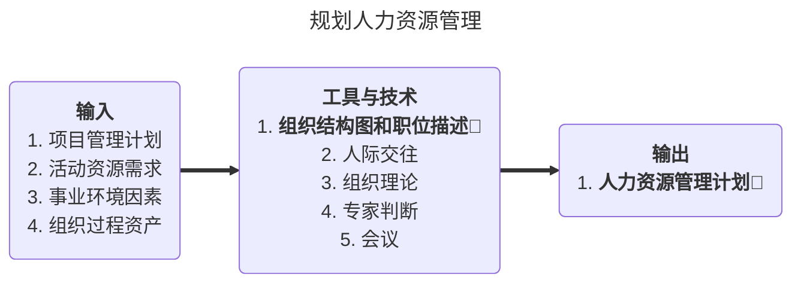
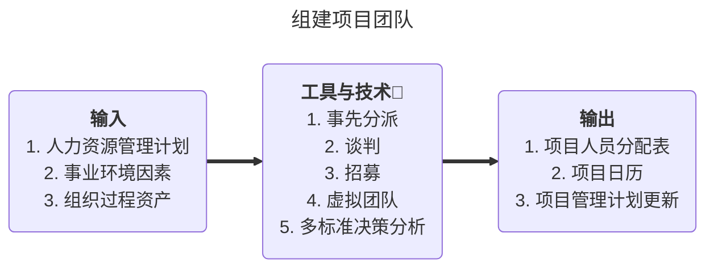
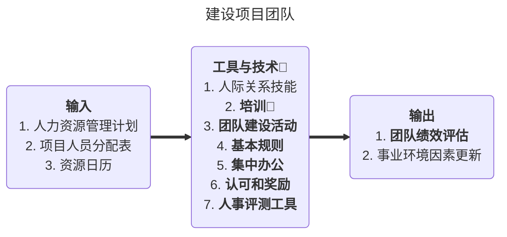
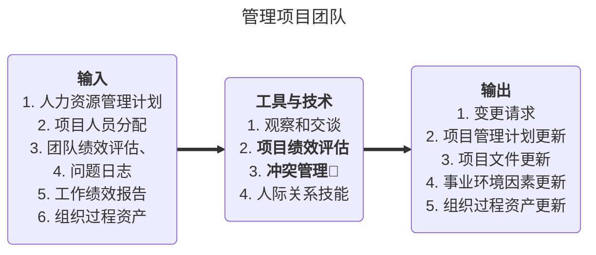

# 信息系统项目管理师笔记

> 第二部分：项目管理知识（二）

## 九、项目人力资源管理

> 强调以可行性为原则，以胜任力为目标，先有专业的个人，再有专业的团队。
>
> 六字诀：
>
> 1. 选：选角色，定计划（人力资源管理计划）
> 2. 定：组建团队，任务分配
> 3. 育：团队建设，使其成长
> 4. 用：绩效用人，绩效考核
> 5. 留：有效激励，激励留人
> 6. 通：有效沟通

### 9.1 项目人力资源原理的相关概念

#### 9.1.1 项目人力资源管理过程

- **编制人力资源管理计划**：确定与识别项目中的角色、所需技能、分配项目职责和汇报关系，并记录下来形成书面文件 ，其中也包括项目人员配备管理计划。
- **项目团队组建**：通过调配、招聘等方式得到需要的项目人力资源。
- **项目团队建设**：培养提高团队个人的技能，改进团队协作，提高团队的整体水平以提升项目绩效。
- **项目团队管理**：跟踪团队成是个人的绩效和团队的绩效，提供反馈，解决问题并协调变更以提高项目绩效。

#### 9.1.2 激励理论（🌟必考）

1. 马斯洛需求层次激励理论

   - 层层激励原则

     

2. 赫兹伯格的双因素理论（也叫卫生理论）
   - 保健因素是指那些与人们的不满情绪有关的因素，始企业政策，工资水平，工作环境，劳动保护，人际关系等。
   - 激励因素是指那些与人们的满意情绪有关的因素，如工作表现机会，工作带来的愉快，工作上的成就感，由于好的成绩而得到的奖励，未来发展的期望，职务上的责任感．
   - 赫兹伯格的双因素理论保健因素和激励因素。前者是导致不满足感的，做得不好就会损害激励，做得好却不会提高激励，如工作条件、工资、同事之间的关系、安全、职位等，相当于马斯洛理论的较低层次的需求（生理、安全、社会需求）；后者是导致满足感的因素，是能够真正起激励作用的，如责任、自我实现、职业发展、得到承认等，相当于马斯洛理论的较高层次需求（尊重、自我实现需求）。

3. 期望理论和成就动机理论

   - 弗鲁姆的期望理论（ Vroom's Expectancy Theory )。一种行为倾向的强度取决于个人对于这种行为可能带来的结果的期望度，以及这种结果对个人的吸引力。如果一个人认为努力工作会带来成功的结果，而这种成功又会带来相应的回报，他就会受到激励而努力工作。

   - 麦克利兰的成就动机理论（McCelland's Achievement Motivation Theory )，又称作“三种需要理论”。该理论认为各人在不同程度上有这三种需要，即成就需要、权力箭婴和亲和需要。管理者应该根据各人更重视的需要来制定激励措施，如为成就需要者设立具有挑战性但可实现的目标，为权力需要者提供较能体现地位的工作环境，为亲和需要者提供合作而非竞争的工作环境。

   - 期望理论关注的不是人们的需要的类型，而是人们用来获取报酬的思维方式，认为当人们预期某一行为能给个人带来预定的结果，且这种结果对个体具有吸引力时，人们就会采取这一特定的行动。

     期望理论认为，一个目标对人的激励程程度受两个因素的影响：

     1. 目标效价，指实现该目标对个人有多大价值的主观判断。如果实现这个目标对个人来说很有价值，积极性高；否则就低。
     2. 期望值，指个人对实现该目标的可能性大小的主观估计。只有个人认为实现的可能性大，才会努力去争取实现；否则没有激励作用。

4. 麦格雷戈-**X理论**🌟（**强调消极负面的，以不信任为前提，适用于新员工，强调定制度，重考核**）

   该理论假定人们：不喜欢他们的工作，尽力逃避工作，缺三进取心 ，没有创造力，喜欢得到指导 ，不愿意承担责任，缺二主动性，只能用低层次需求进行激励，自我为中心，对组织需求反应冷淡，反对变革。

5. 麦格雷戈-Y理论（以信任为前提，适用于老员工，强调定目标，重责任）

   该理论假定人们：如果给予适当的激励与支持性的工作氛国 ，会达到很好的绩效预期，具有创造力、想象力、雄心与信心来实现组织目标，能够自我约束、自我控制、渴望承担责任，受高层次需求的激励。

#### 9.1.3 领导与管理（了解）

- 领导是一种影响力，是指对人们施加影响 ，从而使人们心甘情愿地为实现组织目标而努力的艺术过程。
- 管理者是组织依法任命的，负责某个组织或事件的管理，通过调研、计划、组织、实施和控制来实现管理。
- **项目经理具有领导者和管理者的双重身份**。
- **倾听是一个优秀项目经理必备的关键技能**。

#### 9.1.4 影响和效率-权力理论

- 合法权力来源于项目章程

- 强制权力和奖励权力来源于合法权力

- 专家权力

- 感召权力（参照权力），是由于他人对你的认可和敬佩从而愿意模仿和服从你，以及希望自己成为你那样的人而产生的，这是一种人格魅力。

  

#### 9.1.5 冲突管理

- 冲突来源

  进度、项目优先级、资源、技术、管理过程、成本、个性等7种。

- 冲突的特点

  冲突是不可避免的，应公开的处理冲突，对事不对人，聚焦现在，而不是过去。

- 项目各阶段冲突排序

  - 概念阶段：项目优先级、管理过程、进度

  - 计划阶段：项目优先级、进度、管理过程

  - 执行阶段：进度、技术、资源冲突

  - 收尾阶段：进度冲突、资源冲突、个人冲突

- 冲突的根源

  **资源争抢**、进度优先级、个人风格、项目的高压环境、责任模糊、存在多个上级、新技术的应用等。

- **冲突的解决办法**

  - 解決问题：综合考虑不同的观点和意见，采用合作的态度和开发式对话引导各方**达成共识和承诺**。**最好的方案**。
  - **合作**：集合多方观点和意见，得出一个**多数人**接受和承诺的冲突解决方案。
  - 强制/命令：以辆性其他方为代价 ，推行某一方的观点；只提供输赢方案。通常是利用权力来强行解决紧急问题。一输一赢。**时效性最快**
  - 妥协/调解：就是冲突的各方协商解决并旦寻找一种能够使冲突各方都有一定程度满意、但冲突各方没有任何一方完全满意、是一种都做一些让步的冲突解决方法。**双方各让一步**
  - 求同存异（缓和/包容）：强谓一致、淡化分歧；为维持和谐与关心而单方面退让一步。是一种暂时性的冲突解决方法。
  - 撤退/回避：从实际或潜在冲突中退出 ，将问题推迟到准备充分的时候或者将问题推给其他人员解决。双方在解决问题上都不积极，也不想合作。是一种暂时性的冲突解决方法。**一方主动**

### 9.2 编制人力资源管理计划（规划人力资源管理）

#### 9.2.1 概念

- 项目人力资源管理计划的目的是确定项目的**角色、职责、报告关系**，并制定**人员配备管理计划**。
- 在大多数项目中，项目人力资源规划被作为项目最初阶段的一项主要工作来完成。
- 这一工作的结果应当在项目**全过程**中经常性地复查，以保证它的持续适用性。

#### 9.2.2 ITO

#### 9.2.3 组织结构图🌟

1. 层次结构图

   - 用**工作分解结构**来确定项目的范围，将项目可交付物分解成工作包，即可得到该项目的WBS。也可用WBS来描述不同层次的责任。

   - **组织分解结构（OBS）**与工作分解结构形式上类似 ，是根据组织现有的部门、 单位或团队进行分解。将工作包/可交付成果挂在组织分解结构下

   - **资源分解结构**是另一种层次结构图，它用来分解项目中各种类型的资源。

2. 矩阵图

   - 反映团队成员个人与其承担的工作之间联系的方法有多种，而**责任分配矩阵（RAM）**是最直观的方法。

   - RACI模型

     R=要求审查；A=负责人；P=参与者；I=要求输入；S=要求签字

     每个活动的负责人只能有一个

3. 文本格式
   - 团队成员职责需要详细描述时，可以用文字形式表示。

#### 9.2.4 输出：人力资源管理计划🌟（内容包含以下三点）

- **角色与职责的分配**：定义项目所需的岗位、技能和能力。

- **项目组织结构图** ：用图形表示项目汇报关系。

- **人员配备管理计划**：描述的是何时、以何种方式、他们需要在项目中工作多久以及怎样满足人力资源需求。**包括**：🌟
  1. 人员招募
  2. 资源日历
  3. 人员遣散计划
  4. 培训需求
  5. 表彰和奖励
  6. 遵守的规定
  7. 安全性

### 9.3 组建项目团队

#### 9.3.1 ITO

> 助记：**事先分派要授权，沟通谈判借资源，采购招募看缺口，虚拟团队定沟通（定期沟通），**

#### 9.3.2 工具与技术

- 事先分派
- 谈判（职能经理或其他项目经理）
- 采购（外部聘用或分包）
- 虚拟团队（非集中办公）
- **多标准决策分析**：是指制定出用来选择项目团队成员的多种标准，并用这些标准去选择团队成员，以便把最合适的人拉入项目团队中。如果各标准的重要性不同，就应该对各标准赋予不同的权重。应该用各种标准对团队成员候选人进行打分，选择加权汇总得分较高者加入项目团队。用于选择的标准可以包括可用性，成本（工资）、工作经验、工作能力、相关知识、王作技能、工作态度和空间因素等。

#### 9.3.3 团队组建常见的问题

- 问题：

  1. 招募不到合适的项目成员：

  2. 团队的组成人员尽管富有才干，但却很难合作；

  3. 国队气氛不积极 ，造成项目团队成员的士气低落；

  4. 项目团队的任务和职责分配不清楚；

  5. 人员流动过于频繁。

- 产生的原因：

  1. 没有能够建立人力资源获取和培养的稳定机制；
  2. 没有完整识别项目所需的人力资源种类、数量和相关任职条件；
  3. 没有建立一个能充分、有效发挥能力的团队；
  4. 没有清楚地分配工作职责到个人或人力单元。

- 应对措施

  1. 建立稳定的人力资源获取和培养机制；
  2. 在项目早期，进行项目的整体人力资源规划，明确岗位设置、工作职责和协作关系；
  3. 进行项目团队建设，加强团队沟通，建立合作氛围；
  4. 根据项目团队成员的工作职责和目标，跟踪工作绩效，及时予以调整和改进，提升项目整体绩效。

### 9.4 建设项目团队

#### 9.4.1 ITO

> **人事测评工具即心理偏好指示器**

#### 9.4.2 工具和技术

- 团队建设活动（5分钟的议事日程、拓展训练、娱乐活动）
- 基本规则（界定对团队成员的明确期望）
- **人事评测工具**：是指采 用各种方法 ，如态度调查、细节评估、结构化面谈、能力测试和焦点小组讨论，来充分了解团队成员的优势、劣势、愿望和行为方式、喜好和厌恶等，以便更有针对性地开展团队活动。开展人事测评，有利于增强团队成员之间的理解和信任，有利于提高团队绩效和项目绩效。

#### 9.4.3 输出：团队绩效评估🌟

- **当一些培训、团队建设、集中办公等措施被实施后，项目管理团队可以进行正式或非正式的团队绩效评估。可以包括：**

  1. 提高个人技能，可以使专业人员更高效地完成所分配的活动；
  2. 提高团队能力，可以帮助团队更好的共同工作；
  3. 较低的员工流动率；

  4. 团队凝聚力的加强，从而使团队成员公开分享信息和经验，并互相帮助，来 提高项目绩效。

#### 9.4.4 团队一般成长模型 —— Bruce Tuckmans 模型

- 形成期团队成员相互独立，不一定开诚布公
- 震荡阶段强调冲突不断，彼此相互不信任 1 + 1 < 2
- 规范阶段基本能够协同工作，团队成员开始相互信任 1+ 1 = 2
- 成熟阶段（也叫发挥阶段）团队成员相互依靠，平稳高效地解决问题 1 + 1 > 2
- 解散
- HR为公司新成员培训，而项目经理为项目新成员培训

### 9.5 管理项目团队

#### 9.5.1 ITO

#### 9.5.2 相关概念（了解）

- “**让非管理层的团队成员参与到项目计划制定过程中**〞 的活动则是一种通过提高团队成员的参与意识、增进团队的凝聚力，利用其附属效应来提高团队绩效的措施。
- **资源平衡**指的是在一个时间段内项目保持有大致相同的资源，它与任务分配或管理会议没有关系。
- 项目经理必须知道使项目顺利完成需要哪些技能 ，但是**项目团队没有必要拥有所有技能**，只要找到可以获得必要的**技能**和**知识的来源**以完成项目就可以了。
- 组织/业务关系图描述了业务和部门的关系。
- **项目经理**和**职能经理**应**协商**确保项目所需的员工按时到岗并完成所分配的项目任务。

### 9.6 真题

- **新技术**意味着**新风险**、**新冲突**
- 项目团队中项目经理的管理能力和管理能力二者缺一不可

## 十、项目沟通管理和干系人管理

> 一个宗旨：沟通无止境，共识促发展
>
> 两个原则：沟通要注意**相关性**（相关的人和内容）和**适用性**（合适的沟通方式和技巧）原则
>
> 三个方向：1. 向上沟通要授权 2. 向下沟通要落实 3. 水平沟通要支持
>
> 四个要素：1. 沟通目标 2. 沟通对象 3. 沟通内容 4. 沟通反馈（反馈要明确）

> 规划沟通求有效
>
> 管理沟通求发布
>
> 控制沟通求改进

### 10.1 沟通的基本概念

#### 10.1.1 口沟通的含义与特点

- **沟通**是为了特定的目标，在人与人之间、组织或团队之间进行的信息、思想和情感的**传递或交互的过程**。

- **项目沟通**是为实现项目管理目标，项目团队与其他组织、项目团队成员之间信息、思想、情感的**传递和理解的过程**。

- 软件项目是否达到客户的期望主要取决于**客户在多大程度上 “赞同”** 所交付的项目内容，而不是项目提供者提供了 “多好” 的系统。因此，建立有效和持续的各户沟通机制是项目得到客户认可的基础。

- 应该明确，**沟通并不是一种本能，而是一种能力**。也就是说，沟通不是人天生就具备的，而是在工作实践中培养和训练出来的。

#### 10.1.2 沟通模型 🌟🌟

- 发送方：🌟
  - 选择合适的编码方式
  - 确保信息清楚明确
  - 确保发送的信息完整
  - 确保信息容易被理解
  
- 接收方：🌟
  - 解码
  - 确保完整接收了信息
  - 确保被正确的理解
  - 给出反馈

- 沟通的障碍

  - 缺乏清晰的沟通渠道；

  - 发送者和接收者存在物理距离；
  - 沟通双方彼此技术语言不通；
  - 分散注意力的环境（噪声）；
  - 有害的态度（敌对、不信任）；
  - 权力游戏、滞留信息、隐藏议程和敌对情绪等。

- 沟通渠道数量的计算公式；

  **N(N-1)/2**，N是人数

#### 10.1.3 沟通方式

- 在进行沟通过程中，要根据沟通目标、参与者的特点选择适合的沟通方式。一般沟通过程所采用的方式分为以下几类：参与讨论方式、征询方式、推销方式（说明）、叙述方式
- 

- 参与程度越强控制强度越弱🌟⬆️

- 沟通方法的分类
  

- **项目经理对外多以正式的方式进行沟通**🌟

  |            | 正式的                                | 非正式                                |
  | ---------- | ------------------------------------- | ------------------------------------- |
  | 口头方式   | 演讲、报告、汇报、谈判、会议          | 谈话、电话、打招呼                    |
  | 书面方式   | 合同、报告、会议纪要、报表            | 笔记、便条、备忘录                    |
  | 非语言沟通 | 手语、信号灯、音乐                    | 表情、声调、握手、拥抱                |
  | 工具沟通   | 电话、传真、Email、手机、面对面、快递 | 电话、传真、Email、手机、面对面、快递 |

  | 方式       | 特点                             | 适用场景                                 |
  | ---------- | -------------------------------- | ---------------------------------------- |
  | 正式书面   | 适合保存、内容不走样、有格式要求 | 根据合同进行的沟通；终止与某供应商的合作 |
  | 正式口头   | 速度快、不易保存、需要很多条件   | 项目启动会                               |
  | 非正式口头 | 效率高                           | 某个团队成员表现不太好                   |
  | 非正式书面 | 适合保存，没有格式要求           | 团队成员的笔记、便条、即时贴             |

### 10.2 制定沟通管理计划

### 10.3 管理沟通

### 10.4 控制沟通

